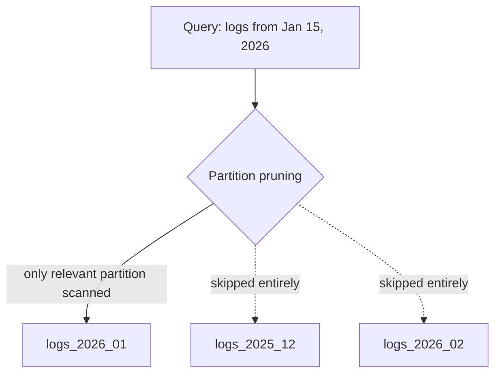

## Definition

Partitioning is the general practice of splitting a large dataset into smaller, more manageable pieces (partitions), each holding a subset of the total data. [Sharding](/docs/databases/sharding) — splitting data across multiple *machines* — is the most commonly discussed form of partitioning in system design, but partitioning can also happen within a single machine.

## Why it exists

Very large tables become unwieldy in several ways: queries and maintenance operations (backups, index rebuilds) can become slow, and — at sufficient scale — the data no longer fits comfortably on one machine at all. Partitioning exists to break a large, unwieldy dataset into smaller, independently manageable pieces, whether for operational convenience on a single machine or to distribute across many.

## The problem it solves

An enormous single table — say, billions of rows of time-series log data — makes routine operations (an index rebuild, a backup, a query that has to scan a wide date range) slower and more resource-intensive than necessary if a query only actually needs a small slice of that data (e.g. "just last week's logs"). Partitioning solves this by physically separating the data so operations can target just the relevant slice.

## Real-world analogy

A single, enormous filing cabinet with every company record ever created, all mixed together, makes finding "last month's invoices" slow — you'd have to search the whole cabinet. Partitioning is like organizing that cabinet into separate drawers by month; finding last month's invoices now means opening exactly one drawer, not searching everything.

## Simple explanation

Partitioning splits a large table into smaller partitions, usually based on a **partition key** — often a date range, a hash of an ID, or a category — so that a query or operation touching only a subset of the data can be scoped to just the relevant partition(s), rather than scanning everything.

## Technical explanation

### Partitioning within a single database (not sharding across machines)

Even on a single database server, **table partitioning** can meaningfully help:

```sql
CREATE TABLE logs (
    id BIGINT,
    created_at TIMESTAMP,
    message TEXT
) PARTITION BY RANGE (created_at);

CREATE TABLE logs_2026_01 PARTITION OF logs
    FOR VALUES FROM ('2026-01-01') TO ('2026-02-01');
```

A query filtering on a date range within January 2026 only needs to scan the `logs_2026_01` partition, not the entire, much larger `logs` table — a technique called **partition pruning**.

### Partitioning strategies

- **Range partitioning**: partitions based on a range of values (e.g. dates, ID ranges) — simple, and naturally supports range queries, but can create uneven partition sizes if the underlying data isn't evenly distributed across ranges.
- **Hash partitioning**: partitions based on a hash of a key — spreads data more evenly, at the cost of losing natural ordering/range-query-friendliness.
- **List partitioning**: partitions based on a specific set of discrete values (e.g. by country or category).

## Internal working



## Advantages

- Queries scoped to a specific partition avoid scanning the entire (much larger) dataset, improving performance.
- Maintenance operations (archiving old data, rebuilding indexes) can target individual partitions independently, rather than operating on an enormous single table.
- Old partitions (e.g. old log months) can be archived or dropped entirely as a fast, simple operation, rather than a slow row-by-row delete across a giant table.

## Disadvantages

- Queries that need to span many partitions (e.g. "all logs from the last two years") don't benefit from partition pruning and may even be somewhat slower than an equivalent unpartitioned table, due to the overhead of coordinating across partitions.
- Choosing a poor partition key (or strategy) can lead to uneven partition sizes, undermining the benefit.
- Adds schema and operational complexity compared to a single, unpartitioned table.

## Trade-offs

Partitioning speeds up queries and maintenance that can be scoped to specific partitions, at the cost of some complexity and potentially worse performance for queries that must span many partitions — the key design question is whether your actual, common query patterns align with a sensible partition key.

## Complexity considerations

Partitioning is comparatively simpler within a single database (a well-supported, standard feature in most relational databases) than sharding across multiple machines, which additionally requires a routing layer and introduces cross-machine network calls for anything spanning partitions.

## When to use

- Very large tables where queries and maintenance operations commonly target a specific, identifiable slice of the data (a date range, a category, a tenant ID in a multi-tenant system).
- Time-series data, where old data is naturally partitioned by time and can be archived or dropped a whole partition at a time.

## When NOT to use

- Tables small enough that partitioning's added complexity isn't justified by any real performance benefit yet.
- Query patterns that routinely need to span most or all partitions anyway, gaining little from the scoping benefit partitioning provides.

## Common mistakes

- Choosing a partition key that doesn't match actual query patterns, so most queries still need to scan many (or all) partitions anyway.
- Conflating partitioning (which can happen within a single machine) with sharding (partitioning specifically across multiple machines) — related concepts, but not identical, and worth being precise about in a design discussion.
- Not planning for partition maintenance (e.g. automatically creating new date-range partitions as time moves forward) as an ongoing operational task.

## Interview questions

- "How would partitioning by date help this specific time-series logging system?"
- "What's the difference between partitioning and sharding?"
- "What happens to a query that needs to span multiple partitions — does partitioning help or hurt in that case?"

## Practical example

A logging system partitions its main table by month — queries for recent logs (the overwhelming majority of actual queries) only scan the current month's partition, and old partitions (e.g. logs older than a year) can be archived to cheaper storage or dropped entirely as a single fast operation, rather than a slow row-by-row deletion from a single enormous table.

## Production example

Most managed data warehouses (BigQuery, Redshift, Snowflake) and time-series databases build partitioning (often by date) into their core design, specifically because time-series and analytics workloads so commonly query recent, bounded ranges of otherwise enormous datasets.

## Best practices

- Choose a partition key that matches your actual, common query patterns, so partition pruning provides a real benefit.
- Automate partition creation and archival (e.g. automatically creating a new monthly partition, and dropping ones past a retention period) rather than managing it manually.
- Distinguish clearly, in design discussions, between partitioning within one machine and sharding across multiple machines — the term "partitioning" is often used as an umbrella covering both, but the operational implications differ significantly.

## Summary

Partitioning splits a large dataset into smaller, more manageable pieces based on a partition key, letting queries and maintenance operations that target a specific slice of the data avoid scanning everything. It's a general concept applicable within a single machine (for query and maintenance efficiency) or across multiple machines (as sharding, primarily for scaling past a single machine's limits) — the right partition key depends entirely on matching actual query patterns.

## References

- PostgreSQL documentation: Table Partitioning
- Designing Data-Intensive Applications, Martin Kleppmann (Ch. 6)

<Quiz questions={[
  {
    q: "What is 'partition pruning'?",
    options: [
      "Deleting old partitions permanently",
      "The database's ability to skip scanning partitions that can't contain data relevant to a given query, based on the partition key",
      "A way to compress partition data",
      "A synonym for sharding"
    ],
    answer: 1,
    explanation: "Partition pruning is the query planner recognizing, based on the partition key and the query's filters, which partitions couldn't possibly contain relevant rows, and skipping them entirely — the core performance benefit of partitioning."
  }
]} />
