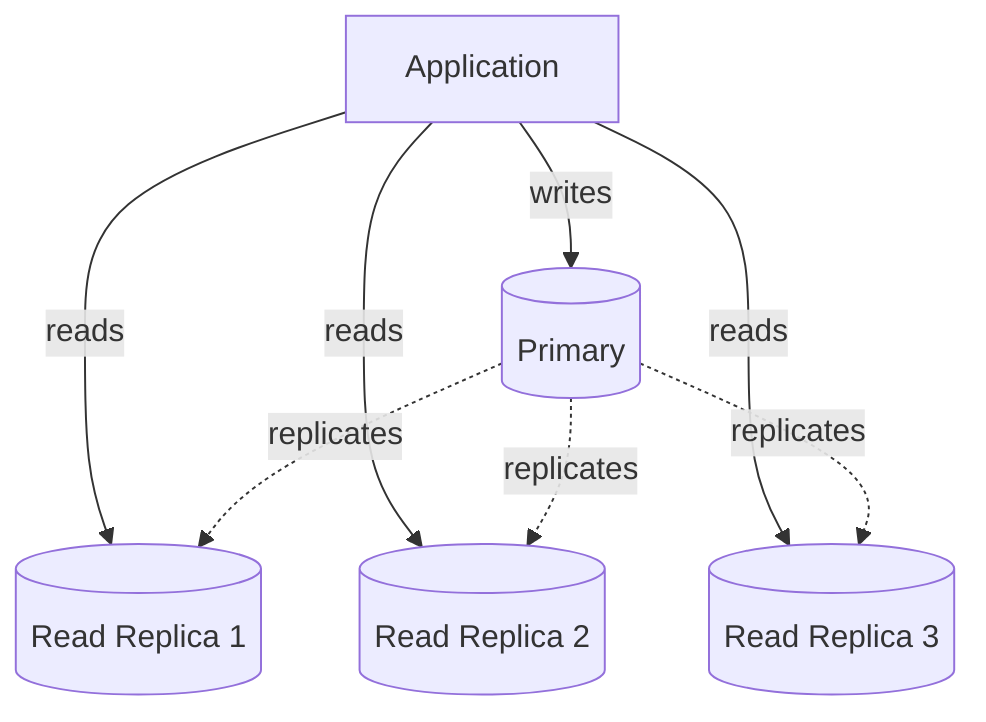
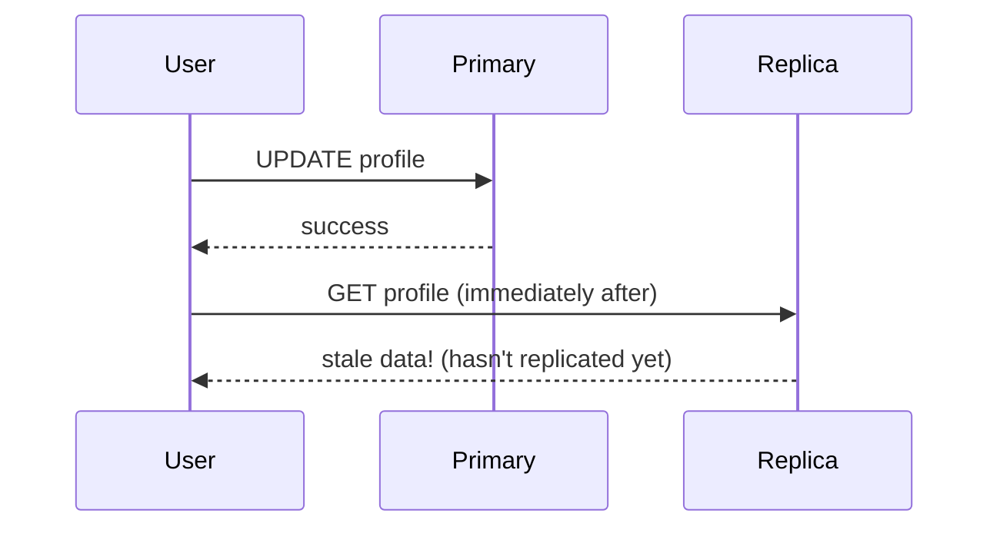

## Definition

A read replica is a copy of a database, kept in sync via [replication](/docs/databases/replication), used specifically to serve read queries — offloading read traffic from the primary database so it can focus on handling writes.

## Why it exists

Most applications are read-heavy — far more reads happen than writes (loading a profile vastly outnumbers updating it). Read replicas exist to exploit this asymmetry directly: since reads don't need to modify data, many independent copies can each serve reads in parallel, without needing to coordinate with each other the way writes do.

## The problem it solves

If every single read and write hits one database instance, that instance's total capacity is shared between both — and reads, being far more numerous, can crowd out the (comparatively rare but critical) write capacity, or simply exceed what one machine can serve at all. Read replicas solve this by giving reads their own, horizontally scalable pool of capacity, separate from the primary's write-handling responsibility.

## Real-world analogy

A popular reference book at a library, where only the librarian's original copy can be annotated (written to), but the library keeps several photocopies available so many patrons can read it simultaneously without waiting for one single copy — as long as nobody needs to write in the margins, more copies straightforwardly means more people can read at once.

## Simple explanation

Application writes always go to the primary database. Application reads can go to the primary *or* to any of several read replicas — a simple architectural decision (a load balancer or application-level routing logic) that spreads read load across many machines.

## Technical explanation

Read replicas are usually kept up to date via asynchronous replication (see [Replication](/docs/databases/replication)) — meaning there's a small, real window of replication lag during which a replica might not yet reflect the very latest write.

## Internal working — the read-your-writes problem

The most common practical issue with read replicas: a user writes something (say, updates their profile), and immediately reads it back — if that read happens to be routed to a replica that hasn't caught up yet, the user briefly sees stale (old) data, which looks like their update silently failed or reverted.

Common fixes: route a user's own immediate post-write reads back to the primary for a short window, or track a "read your own writes" token/timestamp that ensures a replica has caught up to at least the version the user just wrote before serving their read.

## Advantages

- Straightforward, well-supported way to scale read throughput horizontally — most managed databases (RDS, Cloud SQL) support this with minimal configuration.
- Improves availability and durability as a side effect, since data exists on multiple machines.
- Can also serve specific workloads (analytics queries, reporting) without impacting the primary's performance, by directing those queries specifically to a dedicated replica.

## Disadvantages

- Doesn't help write throughput at all — only reads scale with more replicas; writes are still bottlenecked by the primary (see [Leader-Follower](/docs/databases/leader-follower)).
- Introduces the read-your-writes problem, requiring explicit handling in application logic for cases where it matters to the user experience.
- Adds infrastructure and monitoring overhead — replicas need to be watched for replication lag and health, same as any other production database instance.

## Trade-offs

Read replicas are close to a "free win" for read-heavy workloads (little downside beyond replication lag handling), but they specifically don't address write scaling — for that, sharding or a different write architecture is needed regardless of how many read replicas exist.

## Complexity considerations

Adding read replicas to an existing single-database setup is usually a modest, well-supported configuration change in most managed database platforms. The real complexity is in the application layer: deciding which specific reads can tolerate potential staleness (route to a replica) vs. which need the absolute latest data (route to the primary).

## When to use

- Any read-heavy application where the primary database's read load is becoming a meaningful fraction of its overall capacity.
- Offloading expensive analytics or reporting queries onto a dedicated replica, so they don't compete with the primary's regular transactional workload.

## When they're not enough

- Write throughput itself is the actual bottleneck — read replicas do nothing for this; sharding is the relevant technique instead.

## Common mistakes

- Routing every single read to a replica by default without considering the read-your-writes problem for reads that need to reflect a very recent write.
- Expecting read replicas to help with write scaling — a common, understandable confusion, since they're often introduced in the same "replication" conversation as write-scaling techniques, but they solve a different problem entirely.
- Not monitoring replication lag — if a replica falls significantly behind (e.g. due to a slow disk or high write volume), reads routed to it could be surprisingly stale.

## Interview questions

- "How would you decide which reads should go to a replica vs. the primary?"
- "A user updates their profile and immediately doesn't see the change reflected — what's likely happening, and how would you fix it?"
- "Do read replicas help scale write throughput? Why or why not?"

## Practical example

In the [URL Shortener case study](/docs/case-studies/url-shortener), read replicas handle the portion of redirect traffic that misses the cache, while the primary database is left free to handle new-link-creation writes without that additional read load competing for its capacity.

## Production example

Nearly every major managed database service (AWS RDS, Google Cloud SQL, Azure Database) offers one-click read replica provisioning specifically because this pattern is so broadly applicable and commonly needed across read-heavy production workloads.

## Best practices

- Route reads deliberately based on freshness requirements — use the primary (or a replica known to be caught up) for reads that must reflect the user's own very recent write.
- Monitor replication lag explicitly as a first-class operational metric, not an afterthought.
- Use dedicated replicas for expensive analytics/reporting queries specifically to isolate that load from the primary's transactional workload.

## Summary

Read replicas are copies of a database kept in sync via replication, used specifically to scale read throughput by spreading read traffic across multiple machines while writes remain funneled through the primary. They're a low-friction, high-value pattern for read-heavy workloads, but introduce the read-your-writes staleness problem and do nothing to address write-throughput scaling, which requires a different technique (sharding) entirely.

## References

- Designing Data-Intensive Applications, Martin Kleppmann (Ch. 5)

<Quiz questions={[
  {
    q: "A user updates their email address and, on the very next page load, still sees their old email. What's the most likely cause in a system using read replicas?",
    options: [
      "The write actually failed silently",
      "The read was routed to a replica that hasn't yet caught up with the primary's latest write - a replication lag / read-your-writes issue",
      "Read replicas don't support email fields",
      "The database is corrupted"
    ],
    answer: 1,
    explanation: "This is the classic read-your-writes problem: the write succeeded on the primary, but the subsequent read happened to hit a replica that hadn't yet replicated that specific change, momentarily showing stale data."
  }
]} />
