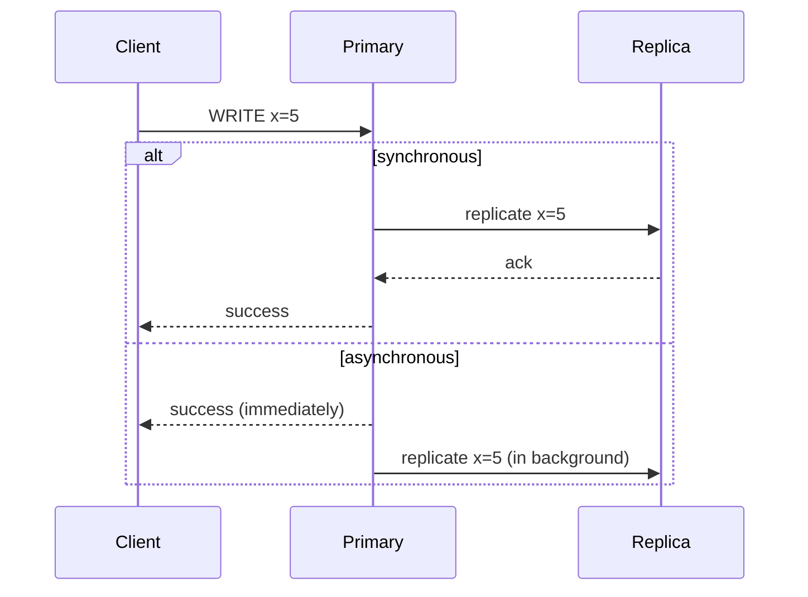

## Definition

Replication is the practice of keeping copies of the same data on multiple machines (replicas), so that reads can be served from any of them, and the data survives the failure of any single machine.

## Why it exists

A single database machine is both a read-throughput ceiling and a single point of failure — lose that machine, and you lose the data (if not backed up) and all availability (even if backed up, there's downtime while restoring). Replication exists to solve both problems at once: multiple machines can each serve reads (spreading load), and losing one doesn't lose the data or all availability.

## The problem it solves

Without replication, scaling read throughput requires a bigger single machine (with a hard ceiling), and any single machine failure causes a full outage and, in the worst case, data loss. Replication solves read scaling (multiple machines can serve reads) and durability/availability (multiple independent copies of the data) simultaneously.

## Real-world analogy

A company keeping only one copy of an important contract in a single filing cabinet risks losing it entirely to a fire. Keeping identical copies in three different offices means a fire in one office doesn't destroy the only record — and, as a bonus, employees at any of the three offices can read the contract locally without needing to call the one original office each time.

## Simple explanation

One machine (the **primary** or **leader**) typically accepts writes; changes are then propagated to one or more **replicas** (or **followers**), which can serve read traffic and can be promoted to take over if the primary fails.

## Technical explanation

### Synchronous vs. asynchronous replication

- **Synchronous replication**: the primary waits for (at least one) replica to confirm it has the write before acknowledging success to the client — guarantees the replica is up to date, at the cost of added write latency (and potential unavailability if that replica is slow or down).
- **Asynchronous replication**: the primary acknowledges the write immediately, and propagates it to replicas in the background — faster writes, but a replica can briefly lag behind, and a primary failure right after an unacknowledged async write can lose that write entirely.

## Internal working — replication lag

With asynchronous replication (the common default for read-scaling use cases), there's always some **replication lag** — a small delay between a write completing on the primary and that write becoming visible on a given replica. This is the direct, everyday manifestation of the [PACELC](/docs/fundamentals/pacelc) trade-off: favoring lower write latency (async) means occasionally reading slightly stale data from a replica.

<Callout type="warning" title="A classic replication lag bug">
A user updates their profile, then immediately reloads the page — if that reload's read happens to hit a replica that hasn't caught up yet, the user briefly sees their old data, even though their write "succeeded." This is a common, real production issue, often solved by routing a user's own immediate post-write reads back to the primary for a short window.
</Callout>

## Advantages

- Scales read throughput horizontally — add more replicas to serve more concurrent read traffic.
- Improves durability — data exists on multiple independent machines, surviving a single machine's failure or disk corruption.
- Improves availability — a replica can be promoted to primary if the original primary fails, reducing (though not eliminating) downtime.

## Disadvantages

- Asynchronous replication introduces replication lag — replicas can briefly serve stale data.
- Synchronous replication improves consistency but adds write latency, and can reduce availability if the required replica is slow or unreachable.
- Failover (promoting a replica to primary) needs careful coordination to avoid data loss or, worse, two nodes both believing they're the primary at once ("split brain").

## Trade-offs

This is a direct, practical instance of the PACELC trade-off: synchronous replication favors consistency at the cost of latency; asynchronous replication favors latency at the cost of possible (brief) staleness on replicas — the right choice depends on how costly stale reads are for the specific data involved.

## Complexity considerations

Basic single-primary, multiple-replica setups (see [Leader-Follower](/docs/databases/leader-follower)) are common and well-supported by most modern databases out of the box. More advanced topologies — [Multi-leader](/docs/databases/multi-leader) replication, where more than one node accepts writes — introduce genuinely hard conflict-resolution problems and should only be adopted when single-leader replication's limitations (e.g. needing writes accepted in multiple geographic regions) are a real, measured requirement.

## When to use

- Nearly any production database serving meaningful read traffic or requiring high availability — replication is close to a default expectation for production systems, not an advanced optimization.

## When simpler setups are fine

- Early-stage systems with very low traffic and low availability requirements, where a single database instance with regular backups may be sufficient temporarily.

## Common mistakes

- Not accounting for replication lag in application logic, causing user-visible bugs like "I just updated this and it reverted" (actually a stale read from a lagging replica).
- Treating asynchronous replication as equivalent to synchronous for durability purposes — an async write acknowledged to the client can still be lost if the primary fails before it propagates.
- Not having a tested, automated failover process — manually promoting a replica during an actual outage, under pressure, is far riskier than having this tested and automated in advance.

## Interview questions

- "What happens to in-flight writes if the primary fails right after acknowledging them, under asynchronous replication?"
- "How would you handle a user seeing stale data immediately after their own write, due to replication lag?"
- "Walk me through your failover process if the primary database goes down."

## Practical example

In the [URL Shortener case study](/docs/case-studies/url-shortener), read replicas absorb the (much smaller) portion of read traffic that misses the cache, freeing the primary database to handle writes (new link creation) without being burdened by read load as well.

## Production example

Most managed database services (AWS RDS, Google Cloud SQL) offer built-in read replica support and automated failover specifically because replication has become a standard, expected requirement for production database deployments, not a specialized, advanced feature.

## Best practices

- Choose synchronous vs. asynchronous replication deliberately per use case, based on how costly staleness vs. added write latency actually is for that specific data.
- Route a user's own immediate post-write reads back to the primary (or a replica known to be caught up) to avoid the "I just saved this and it disappeared" class of bugs.
- Regularly test failover (not just configure it) so that promoting a replica during a real incident is a well-rehearsed, automated process, not an improvised one.

## Summary

Replication keeps copies of data on multiple machines, scaling read throughput and improving durability and availability. Synchronous replication favors consistency at the cost of write latency; asynchronous replication favors speed at the cost of brief, possible staleness on replicas — a direct, practical instance of the PACELC trade-off that shows up in nearly every production database deployment.

## References

- Designing Data-Intensive Applications, Martin Kleppmann (Ch. 5)

<Quiz questions={[
  {
    q: "With asynchronous replication, what can happen if the primary fails immediately after acknowledging a write to the client?",
    options: [
      "Nothing - async replication guarantees no data loss",
      "That write may be lost, since it was acknowledged before being propagated to any replica",
      "The client automatically retries and no data is lost",
      "Asynchronous replication doesn't allow writes to be acknowledged before replication"
    ],
    answer: 1,
    explanation: "Asynchronous replication acknowledges the write immediately, before it's confirmed on any replica — if the primary fails before that background replication completes, the write can be lost entirely, which is the central durability trade-off of choosing async over sync replication."
  }
]} />
