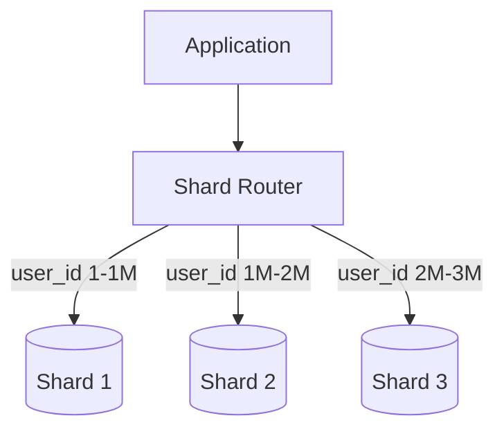

## Definition

Sharding (also called horizontal partitioning) is splitting a database's data across multiple independent machines ("shards"), where each shard holds a subset of the total data, based on some partitioning key — allowing write throughput and total data volume to scale past what any single machine could handle.

## Why it exists

A single database machine, no matter how powerful, has a ceiling on write throughput, storage, and memory. Once a workload's writes or total data size exceed what any single machine can handle — even the largest available — there's only one option left: split the data across multiple machines. Sharding exists to do this systematically, so the application can still query "the database" without manually tracking which physical machine holds which piece of data.

## The problem it solves

[Replication](/docs/databases/replication) helps scale *reads* (many replicas can each serve read traffic), but every replica still has a full copy of the data and the same single-machine write ceiling, since all writes go through one primary. Sharding solves the *write* and *total storage* scaling problem instead, by giving each shard only a fraction of the data (and therefore only a fraction of the total write load).

## Real-world analogy

Imagine a massive library that's outgrown a single building. Instead of building one impossibly large building, you open five branch libraries, each holding a specific range of the collection (e.g. by author's last name, A-F in one branch, G-M in another). Anyone looking for a specific book needs to know (or be told) which branch to go to — that's exactly the role of a shard key and routing layer in a sharded database.

## Simple explanation

Sharding splits one logical table (or database) into multiple physical pieces, each on a different machine, based on a **shard key** — some column (or hash of a column) that determines which shard a given row lives on.

## Technical explanation

### Sharding strategies

- **Range-based sharding**: each shard holds a contiguous range of the shard key (e.g. user IDs 1-1,000,000 on shard 1). Simple, but can create "hot" shards if certain ranges are accessed far more than others.
- **Hash-based sharding**: the shard key is hashed, and the hash determines the shard — spreads data more evenly, but makes range queries (e.g. "all users created this month") harder, since consecutive keys are no longer on the same shard.
- **Directory-based sharding**: a separate lookup service maps each key to its shard explicitly — flexible (shards can be reassigned individually), but adds an extra lookup and a new critical dependency.

## Internal working — resharding

The hardest part of sharding isn't the initial split — it's what happens when you need to **add more shards** later, as data continues to grow. Naive hash-based sharding (`hash(key) % N`) requires remapping almost all keys when N changes, causing massive data movement. This is why [Consistent Hashing](/docs/distributed-systems/consistent-hashing) is often used instead, minimizing how much data needs to move when the shard count changes.

## Advantages

- Scales both write throughput and total storage capacity well past what a single machine can provide.
- Each shard can be scaled, backed up, and maintained somewhat independently.

## Disadvantages

- **Cross-shard queries and joins become much harder** — a query needing data spread across multiple shards (e.g. "top 10 users across the entire platform") can no longer be a single simple query; it requires querying multiple shards and combining results in application code.
- **Rebalancing is expensive and operationally risky** — moving data between shards while the system is live requires careful, often complex migration logic.
- **Hot shards** — if the shard key isn't chosen well, some shards can end up with disproportionately more data or traffic than others (e.g. sharding by a celebrity's user ID putting massively more load on one specific shard).
- Transactions that span multiple shards lose the simple guarantees a single-database ACID transaction would have provided.

## Trade-offs

Sharding trades the simplicity of "one database, always consistent, joins work naturally" for the ability to scale past a single machine's limits — a necessary trade-off at sufficient scale, but real complexity that shouldn't be adopted before it's actually needed.

## Complexity considerations

Sharding is widely considered one of the more operationally complex techniques in system design — the choice of shard key has long-lasting consequences (a poor choice is very expensive to correct later), and most teams should exhaust simpler options (vertical scaling, read replicas, caching) before reaching for it.

## When to shard

- When write throughput or total data volume genuinely exceeds what a single (even well-tuned, vertically-scaled) machine can handle.
- When you've already addressed read scaling via replicas and caching, and writes (not reads) are the actual bottleneck.

## When NOT to shard

- Before you've measured that a single machine (possibly with read replicas and caching in front) is genuinely insufficient — sharding significantly early, before it's needed, adds substantial ongoing complexity for no real benefit yet.

## Common mistakes

- Choosing a shard key based on convenience rather than actual query and load patterns, leading to hot shards or constant painful cross-shard queries.
- Sharding far earlier than necessary, adding operational complexity to a system that a single well-tuned database (plus replicas/caching) could have handled for a long time.
- Not planning for resharding from the start, making it painfully expensive to add capacity later.

## Interview questions

- "How would you choose a shard key for this specific system, and what could go wrong with that choice?"
- "How would a query needing data from multiple shards work, and what does that cost you compared to a single-database query?"
- "How would you add more shards later without an enormous, risky data migration?"

## Practical example

A large-scale user database sharded by `hash(user_id)` distributes user data evenly across many shards, avoiding hot spots from naturally skewed access patterns (e.g. alphabetically clustered signups), at the cost of losing the ability to efficiently query "all users in alphabetical order" as a single simple query, since that would now require querying every shard and merging results.

## Production example

Instagram's engineering team has publicly described sharding their Postgres database by user ID specifically to scale past what any single Postgres instance could handle, while using directory-based logical shard mapping to allow flexibility in how logical shards are assigned to physical machines over time.

## Best practices

- Exhaust simpler scaling techniques (vertical scaling, read replicas, caching) before reaching for sharding.
- Choose a shard key based on actual access patterns and expected load distribution, not just convenience.
- Plan for resharding (e.g. via consistent hashing or a flexible directory-based mapping) from the start, rather than assuming the initial shard count will be permanent.

## Summary

Sharding splits a database's data across multiple machines by a shard key, scaling write throughput and total storage past a single machine's limits — at the real cost of harder cross-shard queries, rebalancing complexity, and the risk of hot shards from a poorly chosen key. It's a powerful but operationally demanding technique, best adopted only once simpler scaling approaches are genuinely insufficient.

## References

- Designing Data-Intensive Applications, Martin Kleppmann (Ch. 6)
- Instagram Engineering: Sharding & IDs at Instagram

<Quiz questions={[
  {
    q: "What's a major downside of choosing a poor shard key, such as one that puts disproportionate load on a single shard?",
    options: [
      "It has no real downside",
      "It creates a 'hot shard' that's overloaded while other shards sit relatively idle, undermining the whole point of sharding",
      "It makes the database faster",
      "It only affects read queries, never writes"
    ],
    answer: 1,
    explanation: "A poorly chosen shard key can concentrate disproportionate data or traffic onto one shard (a 'hot shard'), defeating the purpose of distributing load evenly across multiple machines."
  }
]} />
