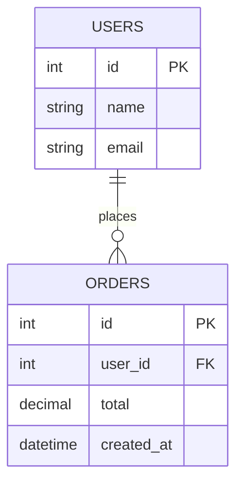

## Definition

SQL (Structured Query Language) is the standard language for interacting with **relational databases** — systems that store data in structured tables with predefined schemas, and support powerful querying across related tables via joins. "SQL database" and "relational database" are used near-interchangeably in casual conversation.

## Why it exists

Early database systems had no standard way to query structured data, forcing custom, low-level code for even simple lookups. SQL, developed at IBM in the 1970s based on E.F. Codd's relational model, exists to give a declarative, standardized way to describe *what* data you want, letting the database figure out *how* to retrieve it efficiently.

## The problem it solves

Without a relational model and a standard query language, every application would need custom code to enforce data structure, relationships, and consistency rules — and every database vendor would have incompatible ways of expressing even a simple query. SQL standardizes both the data model (tables, rows, columns, foreign keys) and the query interface across (mostly) all relational database vendors.

## Real-world analogy

A SQL database is like a set of precisely organized filing cabinets, where every drawer (table) has clearly labeled columns, and cross-references between drawers (foreign keys) are explicit and enforced — you can't file an "order" folder that references a "customer" who doesn't exist, because the filing system itself won't allow it. This structural rigor is exactly the trade-off relational databases make.

## Simple explanation

Data lives in **tables** (rows and columns), tables can be related to each other via **foreign keys**, and SQL lets you query, join, filter, and aggregate across these related tables in a single, declarative statement.

## Technical explanation

### Core building blocks

- **Table**: a structured collection of rows, each with the same set of typed columns.
- **Primary key**: a column (or set of columns) uniquely identifying each row.
- **Foreign key**: a column referencing a primary key in another table, enforcing relational integrity.
- **Join**: combining rows from multiple tables based on a related column.

```sql
SELECT users.name, orders.total
FROM users
JOIN orders ON orders.user_id = users.id
WHERE orders.created_at > '2026-01-01';
```

### Schema enforcement

Relational databases enforce a fixed schema — every row in a table must conform to the same column structure and types, and constraints (foreign keys, uniqueness, not-null) are enforced by the database itself, not left to application code to get right every time.

## Internal working



The database engine uses **indexes** (see [Indexing](/docs/databases/indexing)) to avoid scanning entire tables for lookups, and a **query planner** decides the most efficient way to execute a given SQL statement (which indexes to use, which order to join tables in) — a significant part of what makes relational databases powerful, since the developer just states *what* they want, not the exact retrieval algorithm.

## Advantages

- Strong data integrity guarantees — foreign keys, constraints, and [ACID](/docs/databases/acid) transactions prevent large classes of data corruption at the database level, not just in application code.
- Powerful, flexible querying — joins across many related tables in a single, declarative statement.
- Mature, well-understood technology with decades of tooling, documentation, and operational experience behind it.

## Disadvantages

- A fixed schema means structural changes (adding a column, changing a relationship) require explicit migrations, which can be slower-moving than schema-less alternatives.
- Horizontal scaling (sharding across many machines) is harder for relational databases than for many NoSQL systems specifically designed around it from the start — see [Sharding](/docs/databases/sharding).
- Complex joins across very large tables can become a performance bottleneck at high scale if not carefully indexed and optimized.

## Trade-offs

Relational databases trade some flexibility and horizontal scaling ease for strong consistency guarantees and powerful relational querying — the right trade for data with clear structure and relationships where correctness matters (financial records, order systems), and sometimes an unnecessary constraint for less structured or extremely high-scale data (see [NoSQL](/docs/databases/nosql)).

## Complexity considerations

A single relational database instance, for moderate scale, is operationally simple and well understood. Scaling a relational database horizontally (sharding writes across many machines) is one of the harder problems in system design — many teams reach for read replicas and vertical scaling first, and only shard when truly necessary.

## When to use

- Data with clear structure and relationships that benefit from enforced integrity (foreign keys, constraints) — orders, financial transactions, inventory, most traditional business applications.
- Workloads needing complex queries across multiple related entities.

## When NOT to use (or not exclusively)

- Extremely high write-throughput workloads needing horizontal scale from day one, where a NoSQL system designed around sharding might fit more naturally.
- Data without a clear, stable schema (highly variable or nested document structures) — a document database may be a more natural fit.

## Common mistakes

- Not indexing columns used in frequent WHERE/JOIN conditions, leading to full table scans and poor performance as data grows.
- Over-normalizing to the point where simple queries require many joins, hurting read performance for read-heavy workloads (see [Denormalization](/docs/databases/denormalization)).
- Assuming a relational database can't scale — it can, significantly, via read replicas, caching, and (when truly needed) sharding, though each adds real complexity.

## Interview questions

- "Why might you choose a relational database over a NoSQL store for this use case?"
- "How would you scale a relational database's read throughput? Its write throughput?"
- "What database-level guarantees does a foreign key constraint actually provide?"

## Practical example

An e-commerce order system uses a relational database specifically because orders, customers, products, and payments have clear, enforced relationships — a foreign key constraint prevents an order from ever referencing a nonexistent customer, a guarantee that would otherwise require careful, error-prone application-level checks.

## Production example

Stripe, handling enormous volumes of financial transaction data where correctness is paramount, has spoken publicly about their heavy reliance on relational databases (specifically a heavily sharded Postgres architecture) precisely because of the strong consistency and integrity guarantees financial data demands.

## Best practices

- Index columns used in frequent lookups, filters, and joins.
- Use foreign keys and constraints to enforce data integrity at the database level, not just in application code.
- Consider read replicas before reaching for sharding, since replicas solve read-scaling with far less complexity.

## Summary

SQL and the relational model organize data into structured, related tables with enforced integrity constraints, queried via a powerful declarative language. Relational databases are the right default for data with clear structure and relationships where correctness matters, though horizontal write scaling requires deliberate additional work (sharding) compared to some NoSQL alternatives designed around it from the start.

## References

- Codd, E.F., "A Relational Model of Data for Large Shared Data Banks" (1970)
- Designing Data-Intensive Applications, Martin Kleppmann (Ch. 2-3)

<Quiz questions={[
  {
    q: "What does a foreign key constraint enforce?",
    options: [
      "That a column's data is encrypted",
      "That a value in one table must correspond to an existing value in another table, preventing orphaned or invalid references",
      "That a table can only have one row",
      "That queries run faster"
    ],
    answer: 1,
    explanation: "A foreign key ties a column's value to a primary key in another table, and the database enforces this relationship — preventing, for example, an order from referencing a customer ID that doesn't actually exist."
  }
]} />
