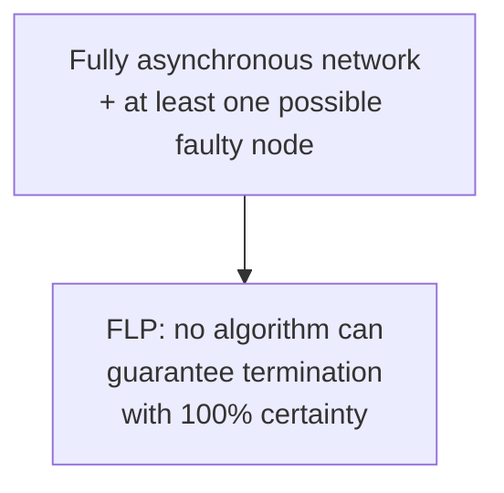

## Definition

Consensus, in distributed systems, is the formal problem of getting multiple nodes to agree on a single value, satisfying three properties: **agreement** (all correct nodes decide the same value), **validity** (the decided value was actually proposed by some node), and **termination** (every correct node eventually decides). See [Consensus Basics](/docs/databases/consensus-basics) for the practical, majority-quorum mechanics; this page focuses on the formal problem statement and its theoretical limits.

## Why it exists

Distributed agreement shows up constantly — which node is the leader, whether a transaction committed, what the next entry in a replicated log is — and formalizing exactly what "successfully reaching agreement" means (and proving what's achievable) turns a vague, intuitive goal into a rigorously analyzable problem, letting researchers prove both what's possible and what fundamentally isn't.

## The problem it solves

Without a formal definition, it's easy to build a consensus-like mechanism that seems to work in testing but has a subtle correctness gap that only shows up under specific, rare failure conditions in production. Formalizing consensus's exact requirements lets algorithms be rigorously proven correct (or shown incorrect) against precise, unambiguous criteria, rather than relying on informal confidence.

## Real-world analogy

Imagine a jury asked to reach a unanimous verdict: **agreement** means every juror must reach the same verdict; **validity** means the verdict must actually be one of the arguments presented in the case (not something nobody argued for); **termination** means the jury must eventually reach a verdict, not deliberate forever. A "consensus algorithm" for a jury is the specific deliberation process (discussion rules, tie-breaking procedures) that guarantees all three properties hold, even if some jurors are stubborn, absent, or miscommunicate.

## Simple explanation

Consensus asks: can a group of nodes, some of which might fail or be slow, and which communicate over a network that can delay or lose messages, always agree on a single value, correctly, and eventually? The surprising, rigorously proven answer: not always — under specific conditions, it's provably impossible to guarantee all three properties simultaneously.

## Technical explanation

### The FLP impossibility result

The Fischer-Lynch-Paterson (FLP) result, proven in 1985, shows that in a fully **asynchronous** system (no bound at all on message delay or processing time) with even a single faulty node, no algorithm can guarantee consensus with certainty in finite time — there's always some possible sequence of events that prevents termination.

<Callout type="note" title="This doesn't mean consensus is useless in practice">
FLP is a worst-case theoretical result about a fully asynchronous model with zero timing assumptions at all. Real-world systems (Raft, Paxos, ZooKeeper) work around this by using practical timeouts and randomization (e.g. randomized election timeouts) — they don't violate FLP's proof, but they achieve termination with overwhelming practical probability under realistic network conditions, even though a theoretical worst-case scenario (extremely unlikely in practice) could still delay termination indefinitely.
</Callout>

## Internal working — how real algorithms work around FLP in practice

Real consensus algorithms like [Raft](/docs/distributed-systems/raft) and [Paxos](/docs/distributed-systems/paxos) achieve termination in practice by assuming a **partially synchronous** model — the network isn't fully synchronous (no guaranteed bounds on message delay always hold), but in practice, message delays are usually bounded most of the time, and algorithms use techniques like randomized timeouts specifically to avoid the pathological worst-case scenarios FLP describes, making termination overwhelmingly likely rather than mathematically guaranteed in every conceivable scenario.

## Advantages of formalizing consensus this way

- Enables rigorous proofs of correctness (or identification of flaws) for consensus algorithms, rather than relying on informal testing and confidence.
- The FLP result itself is valuable precisely because it tells system designers what's fundamentally *not* achievable, preventing wasted effort chasing an impossible guarantee.

## Disadvantages / practical implications

- Real systems must accept that, in rare, pathological network conditions, consensus-based operations can be delayed indefinitely (though this is extremely rare in well-designed practical systems) — a genuine, if unlikely, availability consideration.
- Achieving even the practical, partially-synchronous version of consensus requires real coordination overhead (majority quorums, multiple round trips) compared to a naive, unsafe single-node decision.

## Trade-offs

Consensus trades some availability (per [CAP theorem](/docs/fundamentals/cap-theorem), consensus-based systems are inherently CP) and coordination overhead for a strong, well-defined correctness guarantee — the right trade for genuinely critical coordination decisions, and unnecessary overhead for data that could tolerate a weaker, eventually-consistent model instead.

## Complexity considerations

Understanding consensus at the level of "why is this provably hard" (FLP) is valuable background for any distributed systems work, even though most practitioners will use a mature, existing implementation (Raft-based etcd, ZooKeeper) rather than implementing a consensus algorithm from first principles.

## When it matters

- Any system genuinely needing strong, rigorously guaranteed agreement — leader election, distributed locking, and coordinating critical shared state across a cluster.

## When it's overkill

- Data or decisions that can tolerate eventual consistency instead — using full consensus where a simpler, eventually-consistent mechanism (like a [Gossip Protocol](/docs/distributed-systems/gossip-protocol)) would suffice adds unnecessary latency and availability constraints.

## Common mistakes

- Assuming a from-scratch, informally-tested "consensus-like" mechanism is actually correct, without understanding the formal properties (agreement, validity, termination) it needs to rigorously satisfy.
- Misunderstanding FLP as meaning "consensus is impossible in practice" — it's a specific, narrow theoretical result about fully asynchronous worst-case conditions, not a statement that real, practical systems like Raft and Paxos don't work.
- Reaching for full consensus for coordination needs that could be solved more simply and with better availability using eventual consistency instead.

## Interview questions

- "What three properties must a correct consensus algorithm satisfy?"
- "What does the FLP impossibility result actually say, and why doesn't it mean systems like Raft don't work in practice?"
- "Why is consensus inherently a CP (not AP) approach, in CAP theorem terms?"

## Practical example

A distributed configuration store (like etcd) needs genuine consensus among its nodes to guarantee that a configuration update is durably and consistently agreed upon before being considered committed — using a Raft-based implementation that achieves practical termination via randomized timeouts, rather than a simpler, informally-designed mechanism that might have subtle correctness gaps under specific failure conditions.

## Production example

Google's Chubby lock service and Apache ZooKeeper (both widely used foundational coordination services) are built on formally analyzed consensus algorithms (Paxos and Zab, respectively) specifically because the strong, rigorously proven correctness guarantees matter enormously for the critical coordination responsibilities (locking, configuration, leader election) these systems support across the infrastructure that depends on them.

## Best practices

- Use mature, formally analyzed consensus implementations (Raft-based etcd, ZooKeeper) rather than attempting an informal, from-scratch consensus mechanism.
- Reserve full consensus specifically for coordination needs genuinely requiring strong, agreed-upon correctness — not as a default mechanism for all distributed state.
- Understand FLP's actual scope (a specific theoretical worst case) rather than over- or under-interpreting what it implies about real-world system reliability.

## Summary

Consensus formally requires agreement, validity, and termination among distributed nodes — properties proven, via the FLP impossibility result, to be unachievable with absolute certainty in a fully asynchronous system with even one potentially faulty node. Real systems (Raft, Paxos) work around this using partially-synchronous assumptions and randomized timeouts, achieving termination with overwhelming practical reliability rather than a mathematical 100% guarantee — a nuance worth understanding even though most practitioners rely on existing, mature implementations rather than building consensus algorithms from scratch.

## References

- Fischer, Lynch, Paterson, "Impossibility of Distributed Consensus with One Faulty Process" (1985)
- Lamport, L. "The Part-Time Parliament" (Paxos, 1998)

<Quiz questions={[
  {
    q: "What does the FLP impossibility result actually prove?",
    options: [
      "That consensus algorithms like Raft don't work in real systems",
      "That in a fully asynchronous system with even one potentially faulty node, no algorithm can guarantee consensus termination with absolute certainty",
      "That consensus is only possible with exactly 3 nodes",
      "That consensus requires synchronized physical clocks"
    ],
    answer: 1,
    explanation: "FLP is a specific theoretical result about the worst case in a fully asynchronous model — it doesn't mean practical algorithms like Raft and Paxos fail in real deployments, since they use partially synchronous assumptions and techniques like randomized timeouts to achieve termination with overwhelming practical reliability."
  }
]} />
