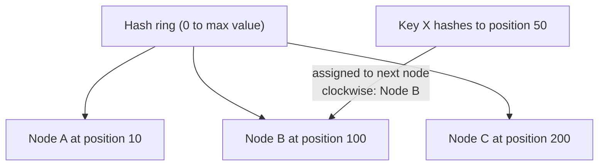
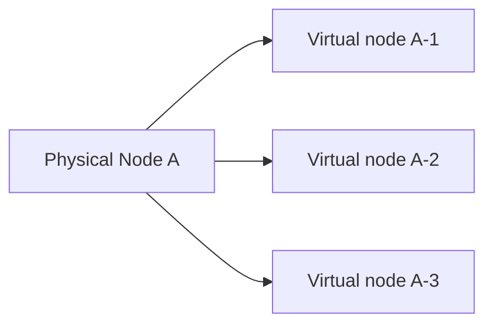

## Definition

Consistent hashing is a technique for distributing keys (data, requests) across a set of nodes such that when a node is added or removed, only a small, proportional fraction of keys need to be remapped — unlike naive hashing schemes, where changing the number of nodes remaps nearly everything.

## Why it exists

A naive approach to distributing data across N nodes — `hash(key) % N` — works fine until N changes. The moment a node is added or removed, N changes, and because the modulo result depends directly on N, almost every key's assigned node changes too, causing massive, unnecessary data movement. Consistent hashing exists specifically to avoid this, by decoupling key placement from the exact current node count.

## The problem it solves

In systems where nodes are added or removed reasonably often (scaling up, scaling down, node failures being replaced), naive modulo-based hashing causes a storm of data movement on every single change — hugely expensive and disruptive at scale. Consistent hashing solves this by ensuring that changing the number of nodes only requires remapping approximately `1/N` of the keys, not nearly all of them.

## Real-world analogy

Imagine seating guests at numbered tables by `hash(guest name) % number_of_tables` — if you add one more table, nearly every single guest's assigned table number changes, because the modulo result shifts for almost everyone. Consistent hashing instead is like placing guests and tables together around a single large circular arrangement — adding one more table only affects the guests immediately next to where that new table was inserted, leaving everyone else's seat unchanged.

## Simple explanation

Both nodes and keys are placed onto a conceptual "ring" (a circular hash space) using the same hash function. A key is assigned to the first node found by moving clockwise around the ring from the key's position. Adding or removing a node only affects the small portion of keys between it and its neighbors on the ring — everything else stays exactly where it was.

## Technical explanation

When a new node is added to the ring (say, between Node A and Node B), only the keys that fall in that specific range need to move to the new node — keys elsewhere on the ring, assigned to Node B or Node C, are entirely unaffected.

### Virtual nodes

A practical refinement: rather than placing each physical node at just one position on the ring, each physical node is represented by many "virtual nodes" scattered around the ring. This spreads a physical node's share of the keyspace more evenly (avoiding one physical node unluckily owning a disproportionately large or small arc of the ring) and makes rebalancing smoother when nodes are added or removed.

## Internal working — rebalancing when a node is added

Only the keys between the new node's position and its immediate predecessor need to move — everything else on the ring remains assigned exactly as before, a dramatic improvement over naive modulo hashing's "remap almost everything" behavior.

## Advantages

- Minimizes data movement when nodes are added or removed — only a proportional fraction of keys need to move, not nearly all of them.
- Enables smoother, less disruptive horizontal scaling and graceful handling of node failures in distributed caches, databases, and load distribution systems.
- Virtual nodes help distribute load more evenly across physical nodes of varying capacity.

## Disadvantages

- More conceptually complex to implement correctly than naive modulo hashing.
- Without virtual nodes, a poorly distributed ring can still create uneven load across physical nodes.
- Some implementations require careful handling of the ring's metadata (which nodes are at which positions) being consistently known across the whole system.

## Trade-offs

Consistent hashing trades some implementation complexity for dramatically reduced data movement during scaling events — a trade that's essentially always worth making for any system where nodes are added or removed with any regularity, and largely why it's the standard approach in modern distributed caches and databases rather than naive modulo hashing.

## Complexity considerations

Implementing consistent hashing correctly (including virtual nodes for even distribution) requires more upfront design than naive hashing, but is well-documented and available in mature libraries and built directly into many distributed systems — rarely something a team needs to implement entirely from scratch today.

## When to use

- Any distributed cache, database, or load distribution system expected to scale (add/remove nodes) over its lifetime — which describes essentially any production distributed system at meaningful scale.

## When simpler approaches might be acceptable

- Systems with a genuinely fixed, essentially never-changing number of nodes, where naive modulo hashing's rebalancing cost is a non-issue since rebalancing essentially never happens.

## Common mistakes

- Using naive modulo hashing (`hash(key) % N`) for a system that will need to scale its node count over time, causing unnecessary, disruptive data movement on every single scaling event.
- Not using virtual nodes, leading to uneven load distribution across physical nodes if the ring happens to place them unevenly.
- Assuming consistent hashing eliminates rebalancing entirely — it minimizes it significantly, but some data movement (proportional to the change) is still expected and normal.

## Interview questions

- "Why does naive `hash(key) % N` hashing cause so much more data movement than consistent hashing when N changes?"
- "What problem do virtual nodes solve in a consistent hashing implementation?"
- "How would you design a distributed cache to minimize disruption when scaling the number of cache nodes?"

## Practical example

A distributed cache (like [Memcached](/docs/caching/memcached)) commonly uses client-side consistent hashing to determine which cache server holds a given key — when a new cache server is added to the cluster, only the small fraction of keys that now map to the new server need to be re-fetched from the origin on their next request, rather than the entire cache being effectively invalidated.

## Production example

Amazon's Dynamo paper, and its descendants (Cassandra, DynamoDB), popularized consistent hashing specifically to support smooth horizontal scaling and graceful node failure handling across large, dynamic clusters, without the massive rebalancing cost naive hashing would impose.

## Best practices

- Use consistent hashing (rather than naive modulo hashing) for any distributed system expected to scale its node count over time.
- Use virtual nodes to ensure more even load distribution across physical nodes of potentially varying capacity.
- Rely on mature, existing implementations or libraries rather than building consistent hashing entirely from scratch, given the subtlety of getting the details (like virtual node placement) right.

## Summary

Consistent hashing places both nodes and keys onto a shared hash ring, so that adding or removing a node only requires remapping a small, proportional fraction of keys — a dramatic improvement over naive modulo hashing, which remaps nearly everything on any change to the node count. It's the standard technique underlying modern distributed caches and databases that need to scale smoothly and handle node failures gracefully.

## References

- Karger et al., "Consistent Hashing and Random Trees" (1997, the original paper)
- DeCandia et al., "Dynamo: Amazon's Highly Available Key-value Store" (2007)

<Quiz questions={[
  {
    q: "What problem do 'virtual nodes' solve in a consistent hashing implementation?",
    options: [
      "They eliminate the need for a hash function entirely",
      "They help distribute load more evenly across physical nodes by representing each physical node at many positions on the ring, rather than just one",
      "They prevent any node from ever failing",
      "They are unrelated to consistent hashing"
    ],
    answer: 1,
    explanation: "Without virtual nodes, a single physical node placed at just one ring position might unluckily own a disproportionately large or small arc of the keyspace; representing each physical node with many virtual nodes scattered around the ring smooths out this distribution."
  }
]} />
