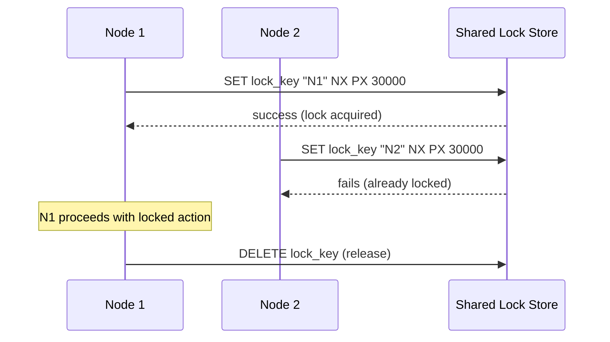

## Definition

A distributed lock is a coordination mechanism that ensures only one node (out of many, in a distributed system) can perform a particular action or access a particular resource at a time — the distributed equivalent of a mutex, but working across independent machines communicating over an unreliable network.

## Why it exists

Some operations must genuinely happen only once, or only by one node at a time, even in a system with many nodes running the same code — a scheduled job that should only run on one instance, or a critical section of code that must not be executed by two nodes concurrently. Distributed locking exists to provide this "only one at a time" guarantee across machines, not just within a single process.

## The problem it solves

Without coordination, if multiple instances of the same service independently try to perform an action meant to happen only once (like processing a specific batch job), they might both start it simultaneously, causing duplicated work or, worse, actual data corruption if the action isn't idempotent. Distributed locking solves this by giving nodes a reliable way to determine, across the whole cluster, who currently "holds the lock" and is therefore allowed to proceed.

## Real-world analogy

A single bathroom key shared among several offices on a floor — only whoever currently holds the physical key can use the bathroom, and everyone else must wait until it's returned. A distributed lock is exactly this key concept, applied to a critical section of code or resource shared across multiple machines instead of a physical room.

## Simple explanation

A node wanting to perform a locked action first attempts to acquire the distributed lock (typically by writing a specific value to a shared, coordinated store); if it succeeds, it proceeds and releases the lock afterward; if another node already holds the lock, it must wait (or fail, depending on design) until the lock becomes available.

## Technical explanation

### A common implementation pattern (using Redis as an example)

```
SET lock_key "node_id" NX PX 30000
```

This attempts to set `lock_key` only if it doesn't already exist (`NX` — "not exists"), with an automatic expiry (`PX 30000` — 30 seconds) as a safety net in case the lock holder crashes without releasing it explicitly.



## Internal working — the subtle failure modes

Distributed locking is genuinely tricky to get right, because of specific failure modes a naive implementation misses:

- **Lock expiry vs. actual completion time**: if a node holding the lock is slow (e.g. due to a garbage collection pause) and takes longer than the lock's expiry to finish its work, the lock can expire and be acquired by a second node — now *two* nodes believe they're the only one performing the locked action, defeating the entire purpose.
- **Clock skew across nodes**: distributed locks relying on wall-clock time for expiry can behave inconsistently if different nodes' clocks aren't well synchronized.

<Callout type="warning" title="A naive lock isn't automatically safe">
A distributed lock implementation that looks correct at first glance can still have a window where two nodes both believe they hold the lock, specifically due to timing issues like the ones above. Production-grade implementations (like the Redlock algorithm for Redis, though itself debated in the distributed systems community) attempt to address these edge cases explicitly — this is not a place to improvise a custom implementation without carefully considering these failure modes.
</Callout>

## Advantages

- Provides a genuine "only one at a time" guarantee across a distributed system, preventing duplicated work or unsafe concurrent access to a shared resource.
- Enables safe coordination of scheduled/singleton jobs across a horizontally scaled fleet of otherwise identical instances.

## Disadvantages

- Genuinely subtle to implement correctly — naive implementations can fail exactly in the scenario they're meant to prevent (two nodes both believing they hold the lock).
- Introduces a new critical dependency (the lock store itself) that must be highly available, or the locking mechanism becomes a new bottleneck or single point of failure.
- Adds real latency to any operation that needs to acquire a lock before proceeding.

## Trade-offs

Distributed locking trades some latency and genuine implementation complexity for a strong mutual-exclusion guarantee across machines — necessary for operations that truly can't tolerate concurrent execution, and unnecessary overhead for operations that are naturally idempotent or don't actually need this guarantee.

## Complexity considerations

Implementing distributed locking correctly, accounting for clock skew, process pauses, and network partitions, is one of the genuinely hard problems in distributed systems — closely related to [Consensus](/docs/databases/consensus-basics). Using a mature, well-tested coordination service (like ZooKeeper or etcd, both built on proven consensus algorithms) is strongly preferred over a custom, from-scratch implementation.

## When to use

- Ensuring a scheduled job runs on exactly one instance across a horizontally scaled fleet.
- Coordinating safe access to a genuinely non-idempotent shared resource that must not be concurrently modified by multiple nodes.

## When NOT to use

- Operations that are naturally idempotent or safe under concurrent execution — adding distributed locking here is unnecessary overhead and complexity for no real benefit.

## Common mistakes

- Implementing a custom distributed lock without carefully considering clock skew, process pause, and network partition edge cases — a common source of subtle, hard-to-reproduce production bugs.
- Setting a lock's expiry (TTL) too short relative to the actual time needed to complete the locked operation, risking the lock expiring and being acquired by a second node while the first is still legitimately working.
- Using distributed locking where the operation could instead simply be made idempotent, avoiding the need for coordination entirely.

## Interview questions

- "What can go wrong with a naive distributed lock implementation if the lock holder is unexpectedly slow?"
- "Why is using an existing, mature coordination service (like ZooKeeper or etcd) generally preferred over implementing distributed locking from scratch?"
- "How would you ensure a scheduled batch job runs on exactly one instance across a horizontally scaled fleet?"

## Practical example

A horizontally scaled fleet of application servers all run the same scheduled job code, but only one instance should actually execute a specific nightly batch job — each instance attempts to acquire a distributed lock (via Redis or a dedicated coordination service) before running the job, ensuring only the one that successfully acquires the lock actually proceeds, while the others skip it for that run.

## Production example

Systems like ZooKeeper and etcd, both built on proven consensus algorithms, are widely used specifically to provide reliable distributed locking primitives — Kubernetes itself relies on etcd-based coordination for various cluster-management locking needs, rather than implementing custom locking logic.

## Best practices

- Use a mature, existing coordination service (ZooKeeper, etcd, or a well-reviewed library like Redlock for Redis) rather than implementing distributed locking from scratch.
- Set lock expiry times with real margin above the expected completion time of the locked operation, and consider extending the lock's expiry dynamically if the operation is taking longer than expected.
- Prefer making an operation idempotent over adding distributed locking, whenever that's a viable alternative — it avoids the coordination overhead and subtle failure modes entirely.

## Summary

Distributed locking ensures only one node in a distributed system performs a particular action at a time, providing the distributed equivalent of a mutex across independent machines. It's genuinely subtle to implement correctly, given clock skew, process pause, and network partition edge cases that can silently break the "only one at a time" guarantee — strongly favoring the use of mature, existing coordination services over custom implementations.

## References

- Kleppmann, M. "How to do distributed locking" (critique of naive Redlock implementations)
- Apache ZooKeeper documentation

<Quiz questions={[
  {
    q: "Why can a distributed lock's expiry (TTL) actually cause the exact problem it's meant to prevent, in some scenarios?",
    options: [
      "TTLs never cause any problems with distributed locks",
      "If the lock holder is unexpectedly slow (e.g. a garbage collection pause) and takes longer than the TTL, the lock can expire and be acquired by a second node while the first still believes it holds it exclusively",
      "TTLs are not supported by any distributed lock implementation",
      "This only happens if the lock store itself crashes"
    ],
    answer: 1,
    explanation: "If a node holding a distributed lock is slower than expected (due to a pause, network delay, etc.), its lock can expire based on its TTL and be acquired by a different node — resulting in two nodes both believing they exclusively hold the lock, exactly the failure mode distributed locking is meant to prevent."
  }
]} />
