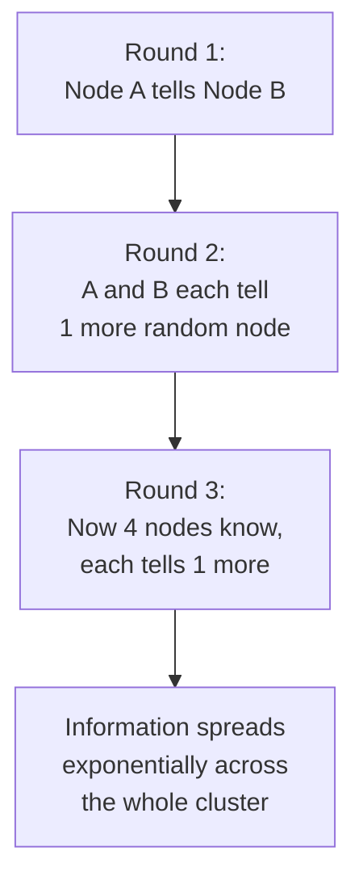

## Definition

A gossip protocol (also called epidemic protocol) is a decentralized method for spreading information across a distributed system, where each node periodically shares what it knows with a small number of randomly chosen other nodes — similar to how a rumor spreads through a population, without any central coordinator.

## Why it exists

Some information (cluster membership, node health status, configuration changes) needs to eventually reach every node in a potentially large, dynamic cluster, but a centralized broadcaster telling every node directly becomes a bottleneck and single point of failure as the cluster grows. Gossip protocols exist to spread information reliably and eventually to the whole cluster, without any single node needing to know about (or communicate directly with) every other node.

## The problem it solves

Centralized approaches to information dissemination (one coordinator directly informing every node) don't scale well to very large or highly dynamic clusters, and create a single point of failure. Gossip protocols solve this by having information spread peer-to-peer, exponentially, the same way a rumor or an epidemic spreads through a population — reaching the entire cluster reasonably quickly without any centralized coordination or bottleneck.

## Real-world analogy

A rumor spreading through a large office doesn't require one person individually telling every single employee — person A tells two colleagues, each of whom tells two more, and within a surprisingly small number of "rounds," nearly everyone in the building has heard it, purely through this random, peer-to-peer, exponential spread — with no central announcement system involved at all.

## Simple explanation

Each node periodically picks a small number of random other nodes and exchanges information with them (what it currently knows about cluster state, node health, etc.). Over successive rounds, information spreads exponentially through the cluster, eventually reaching every node — without any single node needing a complete, centrally coordinated view from the start.

## Technical explanation

This exponential spread is what makes gossip protocols scale so well — the number of "informed" nodes roughly doubles each round, meaning even very large clusters converge to full information dissemination in a relatively small number of rounds (logarithmic in cluster size).

## Internal working — eventual consistency by design

Gossip protocols are inherently **eventually consistent** — there's no guarantee that all nodes have the exact same view of cluster state at any given instant, only that they'll converge to the same view given enough rounds without new changes. This makes gossip protocols a natural fit for the kind of loosely consistent, highly available coordination needs common in large distributed systems (see [BASE](/docs/databases/base) and [PACELC](/docs/fundamentals/pacelc)).

## Advantages

- Scales very well to large, dynamic clusters — no centralized coordinator or bottleneck.
- Naturally resilient to individual node failures — since information spreads redundantly through many random paths, no single node's failure prevents overall convergence.
- Simple, decentralized design with no single point of failure for the dissemination mechanism itself.

## Disadvantages

- Only eventually consistent — there's no guarantee about exactly when all nodes will have converged to the same view, only that they eventually will (absent further changes).
- Some redundant communication overhead, since the same information may be exchanged multiple times between nodes as it spreads.
- Not suitable for information needing immediate, guaranteed consistency across all nodes — a different mechanism (like [Consensus](/docs/databases/consensus-basics)) is needed for that.

## Trade-offs

Gossip protocols trade immediate, guaranteed consistency for excellent scalability and resilience with minimal coordination overhead — the right fit for information that can tolerate eventual, rather than immediate, consistency (cluster membership, health status), and the wrong fit for decisions genuinely requiring strong, immediate agreement (which needs consensus instead).

## Complexity considerations

The core gossip mechanism (periodically exchanging state with random peers) is conceptually simple, though production implementations need to carefully handle details like how to efficiently encode and compare state to avoid excessive redundant data transfer as cluster size grows.

## When to use

- Disseminating cluster membership information (which nodes are currently part of the cluster) and node health/failure detection across large, dynamic clusters.
- Any information where eventual (not immediate) consistency across the cluster is acceptable, and avoiding a centralized coordination bottleneck is valuable.

## When NOT to use

- Decisions genuinely requiring strong, immediate consensus (like leader election or committing a transaction) — gossip's eventual consistency isn't strong enough for these; use a proper consensus protocol instead.

## Common mistakes

- Using gossip for information that actually needs strong, immediate consistency guarantees, when a consensus-based approach is what's actually required.
- Not accounting for the (usually small, but non-zero) propagation delay before all nodes have converged to a consistent view, in application logic that assumes immediate cluster-wide consistency.

## Interview questions

- "Why does gossip protocol information spread scale so well to very large clusters?"
- "What's the difference between the consistency guarantees gossip protocols provide versus a consensus protocol like Raft?"
- "When would you choose a gossip protocol over a centralized broadcast mechanism for spreading cluster membership information?"

## Practical example

A large distributed cache cluster uses a gossip protocol to let each node maintain an eventually-consistent view of which other nodes are currently part of the cluster and healthy — new nodes joining, or nodes failing, propagate through the cluster via gossip within a small number of rounds, without any single centralized membership service needing to directly track and broadcast every change to every node.

## Production example

Amazon's Dynamo, and Cassandra (which draws heavily from Dynamo's design), both use gossip protocols specifically for cluster membership and failure detection — letting each node maintain a reasonably current view of cluster state without a centralized coordinator, fitting naturally with these systems' broader [BASE](/docs/databases/base)-oriented, availability-favoring design philosophy.

## Best practices

- Use gossip protocols specifically for information that can tolerate eventual consistency, particularly cluster membership and health status.
- Use a proper consensus protocol instead for decisions genuinely requiring strong, immediate, agreed-upon guarantees.
- Design application logic to account for gossip's inherent propagation delay, rather than assuming instantaneous cluster-wide consistency.

## Summary

Gossip protocols spread information across a distributed cluster through random, peer-to-peer exchanges, achieving exponential, decentralized propagation without any centralized coordinator or bottleneck — at the cost of only eventual (not immediate) consistency across the cluster. They're an excellent fit for disseminating cluster membership and health information at scale, and the wrong tool for decisions genuinely requiring strong, immediate consensus.

## References

- Demers et al., "Epidemic Algorithms for Replicated Database Maintenance" (1987, foundational gossip protocol paper)
- DeCandia et al., "Dynamo: Amazon's Highly Available Key-value Store" (2007)

<Quiz questions={[
  {
    q: "Why do gossip protocols scale so well to very large, dynamic clusters?",
    options: [
      "They require a single, powerful central coordinator",
      "Information spreads exponentially through random peer-to-peer exchanges, converging across the whole cluster in a relatively small number of rounds without any centralized bottleneck",
      "Gossip protocols only work for small clusters of under 10 nodes",
      "They guarantee immediate consistency across all nodes simultaneously"
    ],
    answer: 1,
    explanation: "Because each round of gossip roughly doubles the number of informed nodes (similar to how a rumor spreads exponentially through a population), full cluster-wide dissemination happens in a relatively small, logarithmic number of rounds relative to cluster size, without requiring any single coordinating node."
  }
]} />
