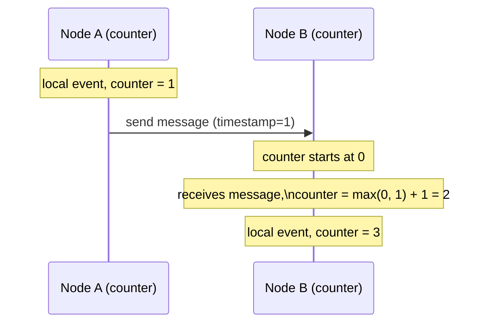

## Definition

A Lamport clock (or Lamport timestamp) is a simple logical clock algorithm that assigns a monotonically increasing counter to events across a distributed system, establishing a consistent partial ordering of events (specifically, a "happens-before" relationship) without requiring synchronized physical clocks across machines.

## Why it exists

Physical clocks on different machines are never perfectly synchronized — even with protocols like NTP, small discrepancies (clock skew) exist, and network delays make it genuinely ambiguous which of two events on different machines "really" happened first based on wall-clock timestamps alone. Lamport clocks exist to sidestep this problem entirely, using a simple logical counting rule instead of physical time to establish a meaningful, consistent ordering.

## The problem it solves

In a distributed system, determining "did event A happen before event B" is surprisingly non-trivial when A and B occur on different machines — physical clock timestamps can be misleading due to clock skew, and even a perfectly synchronized clock can't capture the causal relationship (did A's outcome actually influence B?) that often matters more than raw wall-clock time. Lamport clocks solve this by defining an ordering based on logical causality (message passing) rather than physical time.

## Real-world analogy

Imagine a group of people in different rooms passing notes to coordinate a project, each keeping their own personal running count of "how many relevant things have happened so far, from my perspective" and always including that count when they send a note. If someone receives a note with a count higher than their own, they update their own count to be ahead of it — ensuring that anything they do *after* receiving that note is logically recorded as happening after it, even if their personal counts (like separate wall clocks) aren't otherwise synchronized to any single global "true time."

## Simple explanation

Each node maintains a simple counter. Before any local event, the node increments its counter. When sending a message, it includes its current counter value. When receiving a message, the receiver sets its own counter to `max(local counter, received counter) + 1` — ensuring the timestamp of any event that could have been causally influenced by a received message is always greater than that message's timestamp.

## Technical explanation

### The Lamport clock rule

This simple rule guarantees: if event A happened-before event B (either on the same node, or via a chain of message passing), then A's Lamport timestamp is strictly less than B's. The reverse isn't necessarily true — two events with different timestamps might not actually be causally related at all, just coincidentally numbered differently.

## Internal working — what Lamport clocks can't tell you

Lamport clocks establish a **total order** (every event gets a distinct number, and they can all be sorted), but this ordering doesn't necessarily reflect true causality for events that are genuinely **concurrent** (neither happened-before the other) — Lamport clocks will still assign them some definite relative order, even though no real causal relationship exists between them. This is exactly the limitation that [Vector Clocks](/docs/distributed-systems/vector-clocks) address, by explicitly detecting true concurrency rather than just providing an arbitrary total order.

## Advantages

- Extremely simple to implement — just a counter and one update rule.
- Provides a consistent, meaningful way to order events without needing synchronized physical clocks.
- Sufficient for many use cases that just need *some* consistent global ordering, without needing to distinguish true concurrency from causal ordering.

## Disadvantages

- Can't distinguish genuinely concurrent (unrelated) events from causally ordered ones — it imposes a total order even on events that have no real causal relationship, which can be misleading if that distinction actually matters for a specific use case.
- Doesn't capture the full causal history — just a single number, not which specific events causally preceded a given one.

## Trade-offs

Lamport clocks trade full causal precision (which [Vector Clocks](/docs/distributed-systems/vector-clocks) provide, at the cost of more overhead) for extreme simplicity — the right choice when you just need *a* consistent ordering of events, and vector clocks are the better choice when you specifically need to detect true concurrency (e.g. for conflict detection in [Multi-leader](/docs/databases/multi-leader) replication).

## Complexity considerations

Lamport clocks are about as simple as a distributed ordering mechanism can be — a single counter and a max+1 update rule, with no additional per-node state beyond that single number.

## When to use

- Any distributed system needing a simple, consistent way to order events without relying on (imperfectly) synchronized physical clocks, and where distinguishing true concurrency from an arbitrary total order isn't specifically required.

## When to use vector clocks instead

- Systems needing to explicitly detect concurrent (conflicting) writes, such as [Multi-leader](/docs/databases/multi-leader) replication's conflict resolution needs.

## Common mistakes

- Assuming a Lamport clock timestamp difference implies actual causal influence between two events, when they might simply be unrelated, concurrent events that happened to receive different numbers.
- Using Lamport clocks where the specific goal is detecting true concurrency for conflict resolution — vector clocks are the more appropriate tool for that specific need.

## Interview questions

- "How does a Lamport clock establish event ordering without relying on synchronized physical clocks?"
- "What's a key limitation of Lamport clocks compared to vector clocks?"
- "Why can't you conclude that event A causally influenced event B just because A's Lamport timestamp is smaller?"

## Practical example

A distributed logging system uses Lamport timestamps to establish a consistent, meaningful ordering of log entries generated across many different machines, without needing those machines' physical clocks to be perfectly synchronized — useful for reconstructing a plausible sequence of events for debugging, even though it can't distinguish truly concurrent, unrelated log entries from causally connected ones.

## Production example

Lamport clocks, introduced in Leslie Lamport's foundational 1978 paper "Time, Clocks, and the Ordering of Events in a Distributed System," underpin much of the conceptual foundation for later, more sophisticated distributed systems ordering mechanisms, including vector clocks and many consensus protocol designs.

## Best practices

- Use Lamport clocks when a simple, consistent total ordering of events is sufficient for your use case.
- Reach for vector clocks specifically when you need to detect true concurrency (e.g. conflicting concurrent writes) rather than just an arbitrary but consistent ordering.
- Don't over-interpret Lamport timestamp differences as necessarily implying real causal relationships between events.

## Summary

A Lamport clock is a simple logical counter and update rule that establishes a consistent ordering of events across a distributed system without relying on synchronized physical clocks, guaranteeing that causally related events receive increasing timestamps. Its main limitation is that it can't distinguish truly concurrent, unrelated events from causally ordered ones — a gap that vector clocks are specifically designed to fill when that distinction matters.

## References

- Lamport, L. "Time, Clocks, and the Ordering of Events in a Distributed System" (1978)

<Quiz questions={[
  {
    q: "If event A's Lamport timestamp is smaller than event B's, what can you conclude?",
    options: [
      "A definitely, causally happened before B",
      "A's timestamp being smaller doesn't necessarily mean it causally influenced B - they could be unrelated, concurrent events that simply received different numbers",
      "A and B occurred on the same machine",
      "B's timestamp is invalid"
    ],
    answer: 1,
    explanation: "Lamport clocks guarantee that if A truly happened-before B (causally), A's timestamp will be smaller — but the converse isn't guaranteed: two concurrent, unrelated events will still receive different Lamport timestamps despite having no actual causal relationship."
  }
]} />
