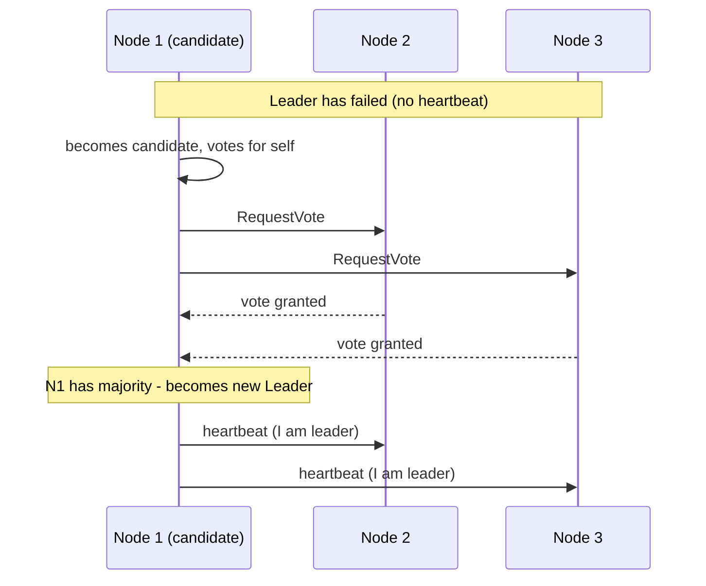

## Definition

Leader election is the process by which a group of distributed nodes agree on a single node to act as leader — coordinating some specific responsibility (accepting writes, scheduling work) — and reliably elect a new leader if the current one fails.

## Why it exists

Some coordination responsibilities are much simpler to reason about with exactly one node in charge, rather than requiring every node to coordinate as equals for every decision. Leader election exists to establish and maintain that single point of coordination reliably, even as nodes fail and need to be replaced — without ever risking two nodes simultaneously believing they're the leader (split brain).

## The problem it solves

Naive approaches to picking a leader (e.g. "whichever node started first") don't handle the reality of distributed systems: nodes fail, networks partition, and a properly designed leader election process must handle a leader failing and a new one being elected, without ever allowing two nodes to simultaneously act as leader based on stale or conflicting information.

## Real-world analogy

A ship's crew designates a single captain to make final calls in emergencies — not because the crew can't discuss things, but because having exactly one clear decision-maker avoids the chaos and delay of trying to reach unanimous agreement on the spot during a crisis. If the captain is incapacitated, a clear, pre-established succession process (the first mate takes over) avoids any ambiguity about who's actually in charge at any given moment.

## Simple explanation

A group of nodes runs an election process (often based on [Consensus](/docs/databases/consensus-basics)) to agree on a single leader; that leader remains in charge until it fails or becomes unreachable, at which point the remaining nodes detect this and elect a new leader.

## Technical explanation

### Raft's leader election (a widely used, understandable example)

In Raft specifically, a node that stops receiving heartbeats from the current leader (after a randomized timeout, to reduce the chance of multiple nodes becoming candidates simultaneously) becomes a candidate, requests votes from other nodes, and becomes leader if it receives votes from a majority — the same majority-based safety property discussed in [Consensus Basics](/docs/databases/consensus-basics).

## Internal working — avoiding split brain

The majority requirement is exactly what prevents split brain: since any two majority groups out of the same cluster must share at least one node, it's impossible for two different nodes to simultaneously believe they've each been elected leader by a genuine majority — that shared node would have had to vote for both, which the protocol prevents.

<Callout type="note" title="What about network partitions?">
If a network partition splits a cluster such that no group has a majority, no new leader can be elected at all until the partition heals — this is a deliberate consequence of prioritizing safety (never having two simultaneous leaders) over availability during a partition, directly reflecting the CP choice in CAP theorem terms.
</Callout>

## Advantages

- Provides a single, clear point of coordination for responsibilities that are much simpler with exactly one node in charge.
- Automatically handles leader failure by electing a new one, without requiring manual intervention.
- Majority-based election protocols provide strong safety guarantees against split brain.

## Disadvantages

- Requires a majority of nodes to be reachable to elect (or re-elect) a leader — a cluster split into groups with no majority can't make progress on leadership decisions until reconnected.
- Adds real implementation complexity if built from scratch — this is exactly why mature, existing implementations (Raft-based systems like etcd) are strongly preferred.
- A brief window of "no leader" always exists between a leader failing and a new one being elected — operations depending on a leader being present must handle this gap gracefully.

## Trade-offs

Leader election trades some availability (no progress possible without a majority) for strong safety guarantees (never simultaneously having two leaders) — a deliberate, necessary trade-off for coordination responsibilities where having two simultaneous "leaders" would cause real problems.

## Complexity considerations

Implementing leader election correctly, with all its edge cases (network partitions, node crashes at inconvenient moments, avoiding split brain), is a genuinely hard distributed systems problem — almost always better solved by adopting a mature, existing implementation (etcd, ZooKeeper, or Raft-based libraries) than attempting a custom implementation.

## When to use

- Coordinating a single "owner" for a specific responsibility across a cluster — a primary database node, a singleton scheduled job, a cluster coordinator role.

## When NOT to use

- Responsibilities that don't actually require a single, exclusive coordinator — forcing leader election onto a problem that could be solved more simply (e.g. via independent, idempotent operations) adds unnecessary complexity.

## Common mistakes

- Implementing custom leader election logic without properly handling network partitions and majority requirements, risking split brain in production.
- Not designing the broader system to tolerate the brief "no leader" window that occurs during an election, causing cascading failures if dependent operations don't handle this gracefully.
- Using leader election for problems that don't genuinely need a single exclusive coordinator, when a simpler approach would suffice.

## Interview questions

- "Why does leader election typically require a majority of nodes to agree, rather than a simple plurality?"
- "What happens to a cluster's ability to elect a new leader if it's split by a network partition into two groups, neither with a majority?"
- "How would you handle the brief window between a leader failing and a new one being elected, in a system that depends on a leader being present?"

## Practical example

A distributed database cluster uses Raft-based leader election to determine which node is currently the primary, accepting writes — if that primary crashes, the remaining nodes detect the missing heartbeat, hold an election, and a new primary is chosen and takes over write responsibilities, all without manual intervention.

## Production example

Kubernetes' control plane components use leader election (built on etcd, which itself uses Raft) to ensure only one instance of certain controllers is actively making cluster-management decisions at a time, even though multiple replicas of these components may be running simultaneously for high availability.

## Best practices

- Use a mature, existing implementation (etcd, ZooKeeper, or a well-tested Raft library) rather than building custom leader election logic from scratch.
- Design dependent systems to gracefully handle the brief window without a leader during an election, rather than assuming a leader is always immediately present.
- Understand and accept the availability trade-off — a cluster without a majority available simply cannot elect a leader, by design, prioritizing safety over availability in that scenario.

## Summary

Leader election lets a group of distributed nodes agree on a single node to coordinate a specific responsibility, automatically re-electing a new leader if the current one fails — typically built on a majority-based consensus protocol (like Raft) specifically to prevent split brain, where two nodes might otherwise simultaneously believe they're the leader. It's a genuinely hard problem to implement correctly from scratch, strongly favoring the use of mature, existing coordination services.

## References

- Ongaro & Ousterhout, "In Search of an Understandable Consensus Algorithm" (Raft, 2014)
- Apache ZooKeeper documentation: Leader Election recipe

<Quiz questions={[
  {
    q: "Why does requiring a majority for leader election prevent split brain (two nodes simultaneously believing they're the leader)?",
    options: [
      "Majorities are always faster to compute",
      "Any two majority groups from the same set of nodes must overlap by at least one node, and that shared node cannot have validly voted for two different leaders simultaneously",
      "Split brain is impossible regardless of the election method used",
      "Majority requirements have nothing to do with preventing split brain"
    ],
    answer: 1,
    explanation: "Since any two majority groups must share at least one common node, and that node can only vote for one candidate in a given term, it's impossible for two different nodes to both have genuinely received a majority of votes at the same time — this overlap is exactly what prevents split brain."
  }
]} />
