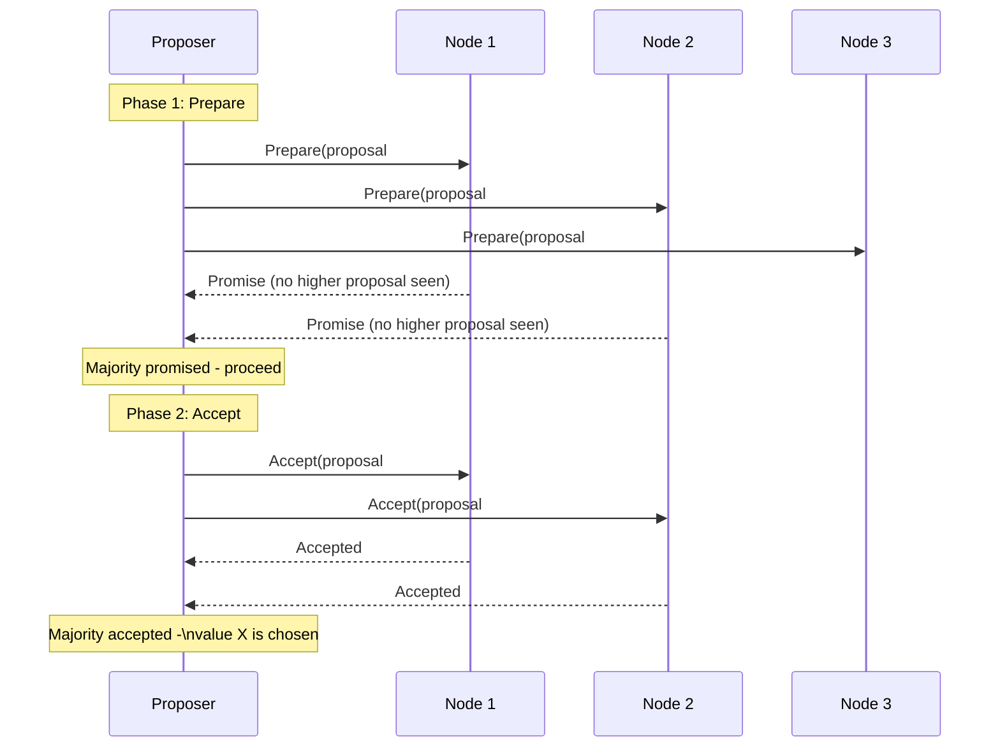

## Definition

Paxos is a family of consensus algorithms, introduced by Leslie Lamport, that allow a distributed group of nodes to agree on a single value even in the presence of node failures and unreliable message delivery — the original, foundational solution to the consensus problem that [Raft](/docs/distributed-systems/raft) was later designed to make more understandable.

## Why it exists

Before Paxos, there was no rigorously proven, general solution to distributed consensus under realistic failure conditions (nodes crashing, messages being delayed or lost). Paxos exists as that original, formally proven solution — establishing that consensus is achievable (with certain caveats, per the [FLP impossibility result](/docs/distributed-systems/consensus)) and providing the algorithmic blueprint that essentially all later consensus protocols, including Raft, build on or take inspiration from.

## The problem it solves

Distributed systems need a reliable way to agree on a single value or decision (who's the leader, what's the next entry in a log) despite nodes failing and messages being delayed or lost — Paxos was the first widely accepted, rigorously proven algorithm to solve this general problem correctly.

## Real-world analogy

Imagine a legislative body trying to pass a single, specific proposal, where legislators might be absent (failed nodes) or messages between them might get delayed or lost (unreliable network) — Paxos is a specific, carefully designed voting and proposal-acceptance procedure that guarantees the body will eventually agree on exactly one proposal, and never accidentally end up believing two different proposals were both passed, no matter how badly-timed the absences and delays are.

## Simple explanation

Paxos works through a two-phase process: a node wanting to propose a value first asks a majority of nodes if they'll promise to consider its proposal (phase 1); if a majority promises, it then asks that majority to actually accept the specific value (phase 2). This two-phase structure, combined with careful rules about proposal numbering, is what guarantees safety even under difficult failure and timing conditions.

## Technical explanation

### The two phases (Basic Paxos)

Each proposal has a unique, increasing number. A node that has already promised to consider a higher-numbered proposal will reject an older one — this proposal-numbering discipline, combined with the majority requirement, is what prevents the algorithm from ever reaching two different, conflicting decisions.

## Internal working — why Paxos is considered hard to fully grasp

The description above is "Basic Paxos" — agreeing on a single value. Real systems need to agree on a whole *sequence* of values (a replicated log), which requires "Multi-Paxos" — running many instances of the basic protocol, with additional optimizations (like a stable, elected proposer/leader to avoid repeating phase 1 for every single value) that aren't as cleanly and formally specified in Lamport's original papers as the later Raft paper's explicit description — this gap between the formal algorithm and a concrete, implementable system is exactly what made Paxos notoriously difficult to implement correctly in practice, and what motivated Raft's design.

## Advantages

- The original, rigorously proven foundation for distributed consensus — extensively studied and validated over decades.
- Extremely flexible at a theoretical level, supporting various optimizations and variants for different practical needs.

## Disadvantages

- Famously difficult to fully understand and correctly implement from its original description — the gap between the formal algorithm and a concrete, production-ready implementation (especially for Multi-Paxos) has historically led to many subtly incorrect implementations.
- Less prescriptive about practical details (like leader election specifics) compared to Raft's more explicit, implementation-ready description.

## Trade-offs

Paxos trades ease of understanding and implementation (which Raft specifically improved on) for being the original, most extensively studied and theoretically flexible consensus algorithm — for most practical system design purposes today, Raft's improved understandability makes it the more commonly chosen starting point, even though Paxos (or Paxos-derived variants like Google's Chubby lock service) remain in significant production use.

## Complexity considerations

Understanding Paxos at a conceptual level (the two-phase, majority-based structure) is valuable background for any distributed systems work. Actually implementing a correct, production-ready Multi-Paxos system is a substantial undertaking, generally best left to existing, battle-tested implementations rather than a from-scratch attempt.

## When to use

- As the conceptual foundation for understanding consensus generally, even if a specific system ultimately chooses a Raft-based implementation for its improved understandability and existing tooling.
- Systems specifically built on mature, existing Paxos-based infrastructure (like Google's Chubby or Spanner) where that choice predates or specifically warrants it.

## When Raft may be a better practical choice

- New systems needing a consensus protocol, where Raft's improved understandability and wide availability of mature, well-tested implementations (etcd) generally make it the more practical starting point today.

## Common mistakes

- Attempting to implement Multi-Paxos from Lamport's original papers without recognizing the significant gap between the formal description and a concrete, production-ready system — a well-documented historical source of subtly incorrect implementations.
- Assuming Paxos and Raft provide fundamentally different guarantees — they solve the same consensus problem with the same essential safety properties; the real difference is in understandability and implementation clarity, not what's theoretically achievable.

## Interview questions

- "At a high level, how does Paxos's two-phase (prepare/accept) structure guarantee safety even under node failures and message delays?"
- "Why is Paxos considered harder to implement correctly than Raft, despite solving the same fundamental problem?"
- "What's the difference between 'Basic Paxos' (a single value) and 'Multi-Paxos' (a replicated log)?"

## Practical example

Google's Chubby lock service, an important piece of internal coordination infrastructure at Google (conceptually similar to what ZooKeeper or etcd provide elsewhere), is built on a Paxos-based consensus implementation — predating Raft's introduction and remaining in significant production use, illustrating that Paxos-based systems, correctly implemented, work reliably at real scale.

## Production example

Google's Spanner, a globally distributed database, uses Paxos internally to achieve strongly consistent replication across globally distributed nodes — a large-scale, production validation of Paxos's practical viability, even as many newer systems choose Raft specifically for its comparative implementation clarity.

## Best practices

- Understand Paxos's conceptual structure (two-phase, majority-based) as foundational distributed systems knowledge, even if choosing Raft for actual implementation.
- If working with an existing Paxos-based system, rely on its mature, established implementation rather than attempting modifications without deep expertise in the algorithm's subtleties.
- For new systems needing consensus, default to considering Raft first, given its improved understandability and wider availability of mature, well-tested implementations.

## Summary

Paxos is the original, foundational consensus algorithm, using a two-phase (prepare/accept) process with proposal numbering and majority agreement to guarantee safe, correct consensus even under node failures and unreliable message delivery. It remains theoretically sound and is used in significant production systems (Google's Chubby, Spanner), but its notorious difficulty to fully understand and correctly implement (especially the "Multi-Paxos" needed for a replicated log) directly motivated Raft's later, more understandability-focused design — which is why Raft has become the more common practical choice for new systems today.

## References

- Lamport, L. "The Part-Time Parliament" (1998, the original Paxos paper)
- Lamport, L. "Paxos Made Simple" (2001, a later, clearer explanation by the same author)

<Quiz questions={[
  {
    q: "What is the key difference between 'Basic Paxos' and 'Multi-Paxos'?",
    options: [
      "Basic Paxos agrees on a single value; Multi-Paxos extends this to agree on a sequence of values (a replicated log), typically with an elected leader to avoid repeating early protocol phases",
      "Multi-Paxos doesn't require a majority of nodes",
      "Basic Paxos and Multi-Paxos are unrelated algorithms",
      "Multi-Paxos removes the need for proposal numbers"
    ],
    answer: 0,
    explanation: "Basic Paxos solves consensus on a single value; real systems need to agree on an ongoing sequence of values (a log), which is what Multi-Paxos addresses — and it's this extension, less formally and completely specified in the original papers, that contributed significantly to Paxos's reputation for being hard to implement correctly."
  }
]} />
