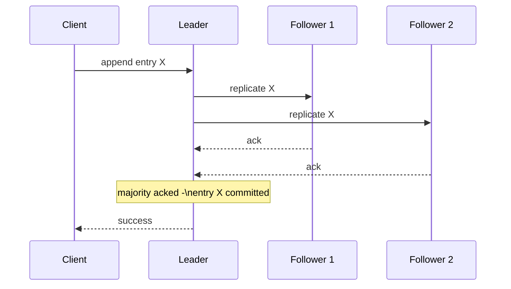
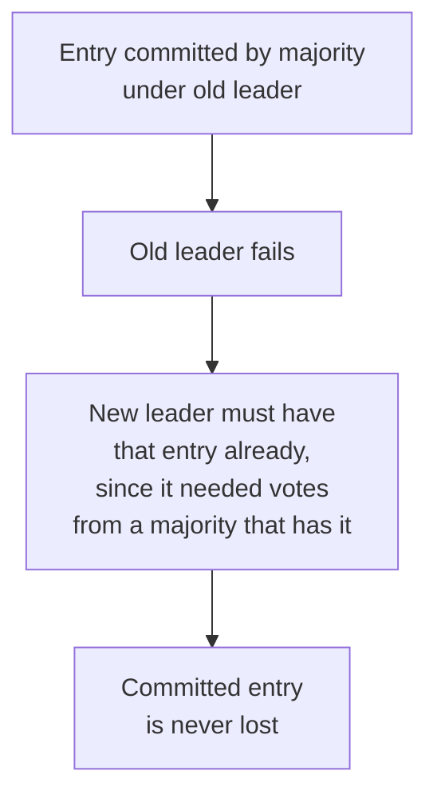

## Definition

Raft is a consensus algorithm designed explicitly for understandability, achieving the same fundamental goal as Paxos (getting a cluster of nodes to agree on a sequence of values, typically log entries) by decomposing the problem into three clearer sub-problems: **leader election**, **log replication**, and **safety**.

## Why it exists

Paxos, while foundational and rigorously proven, is famously difficult to fully understand and correctly implement — its description doesn't map cleanly onto a straightforward implementation, leading to many subtly incorrect real-world implementations over the years. Raft exists specifically to solve the same consensus problem with a design that's easier to reason about, teach, and implement correctly.

## The problem it solves

Teams needing a consensus protocol for their systems (distributed databases, coordination services) need one they can actually understand well enough to implement, operate, and debug correctly — Paxos's difficulty here was a genuine practical liability. Raft solves this specifically by prioritizing understandability as a first-class design goal, without sacrificing the same rigorous correctness guarantees.

## Real-world analogy

If Paxos is like a rigorously correct but famously terse and hard-to-parse legal contract that experts argue over the interpretation of, Raft is like the same contract rewritten in clear, well-structured plain language with explicit numbered sections — legally equivalent in what it guarantees, but dramatically easier for a working engineer to actually understand, implement correctly, and reason about during an incident.

## Simple explanation

Raft elects a single leader (see [Leader Election](/docs/distributed-systems/leader-election)) responsible for managing a replicated log; the leader accepts new entries, replicates them to followers, and only considers an entry "committed" once a majority of nodes have it — all client interactions funnel through the leader, dramatically simplifying reasoning compared to a leaderless approach.

## Technical explanation

### The three sub-problems

- **Leader election**: nodes elect a single leader per "term" (an incrementing epoch number), using randomized election timeouts to avoid repeated split votes.
- **Log replication**: the leader appends new entries to its log and replicates them to followers, only considering an entry committed once acknowledged by a majority.
- **Safety**: additional rules ensuring that once an entry is committed, it can never be lost or overwritten, even across leader changes.

### Terms

Raft divides time into **terms**, each with at most one leader. If a node's election timeout expires without hearing from a leader, it increments the term number and starts a new election — this simple mechanism, combined with randomized timeouts, keeps the protocol's behavior easy to reason about even across multiple leader changes over a cluster's lifetime.

## Internal working — the safety guarantee across leader changes

A subtle but critical part of Raft's design: when a new leader is elected, it must not overwrite or lose any already-committed entry from a previous leader's term. Raft ensures this by requiring a candidate to have a log at least as up-to-date as a majority of the cluster before it can win an election — guaranteeing any already-committed entry (known to a majority) will already be present in whichever node becomes the new leader.

## Advantages

- Significantly easier to understand, teach, and implement correctly compared to Paxos, while providing the same rigorous consensus guarantees.
- Clear decomposition (leader election, log replication, safety) makes it easier to reason about specific parts of the protocol in isolation.
- Widely implemented in mature, production-ready libraries and systems (etcd, Consul), reducing the need for teams to implement it from scratch.

## Disadvantages

- Like any consensus protocol, requires a majority of nodes to be available to make progress — a cluster split without a majority can't elect a leader or commit new entries.
- All writes go through a single leader per term, which (as with any single-leader system) caps write throughput at what one node can handle — Raft solves coordination correctness, not write scalability.

## Trade-offs

Raft trades some of Paxos's (debated) flexibility for dramatically improved understandability and implementability, without sacrificing the fundamental safety guarantees — for the vast majority of practical systems needing consensus, this trade strongly favors Raft, which is why it's become the dominant choice in modern distributed systems infrastructure.

## Complexity considerations

While Raft is designed to be more understandable than Paxos, correctly implementing all its edge cases (particularly around leader changes and log consistency) is still nontrivial — using a mature, existing implementation (etcd's Raft library, for example) is strongly preferred over a custom implementation for production use.

## When to use

- Any system needing a proven, understandable consensus protocol for leader election, distributed configuration, or replicated log coordination.

## When it's not the right tool

- Coordination needs that could be satisfied with weaker, eventually-consistent mechanisms (like a [Gossip Protocol](/docs/distributed-systems/gossip-protocol)) instead, where Raft's majority-availability requirement and coordination overhead aren't actually justified.

## Common mistakes

- Implementing Raft (or any consensus protocol) from scratch without extremely careful attention to its safety edge cases — subtle bugs here can cause rare, catastrophic correctness violations that are hard to detect in testing.
- Assuming Raft (or single-leader consensus generally) solves write throughput scaling — it doesn't; it solves coordination correctness, with all writes still funneled through one leader per term.
- Not deploying an appropriate number of nodes (typically an odd number, like 3 or 5) across independent failure domains for meaningful majority-based fault tolerance.

## Interview questions

- "Why was Raft specifically designed to be more understandable than Paxos, and what problem did that solve in practice?"
- "How does Raft ensure a newly elected leader doesn't lose or overwrite an already-committed log entry from a previous term?"
- "Does Raft help scale write throughput? Why or why not?"

## Practical example

etcd, the distributed key-value store used by Kubernetes for cluster state, is built directly on Raft — providing Kubernetes' control plane with a strongly consistent, reliably agreed-upon source of truth about cluster configuration, even as individual etcd nodes may occasionally fail or become temporarily unreachable.

## Production example

Beyond etcd, Raft (or close variants) is used by HashiCorp Consul, CockroachDB, and many other modern distributed systems specifically because of its combination of rigorous correctness guarantees and comparative ease of correct implementation relative to Paxos.

## Best practices

- Use a mature, existing Raft implementation (like etcd's) rather than implementing the protocol from scratch.
- Deploy an odd number of nodes across independent failure domains for well-defined, resilient majority calculations.
- Reserve Raft-based consensus specifically for coordination needs genuinely requiring strong correctness guarantees, not as a default mechanism for all distributed state.

## Summary

Raft is a consensus algorithm designed explicitly for understandability, decomposing the consensus problem into leader election, log replication, and safety — achieving the same rigorous correctness guarantees as Paxos with a design that's significantly easier to reason about, teach, and implement correctly, which has made it the dominant choice for consensus in modern distributed systems infrastructure like etcd and Kubernetes.

## References

- Ongaro & Ousterhout, "In Search of an Understandable Consensus Algorithm" (Raft, 2014)
- raft.github.io (the Raft project's official visualizations and resources)

<Quiz questions={[
  {
    q: "Why was Raft specifically designed as an alternative to Paxos?",
    options: [
      "Paxos doesn't actually work correctly",
      "Raft was explicitly designed to be more understandable and easier to implement correctly than Paxos, while providing the same fundamental consensus guarantees",
      "Raft is faster than Paxos in every scenario",
      "Paxos cannot be used for leader election"
    ],
    answer: 1,
    explanation: "Raft's creators explicitly prioritized understandability as a design goal, decomposing consensus into clearer sub-problems (leader election, log replication, safety) specifically because Paxos's difficulty had led to many subtly incorrect real-world implementations."
  }
]} />
