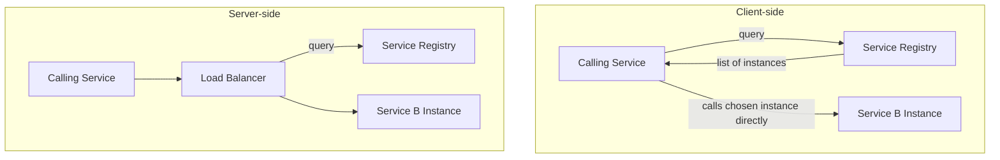
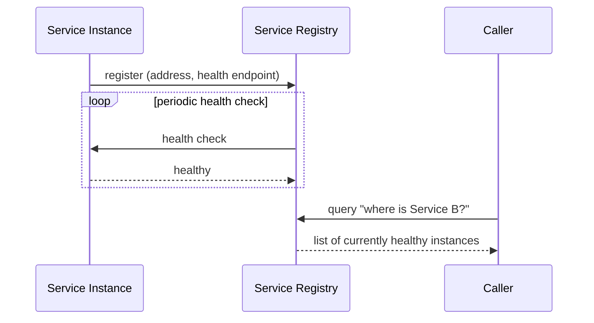

## Definition

Service discovery is the mechanism by which services in a distributed system locate the current network address of other services they need to communicate with, in an environment where service instances are frequently added, removed, or relocated (as is typical with auto-scaling, container orchestration, and rolling deployments).

## Why it exists

In a modern, dynamic infrastructure, the specific instances backing a given service change constantly — auto-scaling adds and removes instances based on load, container orchestrators reschedule containers to different machines, and deployments replace old instances with new ones. Hardcoding IP addresses (or even relying purely on traditional [DNS](/docs/networking/dns) with its caching-driven propagation delay) doesn't fit this level of dynamism well. Service discovery exists to let services reliably find each other's current location despite this constant churn.

## The problem it solves

Without service discovery, every service would need to be manually configured with the current addresses of every other service it depends on — completely unworkable in an environment where instances come and go by the minute, as in a modern auto-scaled or container-orchestrated system. Service discovery solves this by providing an always-current, queryable registry of which instances of each service are currently available and healthy.

## Real-world analogy

A large hospital's paging system lets any staff member reach "the on-call cardiologist" without needing to know which specific doctor is on-call today, or where in the building they currently are — the paging system (service discovery) maintains the current, correct mapping, and staff just address requests to the role/service, not a specific person's fixed number.

## Simple explanation

Services register themselves (their address and health status) with a service registry when they start up, and deregister (or are automatically removed) when they shut down or become unhealthy. Other services query this registry to find current, healthy instances of a service they need to call.

## Technical explanation

### Client-side vs. server-side discovery

- **Client-side discovery**: the calling service directly queries the service registry to get a list of healthy instances, then chooses one itself (often using a load balancing algorithm) and calls it directly.
- **Server-side discovery**: the calling service simply sends its request to a load balancer or gateway, which itself queries the service registry and routes the request — the calling service doesn't need to know about the registry at all.

## Internal working — registration and health checking

Service registries typically integrate closely with [Health Checks](/docs/load-balancing/health-checks) — an instance that stops responding to health checks is automatically removed from the registry's list of available instances, so callers never get routed to it.

## Advantages

- Enables services to reliably find each other despite constant instance churn (scaling, deployments, failures) without manual reconfiguration.
- Naturally integrates with health checking, ensuring only healthy instances are discoverable.
- Removes the need for hardcoded addresses, making the whole system more resilient and easier to scale dynamically.

## Disadvantages

- Introduces a new critical dependency — the service registry itself needs to be highly available, since nearly every inter-service call may depend on it.
- Adds a small amount of latency and complexity to service-to-service communication, especially with client-side discovery, where every caller needs registry-query logic.
- Registry consistency (how quickly it reflects a newly failed or newly started instance) is itself subject to the same kinds of propagation delay considerations seen elsewhere in distributed systems.

## Trade-offs

Service discovery trades some added complexity and a new critical dependency (the registry) for the ability to operate reliably in a highly dynamic environment — an essential trade-off for any system using auto-scaling or container orchestration, and less critical for smaller, more static deployments with a fixed, small number of long-lived instances.

## Complexity considerations

Using a managed service discovery solution (built into a container orchestrator like Kubernetes, or a dedicated tool like Consul) is far simpler than implementing a custom registry from scratch — most modern infrastructure platforms provide service discovery as a built-in, largely automatic capability rather than something engineers need to build themselves.

## When to use

- Any system using auto-scaling, container orchestration, or otherwise dynamic infrastructure where service instances change frequently.
- Microservices architectures with many independently deployed, independently scaled services needing to find each other reliably.

## When it's less critical

- Small, static deployments with a fixed, small number of long-lived servers, where manual configuration (or simple DNS) is sufficient and doesn't change often enough to justify dedicated service discovery infrastructure.

## Common mistakes

- Relying purely on DNS with long TTLs for a highly dynamic environment, where DNS's caching-driven propagation delay doesn't keep up with how quickly instances actually come and go.
- Not making the service registry itself highly available, turning it into an unaddressed single point of failure despite the rest of the system being well-distributed.
- Not integrating service discovery with health checks, allowing calls to be routed to instances that are technically registered but no longer actually healthy.

## Interview questions

- "Why doesn't traditional DNS alone work well for service discovery in a highly dynamic, auto-scaled environment?"
- "What's the difference between client-side and server-side service discovery?"
- "How would you ensure the service registry itself doesn't become a single point of failure?"

## Practical example

In a Kubernetes cluster, each service gets a stable internal DNS name, and Kubernetes' built-in service discovery automatically tracks which pod instances are currently healthy and routes traffic accordingly — as pods are created, destroyed, or rescheduled (constantly, in a typical cluster), other services continue reaching "the current healthy instances" without any manual reconfiguration.

## Production example

HashiCorp Consul and Kubernetes' built-in service discovery (backed by etcd) are widely used examples specifically designed to handle service discovery reliably at scale, in environments with exactly this kind of constant instance churn from auto-scaling and container orchestration.

## Best practices

- Use a managed or platform-provided service discovery mechanism (like Kubernetes' built-in discovery, or Consul) rather than implementing a custom registry from scratch.
- Integrate service discovery tightly with health checks, so only genuinely healthy instances are ever discoverable.
- Ensure the service registry itself is deployed with high availability, since it's a critical dependency for nearly all inter-service communication.

## Summary

Service discovery lets services reliably find the current network location of other services they depend on, in environments where instances are constantly added, removed, or relocated due to auto-scaling, container orchestration, or rolling deployments — a capability traditional DNS alone doesn't handle well given its caching-driven propagation delay. It's an essential piece of infrastructure for dynamic, microservices-oriented systems, typically provided by a platform (Kubernetes) or dedicated tool (Consul) rather than built from scratch.

## References

- HashiCorp Consul documentation
- Kubernetes documentation: Service

<Quiz questions={[
  {
    q: "Why doesn't relying purely on traditional DNS (with typical TTL-based caching) work well for service discovery in a highly dynamic, auto-scaled environment?",
    options: [
      "DNS cannot be used for any service communication",
      "DNS's caching-driven propagation delay means clients can continue using stale, cached addresses for a while after an instance has actually failed or been replaced, which doesn't keep pace with the frequent churn in a dynamic environment",
      "DNS only works for websites, not internal services",
      "There's no issue at all with using plain DNS for this purpose"
    ],
    answer: 1,
    explanation: "DNS's TTL-based caching, while useful for reducing lookup overhead generally, means changes take time to propagate to all clients — in an environment where instances are added, removed, or replaced very frequently, this delay doesn't keep up with the actual rate of change, which is exactly the gap dedicated service discovery tools are built to close."
  }
]} />
