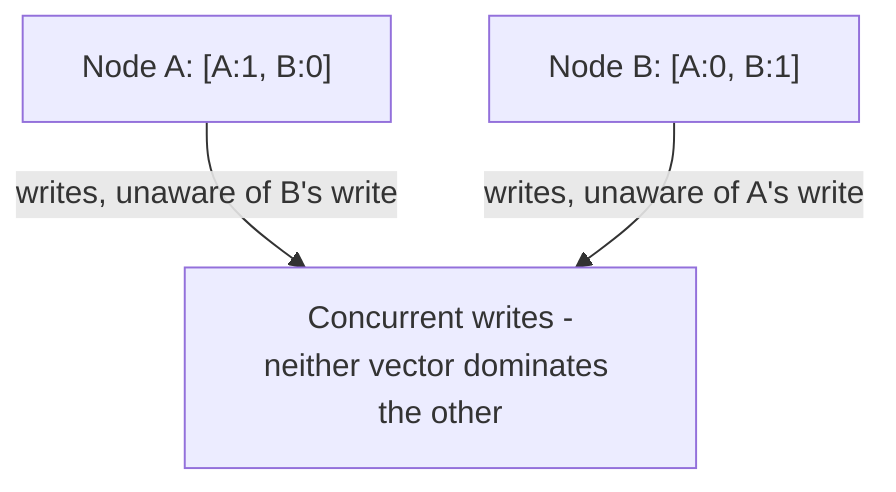

## Definition

A vector clock is a mechanism for tracking causality across distributed nodes that, unlike a [Lamport Clock](/docs/distributed-systems/lamport-clock), can explicitly distinguish events that are truly **concurrent** (neither causally influenced the other) from events with a genuine causal (happened-before) relationship.

## Why it exists

A Lamport clock provides a consistent ordering of events, but can't tell you whether two events with different timestamps were actually causally related or simply coincidentally numbered — this distinction matters enormously for conflict detection: if two writes to the same data were genuinely concurrent (neither aware of the other), that's a real conflict needing resolution; if one causally followed the other, it's simply the latest, correct value. Vector clocks exist specifically to make this distinction detectable.

## The problem it solves

In systems with [Multi-leader](/docs/databases/multi-leader) replication, two different leaders might independently accept writes to the same piece of data before either knows about the other's write — the system needs a reliable way to detect that this happened (a true conflict) rather than incorrectly assuming one write simply overwrote the other in a normal, sequential way. Vector clocks solve this by tracking enough information to definitively identify true concurrency.

## Real-world analogy

Imagine two co-authors independently editing different sections of a shared document draft over email, each keeping a personal note of "here's what I know about my own edits, and what I last heard about my co-author's edits." If both authors' notes show they were each unaware of the other's most recent edit when making their own, that's a genuine conflict needing a real merge conversation — as opposed to one author simply building on an edit they'd already seen and incorporated, which isn't a conflict at all, just a normal sequential update.

## Simple explanation

Each node maintains a vector (an array) of counters, one per node in the system, rather than a single number. When a node makes a local change, it increments its own counter in the vector. When nodes communicate, they merge their vectors (taking the max of each position). Comparing two vectors tells you definitively whether one happened-before the other, or whether they're truly concurrent.

## Technical explanation

### Comparing vector clocks

Given two vector clocks V1 and V2:

- If every element of V1 is ≤ the corresponding element of V2 (and at least one is strictly less), then V1 happened-before V2.
- If neither vector is ≤ the other in every position, the two events are **concurrent** — a genuine conflict.

Here, `[A:1, B:0]` and `[A:0, B:1]` are genuinely concurrent — neither vector is entirely ≥ the other — correctly signaling a real conflict that needs resolution, something a simple Lamport timestamp comparison couldn't reliably detect.

## Internal working — resolving detected conflicts

Detecting a conflict via vector clocks is only half the problem — the system (or application) still needs a strategy to actually resolve it: presenting both conflicting versions to the user (as Amazon's original Dynamo did for shopping carts), automatically merging them via application-specific logic, or using a [CRDT](/docs/databases/multi-leader) that can merge automatically and deterministically.

## Advantages

- Definitively distinguishes true concurrency (real conflicts) from causally ordered events, unlike simpler mechanisms like Lamport clocks.
- Enables correct conflict detection in multi-leader or otherwise concurrently-writable distributed systems.

## Disadvantages

- More overhead than a simple Lamport clock — the vector's size grows with the number of nodes in the system, which can become a real storage and transmission cost at large scale.
- Detecting a conflict is only the first step — the system still needs a separate, deliberate strategy to actually resolve detected conflicts.

## Trade-offs

Vector clocks trade some overhead (a vector, not a single number, per event) for the ability to correctly detect true concurrency — essential specifically for systems where concurrent conflicting writes are possible and need to be identified accurately, and unnecessary complexity for systems that don't have this concern (e.g. single-leader systems, where writes are naturally, totally ordered by the one leader).

## Complexity considerations

Implementing and correctly reasoning about vector clocks is genuinely more involved than Lamport clocks, and the vector's growing size with node count is a real practical scaling consideration for very large clusters — some systems use techniques to prune or summarize vector clock history to manage this.

## When to use

- Multi-leader or otherwise concurrently-writable distributed data stores that need to reliably detect genuine write conflicts, rather than silently and incorrectly resolving them (e.g. via naive last-write-wins, which can silently discard a legitimate concurrent update).

## When NOT to use (simpler mechanisms suffice)

- Single-leader systems, where all writes are naturally totally ordered through the one leader, and true concurrency between writes to the same data simply can't occur in the same way.

## Common mistakes

- Using a simpler mechanism like a Lamport clock or plain timestamp for conflict detection in a genuinely concurrent-write system, silently missing real conflicts that a vector clock would have correctly identified.
- Not having any actual conflict resolution strategy once vector clocks correctly identify a conflict — detection alone doesn't resolve anything.
- Underestimating the storage/transmission overhead of vector clocks at very large node counts, without considering pruning or summarization techniques.

## Interview questions

- "How do vector clocks distinguish a true conflict from a causally ordered pair of writes, in a way Lamport clocks can't?"
- "What does a system need to do once a vector clock has correctly detected a conflict?"
- "Why don't single-leader replicated systems typically need vector clocks?"

## Practical example

A distributed shopping cart service (in a multi-region, multi-leader setup) uses vector clocks to detect when two regions concurrently added different items to the same customer's cart before syncing with each other — correctly identifying this as a genuine conflict to be merged (typically by taking the union of both regions' additions) rather than one region's change silently overwriting the other's.

## Production example

Amazon's original Dynamo system famously used vector clocks specifically to detect concurrent, conflicting writes to shopping cart data across replicas, presenting genuinely conflicting versions back to the application (which, for a shopping cart, could reasonably merge them by taking the union of items) rather than silently and potentially incorrectly picking one via last-write-wins.

## Best practices

- Use vector clocks specifically in systems where genuine write concurrency (multi-leader, or similar) is possible and needs to be correctly detected, not as a default mechanism for all distributed ordering needs.
- Pair vector clock-based conflict detection with an explicit, well-designed conflict resolution strategy (application-specific merge logic, CRDTs, or surfacing the conflict to a user).
- Consider the storage/transmission overhead of vector clocks at scale, and look at pruning or summarization techniques if the node count grows very large.

## Summary

Vector clocks track a per-node counter vector, enabling definitive detection of true concurrency (genuine conflicts) between events across distributed nodes — a capability simpler mechanisms like Lamport clocks don't provide. They're essential for correctly identifying conflicts in multi-leader or otherwise concurrently-writable systems, at the cost of more overhead than a simple logical counter, and detection alone still requires a separate, deliberate conflict resolution strategy.

## References

- Fidge, C. "Timestamps in Message-Passing Systems that Preserve the Partial Ordering" (1988)
- DeCandia et al., "Dynamo: Amazon's Highly Available Key-value Store" (2007)

<Quiz questions={[
  {
    q: "What can vector clocks detect that Lamport clocks cannot?",
    options: [
      "The exact wall-clock time an event occurred",
      "Whether two events are truly concurrent (neither causally influenced the other), rather than just assigning them some consistent but potentially arbitrary order",
      "Which node has the fastest network connection",
      "Vector clocks and Lamport clocks detect exactly the same things"
    ],
    answer: 1,
    explanation: "Vector clocks can definitively identify true concurrency by comparing per-node counters across the full vector — if neither vector dominates the other, the events are genuinely concurrent, a distinction Lamport clocks' single counter cannot reliably make."
  }
]} />
