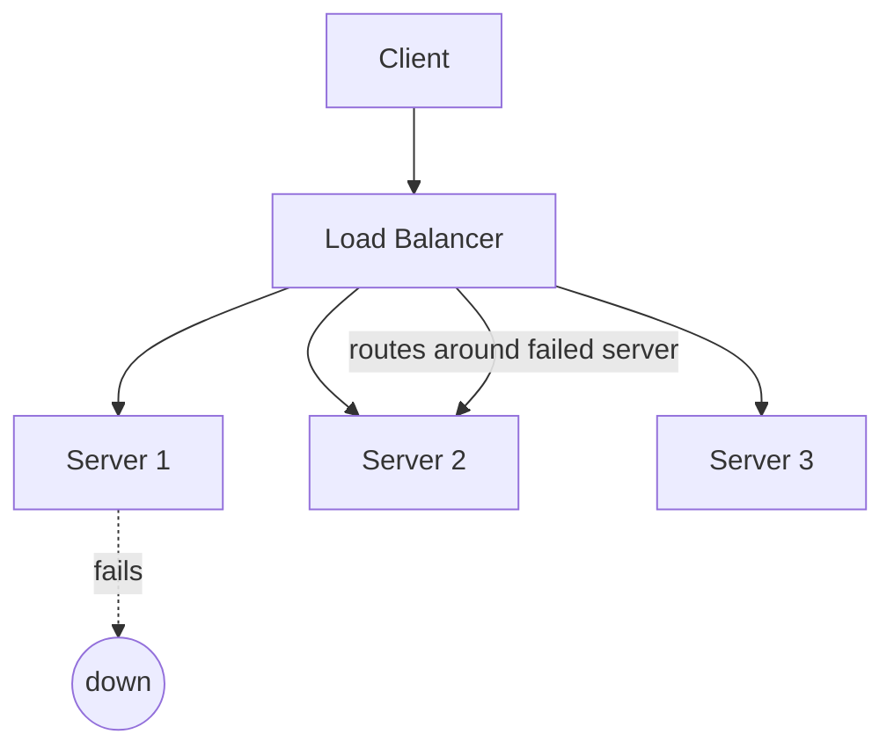

## Definition

Availability is the percentage of time a system is operational and able to serve requests successfully, over some period. It's usually expressed as a percentage of "nines": 99% ("two nines"), 99.9% ("three nines"), 99.99% ("four nines"), and so on.

## Why it exists

Every system experiences failures eventually — a server crashes, a network link drops, a deployment introduces a bug. Availability exists as a metric because "the system should never go down" isn't achievable or even meaningful; what's meaningful is agreeing on **how much downtime is acceptable**, and designing (and paying for) redundancy proportional to that target.

## The problem it solves

Without an explicit availability target, teams have no shared definition of "good enough" — engineers might over-invest in redundancy the business doesn't need, or under-invest and be blindsided by outages that violate customer expectations (and contracts). Stating a target availability turns "be reliable" into a specific, measurable, and fundable engineering goal.

## Real-world analogy

A convenience store open 24/7 with a backup generator has very high availability — power outages, staff illness, and even one till breaking down don't stop it from serving customers. A small shop open only when the single owner feels like it has low availability — perfectly fine for that owner's needs, but it wouldn't work for a hospital pharmacy, where availability requirements are far stricter.

## Simple explanation

Availability = uptime / (uptime + downtime), over a given period. The famous "nines" table:

| Availability | Downtime per year |
|---|---|
| 99% | ~3.65 days |
| 99.9% | ~8.76 hours |
| 99.99% | ~52.6 minutes |
| 99.999% | ~5.26 minutes |

## Technical explanation

Availability is achieved primarily through **redundancy** — having more than one of anything that could fail, so a single failure doesn't take down the whole system:

- Multiple servers behind a load balancer (so one crashing doesn't stop service).
- Multiple availability zones / data centers (so one facility's outage doesn't stop service).
- Database replicas (so a primary failing has a standby ready to take over).

## Internal working

Availability math compounds: if each of 3 redundant servers independently has 99% availability, the probability that **all three** are down simultaneously is roughly 0.01³ ≈ 0.0001% — meaning the combined system's availability is far higher than any single component's. This is the core mathematical reason redundancy works.

<Callout type="note" title="Availability isn't just about servers">
A system is also unavailable if its database, DNS, or a critical third-party dependency (e.g. a payment processor) is down — availability has to be reasoned about for the whole request path, not just the app server tier.
</Callout>

## Advantages of designing for high availability

- Directly translates to user trust and (for many businesses) revenue — downtime often has a direct dollar cost.
- Redundancy that improves availability often also improves the ability to handle load spikes, since there's spare capacity by design.

## Disadvantages / costs

- Each additional "9" gets significantly more expensive — multi-region active-active architectures (needed for 99.99%+) cost far more, in both infrastructure and engineering complexity, than a single well-run region (which can reasonably hit 99.9%).
- More redundant components means more operational complexity: more things to monitor, more failover logic to test and get right.

## Trade-offs

Availability targets should match actual business impact, not be maximized blindly. A five-nines target for an internal admin tool used by 10 employees is very likely wasted engineering effort; the same target for a payments API might be a real business requirement.

## Complexity considerations

Going from single-instance to multi-instance-single-region is a relatively modest jump in complexity. Going from single-region to multi-region active-active (needed to survive a whole region outage) is a much bigger jump — it usually requires solving hard data-consistency problems across regions.

## When to invest in high availability

- Systems where downtime has direct financial or safety cost.
- Systems serving enough users that even a short outage affects many people simultaneously.

## When NOT to over-invest

- Early-stage products, internal tools, or systems with a small, tolerant user base where 99.9% (or even less) is genuinely fine.

## Common mistakes

- Confusing "the app servers are redundant" with "the whole system is highly available" — a single database, single message queue, or single external dependency without redundancy caps the whole system's real availability.
- Chasing a high-nines target without first identifying the actual business cost of downtime.
- Not testing failover paths — redundancy that's never actually exercised (e.g. an untested standby database) often fails silently when it's finally needed.

## Interview questions

- "How would you design this to survive a single server failing? A whole availability zone failing?"
- "What's the actual availability target here, and what does that imply about redundancy?"
- "Where's the single point of failure left in this design?"

## Practical example

In the [URL Shortener case study](/docs/case-studies/url-shortener), read replicas and a cache both improve availability of the read path (redirects) — if the primary database goes down, redirects still work from cache and replicas, even though new-link creation may briefly fail.

## Production example

AWS publishes explicit SLAs per service (e.g. 99.99% for many services when used across multiple availability zones) — a concrete, contractual example of an availability target backing a real architecture (multi-AZ redundancy).

## Best practices

- State an explicit availability target before designing, and size redundancy to match it — not more, not less.
- Identify every component on the critical path (including third-party dependencies) and make sure the target accounts for all of them, not just the app server tier.
- Regularly test failover (chaos engineering) rather than assuming untested redundancy works.

## Summary

Availability measures what fraction of the time a system successfully serves requests, usually expressed in "nines." It's achieved primarily through redundancy, and each additional nine of availability costs disproportionately more — so the right target is the one that matches actual business impact, not the theoretical maximum.

## References

- Google SRE Book, "Embracing Risk" chapter (on availability targets and error budgets)

<Quiz questions={[
  {
    q: "If three redundant servers each independently have 99% availability, why is the combined system's availability much higher than 99%?",
    options: [
      "It isn't — availability doesn't combine that way",
      "Because all three would need to fail simultaneously for the system to be down, which is far less likely than any one failing",
      "Because load balancers fix all availability problems",
      "Because 99% servers always round up to 100%"
    ],
    answer: 1,
    explanation: "With independent failures, the probability of all three being down at once is roughly the product of each individual failure probability — a much smaller number than any single server's downtime rate."
  }
]} />
