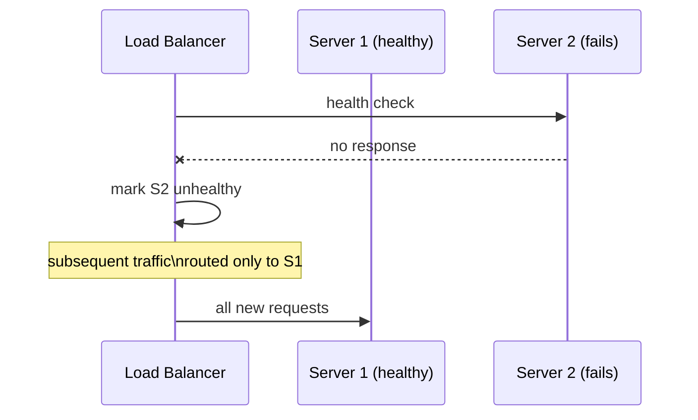

## Definition

Fault tolerance is a system's ability to **continue operating correctly** when one or more of its components fail. A fault-tolerant system doesn't prevent failures — it survives them without the failure becoming a user-visible outage.

## Why it exists

At sufficient scale, hardware and network failures aren't rare edge cases — they're a statistical certainty happening continuously. A data center with tens of thousands of disks will have disk failures daily, not yearly. Fault tolerance exists because "prevent all failures" is not achievable at scale — the only realistic strategy is designing so individual failures don't cascade into system-wide outages.

## The problem it solves

Without fault tolerance, every component is a single point of failure: one server crashing, one disk dying, or one network link dropping takes down the whole system. Fault tolerance solves this by ensuring the failure of any one part is absorbed by the system as a whole, invisible (or nearly so) to users.

## Real-world analogy

A commercial airplane has multiple engines specifically so that losing one engine doesn't cause a crash — the plane is designed, tested, and certified to fly safely on the remaining engine(s). The engine failure still happened (a fault), but the plane tolerated it (no accident). This is exactly the distinction between a fault occurring and a fault causing a failure.

## Simple explanation

Three related terms worth distinguishing precisely:

- **Fault**: one component not working as expected (a disk fails, a server crashes, a network packet is lost).
- **Failure**: the system as a whole stops providing its service correctly.
- **Fault tolerance**: the property that a fault doesn't become a failure.

## Technical explanation

Fault tolerance is achieved primarily through **redundancy** plus **automatic detection and failover**:

- Redundant hardware/instances so a single failure doesn't remove capacity entirely.
- Health checks that detect a failed component quickly.
- Automatic failover / rerouting so traffic moves away from the failed component without manual intervention.
- Data replication so a failed node doesn't mean lost data.

## Internal working

The critical piece is the **health check + automatic rerouting** loop — redundancy alone isn't enough if the system doesn't automatically detect a failure and redirect traffic around it within an acceptable time window.

## Advantages

- Failures become routine, absorbed events rather than incidents requiring urgent human intervention.
- Enables safe, frequent deployments and infrastructure changes — a bad deploy to one instance can be automatically routed around while it's fixed or rolled back.

## Disadvantages / costs

- Redundant infrastructure costs more to run than the bare minimum needed for the happy path.
- Fault tolerance mechanisms (health checks, failover logic, replication) add real complexity and are themselves potential sources of bugs if not carefully tested.

## Trade-offs

More fault tolerance generally means more redundant components and more complex coordination logic between them — there's a real cost curve, and (as with [Availability](/docs/fundamentals/availability)) the right amount of fault tolerance should match actual business risk, not be maximized unconditionally.

## Complexity considerations

Fault tolerance for stateless components (extra app servers behind a load balancer) is relatively simple. Fault tolerance for stateful components (databases, message queues) is much harder, since failing over correctly requires ensuring data consistency during the transition — this is where consensus protocols like [Raft](/docs/distributed-systems/raft) become relevant.

## When to invest heavily

- Any system where an outage has real cost — user trust, revenue, safety.
- Systems large enough that individual hardware failures are a routine, near-daily occurrence rather than a rare event.

## When to accept lower fault tolerance

- Small, low-stakes systems where the cost of occasional manual recovery is lower than the cost of building and maintaining automatic fault tolerance.

## Common mistakes

- Building redundancy without testing failover — an untested standby is not proven fault tolerance, just a hope.
- Assuming redundancy at one layer (e.g. app servers) covers the whole system, while a single database or single external dependency remains an unaddressed single point of failure.
- Conflating "we have backups" with "we're fault tolerant" — backups address data loss after a failure; fault tolerance is about not experiencing an outage in the first place.

## Interview questions

- "Walk me through what happens, step by step, when this specific server/database/queue fails."
- "Is there a single point of failure left anywhere in this design?"
- "How would you test that your failover mechanism actually works before it's needed in production?"

## Practical example

In the [URL Shortener case study](/docs/case-studies/url-shortener), losing a single cache node is tolerated gracefully (cache-aside falls back to the database automatically), and losing the database primary is tolerated for reads (via replicas) even though writes are briefly affected — a deliberate, partial fault-tolerance design matched to which operations matter most.

## Production example

Netflix's Chaos Monkey deliberately and randomly kills production instances to continuously verify that the system tolerates these failures gracefully — turning "we assume this is fault tolerant" into "we've proven this is fault tolerant, repeatedly, in production."

## Best practices

- Identify every single point of failure explicitly, including third-party dependencies, not just your own servers.
- Regularly test failover paths (chaos engineering) rather than trusting untested redundancy.
- Match the level of fault tolerance investment to actual business risk — not every system needs airline-level redundancy.

## Summary

Fault tolerance is the property that individual component failures — which are a statistical certainty at scale — don't become user-visible system failures. It's achieved through redundancy plus automatic detection and failover, and needs to be actually tested (not just built) to be trusted.

## References

- Google SRE Book
- Netflix Tech Blog: Chaos Engineering

<Quiz questions={[
  {
    q: "What's the key difference between a 'fault' and a 'failure'?",
    options: [
      "They're the same thing",
      "A fault is a single component not working; a failure is the whole system failing to provide its service",
      "A fault is worse than a failure",
      "Failures only happen in software, faults only happen in hardware"
    ],
    answer: 1,
    explanation: "Fault tolerance is precisely the property of preventing individual faults (a disk dying, a server crashing) from becoming system-wide failures."
  }
]} />
