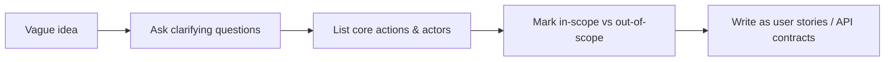

## Definition

Functional requirements describe **what a system must do** — the specific features, behaviors, and outputs it needs to provide for a given input. "A user can upload a photo," "the system sends a confirmation email after checkout," and "an admin can ban a user" are all functional requirements.

## Why it exists

Every design decision downstream depends on knowing what the system is actually for. Without explicit functional requirements, engineers either guess (and build the wrong thing) or over-build (supporting features nobody asked for). Naming functional requirements is the cheapest way to catch a misunderstanding — before any code is written.

## The problem it solves

Vague requests like "build a photo sharing app" hide dozens of implicit decisions: Can users delete photos? Can they be private? Is there a feed, or just profile pages? Functional requirements force these questions into the open, converting an ambiguous idea into a concrete, buildable list.

## Real-world analogy

Ordering a custom cake: "I want a birthday cake" is not enough for the baker to start. "Chocolate, three tiers, feeds 40 people, no nuts, delivered by 2pm Saturday" is a functional (and partly non-functional) spec — precise enough that the baker knows exactly what to build and can tell you if something's not feasible.

## Simple explanation

Functional requirements answer: **"What can a user (or another system) do with this, and what should happen when they do it?"** They're usually written as short action statements: "A user can X," "the system does Y when Z happens."

## Technical explanation

In practice, functional requirements are captured as:

- **User stories**: "As a [role], I want to [action], so that [benefit]."
- **Use cases**: step-by-step interactions between an actor and the system, including edge cases (e.g. "what if the upload fails halfway?").
- **API contracts**: once specific enough, functional requirements translate directly into endpoint definitions (see [REST](/docs/networking/rest)).

## Internal working — how requirements get scoped

The key discipline is explicitly marking things **out of scope**. "Users can share to social media" being explicitly excluded is just as valuable as what's included — it prevents scope creep later.

## Advantages

- Creates a shared, testable definition of "done."
- Surfaces hidden assumptions before they become expensive to fix.
- Directly informs API design and data model.

## Disadvantages

- Gathering them takes real time and stakeholder access — rushing this step is the most common root cause of building the wrong thing.
- Requirements can change mid-project, and rigid specs can make teams resistant to necessary pivots.

## Trade-offs

Being very detailed upfront (a heavy spec document) reduces ambiguity but slows down getting started; being too loose ("we'll figure it out as we build") is fast to start but risks costly rework. Most teams land in the middle: a short list of concrete functional requirements plus a clear "out of scope" list, refined iteratively.

## Complexity considerations

The number of functional requirements should match the actual product stage — an MVP needs a short, tight list; a mature product may formally track hundreds across many features. Trying to fully spec a product on day one, before any user feedback exists, is usually wasted effort.

## When to use

Any project big enough to involve more than one person, or where "what does this actually need to do" isn't obvious from a one-line description.

## When NOT to overdo it

Solo prototypes or throwaway scripts, where writing a formal requirements doc costs more time than it saves.

## Common mistakes

- Confusing functional requirements ("what") with implementation details ("how") — "users can search photos" is functional; "we'll use Elasticsearch" is a technical decision that comes later.
- Not distinguishing must-have from nice-to-have, leading to scope creep.
- Skipping edge cases (e.g. "what happens if two users edit the same document simultaneously?").

## Interview questions

- "Before designing, what functional requirements would you clarify with the interviewer?"
- "Is [some feature] in scope for this design, or should we assume it's not?"

## Practical example

For a URL shortener: "a user submits a long URL and receives a short URL," and "visiting the short URL redirects to the original" are the core functional requirements — see the [URL Shortener case study](/docs/case-studies/url-shortener) for how these two sentences drive the entire architecture.

## Production example

Stripe's public API documentation is effectively a very precise, public functional requirements spec: every endpoint states exactly what action it performs and what the system guarantees in response.

## Best practices

- Write requirements as testable statements, not vague goals.
- Explicitly list what's out of scope, not just what's in scope.
- Revisit and adjust requirements as you learn more — they're a living document, not a one-time exercise.

## Summary

Functional requirements define the concrete "what" of a system — the features and behaviors it must support. They're the first thing to clarify in any design process, because every downstream decision (API shape, data model, architecture) depends on knowing exactly what the system needs to do.

## References

- Designing Data-Intensive Applications, Martin Kleppmann (Ch. 1, on requirements)

<Quiz questions={[
  {
    q: "Which of these is a functional requirement?",
    options: [
      "The system must respond within 200ms",
      "A user can reset their password via email",
      "The system must handle 10,000 requests per second",
      "The system must be available 99.9% of the time"
    ],
    answer: 1,
    explanation: "Functional requirements describe specific features/behaviors (what the system does); the other options describe performance and availability targets, which are non-functional requirements."
  }
]} />
