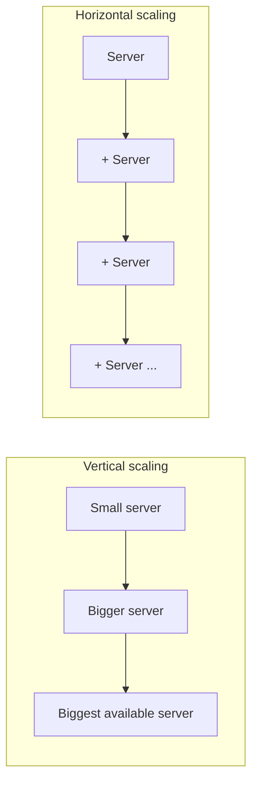

## Definition

**Vertical scaling** (scaling up) increases capacity by making a single machine more powerful — more CPU, RAM, faster storage. **Horizontal scaling** (scaling out) increases capacity by adding more machines and distributing work across them.

## Why it exists

Every machine has a maximum capacity — even the largest cloud instance available has a CPU core count, memory, and disk throughput ceiling. Once a workload approaches or exceeds what a single machine can do, there are exactly two options: get a bigger machine, or use more than one. This binary choice, and its consequences, is fundamental enough to every scaling discussion that it deserves to be understood on its own.

## The problem it solves

Without a clear framework for this choice, teams often default to vertical scaling ("just get a bigger server") because it's operationally simpler, until they hit a hard ceiling — either the largest available machine still isn't enough, or a single machine becomes an unacceptable single point of failure. Understanding both options, and when each applies, avoids painting yourself into that corner.

## Real-world analogy

A small bakery can handle more orders by buying a bigger oven (vertical scaling) — simple, no coordination needed, but there's a limit to how big one oven can physically get, and if that one oven breaks, the whole bakery stops. Alternatively, the bakery could open several smaller kitchens across town (horizontal scaling) — more coordination is needed (delivery logistics, consistent recipes across locations), but there's no practical ceiling, and one kitchen having a problem doesn't shut down the others.

## Simple explanation

| | Vertical Scaling | Horizontal Scaling |
|---|---|---|
| How | Bigger machine | More machines |
| Ceiling | Hard limit (largest machine available) | Practically unlimited |
| Single point of failure | Yes (one machine) | No (many machines) |
| Operational complexity | Low | Higher (coordination, data distribution) |
| Cost curve | Non-linear — big machines cost disproportionately more per unit of capacity | Roughly linear — more machines ≈ proportionally more cost |
| Downtime to scale | Often requires a restart/resize | Usually zero-downtime (add a node) |

## Technical explanation

Vertical scaling is a configuration change — resize an existing instance, or migrate to a bigger one. Horizontal scaling requires the application and data layer to actually support distribution:

- **Stateless application servers** scale horizontally trivially — any request can go to any server (see [Load Balancing](/docs/load-balancing/algorithms)).
- **Stateful components** (databases) require explicit design to scale horizontally — [replication](/docs/databases/replication) for read scaling, [sharding](/docs/databases/sharding) for write scaling — since data must be split or copied across multiple machines correctly.

## Internal working

## Advantages

**Vertical scaling**
- ✅ Simple — no application changes needed, no distributed-systems complexity.
- ✅ No data consistency challenges (it's still one machine).

**Horizontal scaling**
- ✅ No practical ceiling on capacity.
- ✅ Improves availability as a side effect (losing one of many machines is far less catastrophic than losing your only machine).

## Disadvantages

**Vertical scaling**
- ❌ Hard ceiling — eventually there's no bigger machine to buy.
- ❌ Single point of failure — that one machine going down takes everything with it.
- ❌ Non-linear cost — the biggest available instances cost disproportionately more per unit of capacity than mid-sized ones.

**Horizontal scaling**
- ❌ Requires the application to be designed for distribution (stateless servers, a data layer that supports partitioning).
- ❌ Adds real coordination complexity — network calls between nodes, data consistency across replicas/shards.

## Trade-offs

Vertical scaling trades simplicity for a hard ceiling and a single point of failure. Horizontal scaling trades operational complexity for near-unlimited capacity and better resilience. In practice, most production systems use both: reasonably-sized (not maximally huge) individual machines, scaled out horizontally.

## Complexity considerations

Scaling the stateless tiers of a system horizontally is usually straightforward. Scaling the stateful tiers (databases, in particular) horizontally is where most of the real engineering difficulty in system design lives — see [Sharding](/docs/databases/sharding) for the specifics.

## When to prefer vertical scaling

- Early-stage systems with low, uncertain traffic, where the operational simplicity of one machine outweighs the (currently unneeded) benefits of horizontal scale.
- Workloads that are inherently hard to distribute (e.g. a single very large in-memory computation that doesn't parallelize well).

## When to prefer horizontal scaling

- Any system expected to exceed what a single (even large) machine can provide.
- Systems where high availability matters — the redundancy horizontal scaling provides is often as valuable as the extra capacity.

## Common mistakes

- Scaling vertically well past the point of diminishing returns, when horizontal scaling (of the actual bottlenecked tier) would be both cheaper and more resilient.
- Assuming horizontal scaling is a drop-in operational change — for stateful components in particular, it requires real upfront application and data-model design.
- Horizontally scaling a tier that isn't actually the bottleneck (see [Scalability](/docs/fundamentals/scalability)) — it does nothing for overall capacity if a different component is the real limit.

## Interview questions

- "Would you scale this component vertically or horizontally, and why?"
- "What has to be true about this application for horizontal scaling to actually work?"
- "What's the ceiling on vertical scaling here, and what happens when you hit it?"

## Practical example

In the [URL Shortener case study](/docs/case-studies/url-shortener), stateless app servers scale horizontally behind a load balancer with essentially no extra design work, while the database uses read replicas (a horizontal scaling technique specifically designed for the read-heavy nature of that workload) rather than simply being made into a bigger single machine.

## Production example

Most large-scale internet companies (Google, Amazon, Netflix) run on fleets of many thousands of relatively modest, commodity-sized machines rather than a small number of extremely large ones — a deliberate horizontal-scaling-first strategy that trades per-machine simplicity for near-unlimited aggregate capacity and strong fault tolerance.

## Best practices

- Design application servers to be stateless by default, so horizontal scaling is available without extra work when it's needed.
- Reach for vertical scaling first for genuinely simple, low-stakes workloads — it's the lower-complexity option when it's sufficient.
- When horizontal scaling a stateful layer, plan the data distribution strategy (replication vs. sharding) deliberately, rather than bolting it on after the fact.

## Summary

Vertical scaling (bigger machines) is simpler but has a hard ceiling and a single point of failure; horizontal scaling (more machines) has no practical ceiling and improves resilience, at the cost of real distributed-systems complexity — especially for stateful components. Most real systems use both: reasonably-sized machines, scaled out.

## References

- Designing Data-Intensive Applications, Martin Kleppmann (Ch. 1)

<Quiz questions={[
  {
    q: "Which scaling approach improves availability as a side effect, and why?",
    options: [
      "Vertical scaling, because bigger machines fail less often",
      "Horizontal scaling, because losing one of many machines is far less catastrophic than losing your only machine",
      "Neither approach affects availability",
      "Both approaches equally improve availability"
    ],
    answer: 1,
    explanation: "Horizontal scaling introduces redundancy as a natural side effect — with many machines sharing the load, one failing doesn't take down the whole system, unlike vertical scaling's single, larger machine."
  }
]} />
