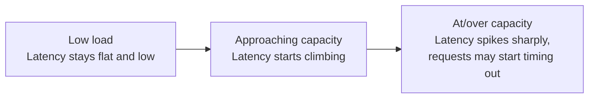

## Definition

**Latency** is the time it takes to complete a single operation — from request sent to response received. **Throughput** is the number of operations a system can complete per unit of time (e.g. requests per second). They measure different things and often trade against each other.

## Why it exists

"How fast is the system?" is ambiguous — fast for one user's single request, or fast at handling many users at once? Latency and throughput exist as two separate metrics because a system can be excellent at one and poor at the other, and the design techniques that improve each are often different.

## The problem it solves

Optimizing blindly for "speed" without distinguishing latency from throughput leads to designs that solve the wrong problem — for example, adding more parallel workers (helps throughput) doesn't make any single request finish faster (doesn't help latency), and can even hurt latency if it increases contention for a shared resource.

## Real-world analogy

A highway toll plaza: **latency** is how long it takes one specific car to get through a booth. **Throughput** is how many cars per minute the whole plaza can process. Adding more booths increases throughput (more cars/minute overall) without necessarily changing how long any one car spends at its booth — that's latency and throughput moving somewhat independently.

## Simple explanation

- Low latency = each individual request feels fast.
- High throughput = the system handles a lot of total traffic.

A system can have low latency but low throughput (a single very fast worker that can only do one thing at a time), or high throughput but high latency (a system that processes huge batches efficiently but each item waits a while before being included in the next batch).

## Technical explanation

Latency is usually reported as **percentiles**, not just an average:

- **p50 (median)**: half of requests are faster than this.
- **p95 / p99**: only 5%/1% of requests are slower than this — the "tail latency," often what actually matters for user experience, since a slow p99 means a meaningful number of real users have a bad experience even if the average looks great.

Throughput is usually reported as requests per second (RPS) or queries per second (QPS), often alongside the latency at which that throughput is sustained (e.g. "5,000 QPS at p99 < 200ms").

## Internal working — how they relate (Little's Law)

A useful relationship from queueing theory:

```
Average number of requests in the system = Throughput × Average Latency
```

This explains a common real-world pattern: as a system approaches its maximum throughput capacity, queueing causes latency to increase sharply (not linearly) — a system running comfortably below capacity has low, stable latency, but pushing it toward its throughput ceiling causes latency to spike as requests start queueing up waiting for resources.



## Advantages / disadvantages of optimizing each

**Optimizing for latency** (e.g. caching, reducing network hops, faster algorithms):
- ✅ Better individual user experience.
- ❌ Doesn't necessarily help (and sometimes doesn't matter for) total system capacity.

**Optimizing for throughput** (e.g. batching, more parallel workers, horizontal scaling):
- ✅ Handles more total traffic.
- ❌ Batching in particular often *increases* latency for individual items, since they wait to be grouped with others before processing.

## Trade-offs

Batching is the clearest example of the latency/throughput trade-off: processing 100 items in one batch is far more throughput-efficient (less per-item overhead) than processing them one at a time, but any individual item now waits for the batch to fill before being processed at all — worse latency for that item.

## Complexity considerations

Measuring latency correctly (percentiles, not averages) and understanding queueing behavior near capacity requires real monitoring infrastructure — teams that only track average latency often miss serious tail-latency problems affecting a meaningful fraction of real users.

## When to prioritize latency

- User-facing interactive requests (page loads, search-as-you-type, redirects) where individual response time is directly felt by a real person.

## When to prioritize throughput

- Batch processing, analytics pipelines, background jobs — nobody is waiting in real time for any single item, so maximizing total items processed per hour matters far more than any individual item's completion time.

## Common mistakes

- Reporting and optimizing only average latency, hiding a bad tail-latency experience for a real subset of users.
- Adding parallelism to improve throughput without checking whether it actually helps, or whether a different resource (e.g. a single shared database) is the true bottleneck limiting both.
- Confusing "the system feels fast in testing" (low load, few users) with "the system is fast" (which must be validated under realistic concurrent load, since latency often degrades sharply near capacity).

## Interview questions

- "What's an acceptable p99 latency for this endpoint, and why?"
- "How would you improve throughput here without making individual request latency worse?"
- "What happens to latency as this system approaches its maximum throughput?"

## Practical example

In the [URL Shortener case study](/docs/case-studies/url-shortener), the redirect path is optimized purely for latency (users expect an instant redirect), while an asynchronous analytics pipeline processing click events in batches is optimized for throughput instead — the same system deliberately makes different trade-offs for different parts of the request flow.

## Production example

Google's search results famously prioritize low p99 latency (a slow search feels broken even if 99% of queries are fast) enough that their infrastructure includes techniques like "hedged requests" — sending a duplicate request to a second server if the first hasn't responded within a target time, explicitly trading a small amount of extra total work (throughput cost) for better tail latency.

## Best practices

- Always report latency as percentiles (p50/p95/p99), never just an average.
- Load-test at realistic concurrent traffic levels, not just single-request benchmarks, since latency behavior near capacity is qualitatively different from latency at low load.
- Be explicit about which metric a given design decision optimizes for — they're often in tension, and "make it faster" without specifying which one leads to solving the wrong problem.

## Summary

Latency (time per operation) and throughput (operations per unit time) are distinct performance metrics that often trade against each other — batching and parallelism tend to help throughput at some cost to individual-request latency. Percentile-based latency (p99, not just average) and load testing at realistic concurrency are essential to understanding either metric honestly.

## References

- Little's Law (queueing theory)
- Google SRE Book, on latency and the value of percentiles

<Quiz questions={[
  {
    q: "A system processes items in batches of 100 to maximize efficiency. What's the most likely trade-off?",
    options: [
      "Higher throughput, but worse latency for individual items (they wait for the batch to fill)",
      "Lower throughput and lower latency",
      "No trade-off - batching only has upside",
      "Higher latency and lower throughput"
    ],
    answer: 0,
    explanation: "Batching amortizes per-operation overhead across many items (better throughput), but each item now waits for the batch to fill before being processed, which increases that item's individual latency."
  }
]} />
