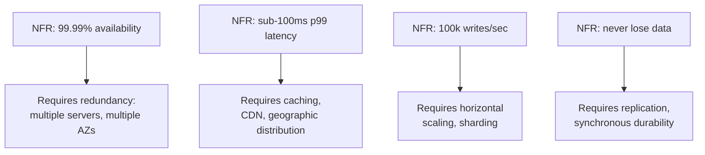

## Definition

Non-functional requirements (NFRs) describe **how well** a system must perform its functions, rather than what those functions are. Latency targets, uptime guarantees, expected user count, data durability guarantees, and security requirements are all NFRs. They're often expressed as concrete numbers: "99.9% uptime," "p99 latency under 200ms," "10 million daily active users."

## Why it exists

Two systems with identical functional requirements — "users can post messages" — can require wildly different architectures depending on whether they serve 100 users or 100 million, and whether a lost message is a minor annoyance or a legal problem. NFRs exist because **the numbers are what actually determine the architecture**, far more than the feature list does.

## The problem it solves

Without explicit NFRs, engineers either under-build (a system that falls over the first time it gets real traffic) or over-build (a system with unnecessary distributed-systems complexity for a workload that never needed it). NFRs turn "make it fast and reliable" — unactionable — into "p99 read latency under 100ms, 99.95% uptime" — something you can actually design and measure against.

## Real-world analogy

Two bridges might both have the same functional requirement — "let vehicles cross this river" — but a footbridge over a stream and a highway bridge over a major river need completely different engineering, because their non-functional requirements (load capacity, span length, traffic volume) are completely different. The steel, foundations, and cost follow directly from those numbers, not from the one-sentence purpose.

## Simple explanation

The core NFRs that show up in almost every system design discussion:

- **Scalability** — can the system handle growth in users/data/traffic?
- **Availability** — what fraction of the time is the system usable?
- **Reliability** — does the system keep working correctly, including under failure?
- **Latency** — how fast is a single response?
- **Throughput** — how many requests/operations per second can it handle?
- **Durability** — once data is written, is it guaranteed not to be lost?
- **Security** — what data protection and access control is required?

Each of these gets its own dedicated page in this course — this page is the map of how they relate.

## Technical explanation

NFRs are typically expressed with concrete, measurable targets (often called **SLOs** — Service Level Objectives):

```
Availability:  99.95% uptime (≈ 4.4 hours downtime/year)
Latency:       p50 < 50ms, p99 < 200ms
Throughput:    5,000 requests/second sustained, 20,000 peak
Durability:    99.999999999% (11 nines) - essentially never lose data
```

Notice **p50 vs p99** — average latency hides the experience of your worst-served users. A system with 50ms average latency but a 3-second p99 means 1% of users (which can be a lot, at scale) have a terrible experience. Real systems are designed and monitored against percentiles, not averages.

## Internal working — how NFRs drive design



Each NFR maps fairly directly to specific architectural techniques covered later in this course — this is why clarifying NFRs first, before designing, saves so much backtracking.

## Advantages of defining NFRs explicitly

- Prevents both under- and over-engineering by anchoring decisions to real numbers.
- Gives a concrete, measurable definition of "working correctly" beyond just passing functional tests.
- Makes trade-offs explicit and debatable (e.g. "do we really need 99.99%, or is 99.9% acceptable and much cheaper?").

## Disadvantages

- Precise NFRs require real usage data or careful estimation — early-stage products often guess, and guess wrong.
- Chasing very high NFRs (e.g. 99.999% availability) has steep, non-linear cost — going from 99.9% to 99.99% can cost far more than 10x as much effort.

## Trade-offs

Higher NFRs almost always cost more — in infrastructure, in engineering complexity, or both. A system doesn't need "the best of everything" — it needs NFRs that match what the business and users actually require. A photo-sharing hobby app doesn't need banking-grade durability; a payments system can't get away with "eventually consistent" balances.

## Complexity considerations

Every additional "9" of availability roughly requires an additional layer of redundancy and automated failover — the jump from single-server (maybe 99%) to multi-server-single-region (99.9%) to multi-region (99.99%+) each adds real operational complexity, not just cost.

## When to invest heavily in NFRs

- Systems with real financial, safety, or reputational cost when they fail (payments, healthcare, critical infrastructure).
- Products already at meaningful scale, where a small percentage of failed requests still means many actual users affected.

## When NOT to over-invest

- Early-stage or low-traffic products, where 99.9% availability and "good enough" latency is far cheaper and the business risk of occasional downtime is low.

## Common mistakes

- Stating NFRs as vague adjectives ("fast," "reliable," "scalable") instead of numbers that can actually be designed against and measured.
- Designing for peak NFRs that don't match real usage patterns (e.g. building for 100k QPS when actual peak is 500).
- Ignoring the cost curve — chasing "five nines" of availability for a system where 99.9% would have been perfectly acceptable.

## Interview questions

- "What non-functional requirements would you clarify before starting this design?"
- "How would your design change if availability requirements went from 99.9% to 99.99%?"
- "What's an acceptable latency target here, and why?"

## Practical example

For the URL shortener case study, the stated NFRs ("must feel instant," "must never lose a link," "read-heavy at 100:1") are what directly justify the cache-aside layer and the choice of a simple, replicated key-value-shaped store — see [URL Shortener](/docs/case-studies/url-shortener).

## Production example

Google's Site Reliability Engineering book popularized the idea of explicit **SLOs** (target NFRs) backed by **error budgets** — a formal allowance for how much a service is permitted to violate its SLO before development work pauses in favor of reliability work. This turns "be reliable" from a vague aspiration into a concrete, tracked number teams are held to.

## Best practices

- State NFRs as concrete, measurable numbers (percentiles, uptime percentages, requests/second) — never adjectives.
- Distinguish average-case from worst-case (p50 vs p99/p999) when discussing latency.
- Revisit NFRs periodically against real traffic data rather than treating early guesses as permanent.

## Summary

Non-functional requirements define how well a system must perform — availability, latency, throughput, durability, security — and they, far more than the feature list, determine the actual architecture. Stating them as concrete numbers up front is what turns "make it fast and reliable" into a design you can actually build and validate.

## References

- Google SRE Book, "Service Level Objectives" chapter

<Quiz questions={[
  {
    q: "Why is p99 latency often more important to track than average latency?",
    options: [
      "p99 is always a smaller number",
      "Average latency can hide a bad experience for a meaningful fraction of users",
      "p99 is easier to measure",
      "Average latency isn't a real metric"
    ],
    answer: 1,
    explanation: "A low average can coexist with a high p99, meaning a non-trivial fraction of requests (which can be a large absolute number of users at scale) have a much worse experience than the average suggests."
  }
]} />
