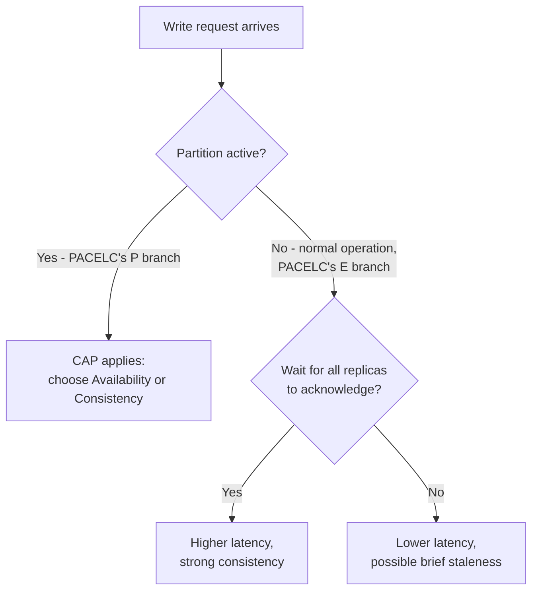

## Definition

PACELC is an extension of the [CAP theorem](/docs/fundamentals/cap-theorem) that says: **if there is a Partition (P), a system must choose between Availability (A) and Consistency (C); Else (E), even when running normally with no partition, it must choose between Latency (L) and Consistency (C).**

## Why it exists

CAP theorem only describes the rare case: an active network partition. But partitions are (hopefully) uncommon — most of the time, a distributed system is running normally, with no partition at all. PACELC exists because CAP is silent about the far more common everyday trade-off engineers actually face: even with a perfectly healthy network, do you wait for all replicas to confirm a write (more consistent, higher latency), or respond as soon as one replica has it (faster, but other replicas might briefly be behind)?

## The problem it solves

Teams that only learn CAP theorem often walk away thinking "consistency vs. availability" is the only trade-off in distributed systems, and only during rare partitions. PACELC corrects this: there's a second, everyday trade-off (consistency vs. latency) that applies during **normal operation**, which is when the system spends the vast majority of its time.

## Real-world analogy

Picture a company with a head office and two branch offices. During normal operation (no partition — the phone lines all work), if the head office wants to update the official price list, it can either:

- **Wait for confirmation from both branches before considering the price "updated"** (consistent, but the update takes as long as the slowest branch to confirm — added latency).
- **Update immediately and just notify the branches, without waiting for their acknowledgment** (fast, but for a brief window, a customer at a branch could see the old price).

This decision has nothing to do with the phone lines being down — it's a trade-off made every single day, under totally normal conditions.

## Simple explanation

PACELC in one sentence: **"Partitioned? Availability or Consistency. Else, Latency or Consistency."** The first half is CAP theorem restated. The second half is the new, practically more relevant part.

## Technical explanation

The "else" branch (E, L, C) maps to concrete replication choices:

- **Prioritize Consistency (EC)**: writes wait for acknowledgment from all (or a quorum of) replicas before being considered successful. Every subsequent read is guaranteed up-to-date, at the cost of higher write latency.
- **Prioritize Latency (EL)**: writes are acknowledged as soon as one replica (often the one closest to the client) has them, and propagate to other replicas asynchronously. Faster writes, but a read from a different replica shortly after might return stale data.

## Internal working

## Classifying real systems with PACELC

| System | Partition behavior | Normal-operation behavior | PACELC classification |
|---|---|---|---|
| DynamoDB (default) | Available | Latency-favoring | PA/EL |
| MongoDB (default) | Consistent (single primary) | Consistency-favoring (waits for primary ack) | PC/EC |
| Cassandra (tunable) | Available | Latency-favoring by default, tunable | PA/EL |
| Traditional single-primary RDBMS with sync replication | Consistent | Consistency-favoring | PC/EC |

## Advantages of using PACELC as a mental model

- Forces the everyday latency/consistency trade-off into the open, rather than treating CAP (a rare-partition-only concern) as the whole story.
- Gives a more complete, four-letter classification (PA/EL, PC/EC, etc.) that better predicts a real system's day-to-day behavior than CAP alone.

## Disadvantages

- It's a more complex model to reason about and explain than CAP — most engineers know CAP but not PACELC, so using it in a conversation may require briefly explaining it first.

## Trade-offs

The core insight: **a system can lean toward availability during partitions (PA) but still lean toward consistency during normal operation (EC), or any other combination** — the two choices are independent, which CAP alone doesn't capture.

## Complexity considerations

Systems offering *tunable* consistency (like Cassandra or DynamoDB, where you can choose consistency level per-query) push this decision to the application layer, which is powerful but requires developers to understand the trade-off well enough to choose correctly per use case, rather than getting a single sensible default for the whole system.

## When it matters most

- Any time you're evaluating or choosing a distributed database and the vendor's marketing says "we're highly available" — ask what they do for latency vs. consistency during **normal** operation, not just during partitions, since that's what you'll experience nearly all the time.

## When to not worry about it

- Single-node systems (no replication, so PACELC's replica-consistency trade-off doesn't apply at all).

## Common mistakes

- Assuming CAP theorem is the complete picture of distributed systems trade-offs — it only describes partition behavior, a small fraction of a system's actual operating time.
- Assuming a database's CAP classification (e.g. "it's AP") tells you everything about its everyday performance characteristics — the "else" (normal operation) behavior is a separate, independent choice.

## Interview questions

- "Even if the network never partitions, what trade-off does this design still have to make?"
- "How would you classify this system under PACELC, not just CAP?"

## Practical example

A globally distributed product catalog (read-heavy, staleness is a minor cosmetic issue) reasonably chooses PA/EL — available during partitions, and fast (low latency) with eventual consistency during normal operation. A globally distributed ledger recording financial transactions reasonably chooses PC/EC instead — correctness matters enough, in both cases, to accept slower writes.

## Production example

DynamoDB explicitly offers a choice between "eventually consistent reads" (faster, EL-leaning) and "strongly consistent reads" (slower, EC-leaning) on the same table — a direct, practical exposure of the PACELC trade-off to the application developer, letting different queries within the same system make different choices.

## Best practices

- When evaluating a distributed data store, ask about both partition behavior (CAP) and normal-operation behavior (the "else" of PACELC) — vendors often only market the former.
- Make the consistency/latency trade-off per data type, not once for an entire system, when the underlying store supports tunable consistency.

## Summary

PACELC extends CAP theorem to cover the much more common case of normal operation: even with no network partition, a distributed system must choose between waiting for replicas to confirm a write (more consistent, higher latency) or responding immediately (faster, briefly less consistent). It's a more complete and practically useful model than CAP alone, since most of a system's life is spent in the "else" branch, not during a partition.

## References

- Abadi, D. "Consistency Tradeoffs in Modern Distributed Database System Design" (2012) — the paper that introduced PACELC

<Quiz questions={[
  {
    q: "What does the 'E' in PACELC represent?",
    options: [
      "Encryption",
      "Else - i.e. what happens during normal operation, when there is no partition",
      "Eventual consistency, always",
      "Error rate"
    ],
    answer: 1,
    explanation: "PACELC says: if Partitioned, choose Availability or Consistency (this is CAP); Else (during normal operation), choose Latency or Consistency instead."
  }
]} />
