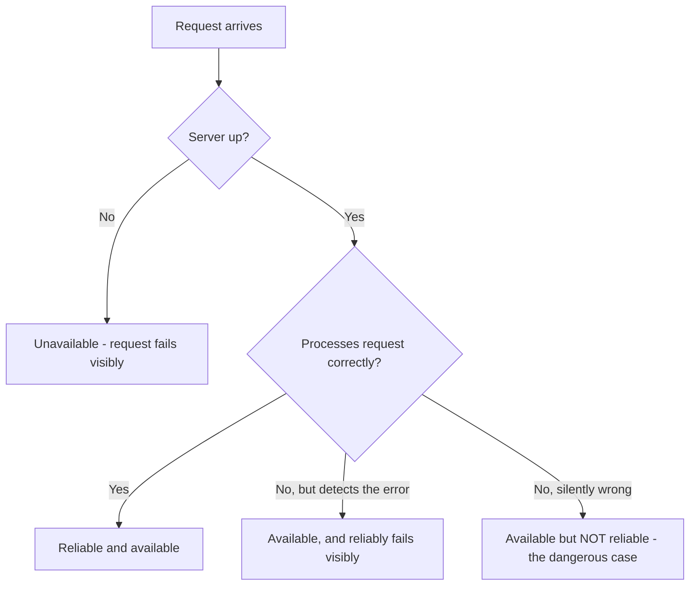

## Definition

Reliability is the probability that a system performs its intended function **correctly** over a given period, including in the presence of faults. A system can be available (responding to requests) while being unreliable (returning wrong answers, corrupting data, or silently dropping some requests) — reliability is a stricter bar than availability alone.

## Why it exists

Availability alone ("is it up?") doesn't capture everything that matters. A payment system that's "up" 99.99% of the time but occasionally double-charges customers is available but not reliable — and the second failure mode can be far more damaging than downtime. Reliability exists as a distinct concept because "responds to requests" and "responds correctly" are genuinely different engineering problems with different solutions.

## The problem it solves

Teams that only measure uptime can miss serious problems: silent data corruption, requests that succeed but produce incorrect results, or partial failures that don't trip any alarm. Reliability as an explicit target forces teams to define and test **correctness under failure**, not just responsiveness.

## Real-world analogy

An elevator that always opens its doors (available) but sometimes stops six inches above the floor (unreliable) is arguably more dangerous than an elevator that's occasionally out of service entirely — because the failure is silent and easy to miss until it causes real harm. Availability asks "does it run?" Reliability asks "does it run correctly, every time, including when something goes wrong?"

## Simple explanation

Reliability is about correctness and consistency of behavior — especially under faults like a server crashing mid-request, a network packet getting lost, or a disk silently corrupting a byte. A reliable system either completes an operation correctly, or fails in a clearly detectable way — it doesn't silently do the wrong thing.

## Technical explanation

Reliability engineering focuses on:

- **Fault tolerance** — continuing to operate correctly when a component fails (see [Fault Tolerance](/docs/fundamentals/fault-tolerance)).
- **Data integrity** — ensuring stored data isn't silently corrupted (checksums, replication with verification).
- **Correctness under concurrency** — avoiding race conditions that produce wrong results only under specific timing (a classic source of "it works on my machine" bugs that show up rarely in production).
- **Graceful degradation** — when something does fail, failing in a controlled, visible way (e.g. returning a clear error) rather than silently returning wrong data.

## Internal working — reliability vs. availability, concretely

The dangerous quadrant is the last one: the system responds (so uptime metrics look fine), but the response is wrong, and nothing alerts anyone.

## Advantages of designing for reliability

- Prevents the worst class of production incidents: silent data corruption or incorrect results that erode trust long before anyone notices a root cause.
- Forces explicit handling of partial failures, which tends to produce a more robust system overall.

## Disadvantages / costs

- Achieving strong reliability guarantees (e.g. exactly-once processing, strong data integrity checks) adds real engineering and sometimes performance cost.
- It's harder to test for than availability — you can measure uptime with a simple health check, but verifying correctness under every failure mode requires much more deliberate testing (fault injection, checksums, audits).

## Trade-offs

Stronger reliability guarantees (e.g. synchronous replication with verification before acknowledging a write) usually cost latency or throughput compared to weaker guarantees (e.g. asynchronous replication that's faster but risks a small window of data loss on failure).

## Complexity considerations

Reliability work is disproportionately about the failure paths, not the happy path — handling "what if this exact request is retried twice," "what if this write partially completes," or "what if this byte on disk flips" is where most of the complexity (and most of the value) lives.

## When to invest heavily

- Anything involving money, safety, health data, or legal records, where a silently wrong answer has real consequences.
- Systems where partial or corrupted data would be difficult to detect and expensive to clean up after the fact.

## When to accept lower reliability

- Systems where an occasional wrong or stale result is a minor inconvenience (e.g. a "trending topics" list that's briefly out of date) rather than a real problem.

## Common mistakes

- Treating "uptime looks good" as proof the system is healthy, without checking for correctness under failure.
- Not testing what happens on partial failures (e.g. a multi-step operation that fails after step 2 of 3) — this is where silent data corruption usually originates.
- Retrying non-idempotent operations without an idempotency mechanism, causing duplicate side effects that look like a "reliable" success from the client's point of view but are actually wrong.

## Interview questions

- "What happens to data correctness if this write partially fails halfway through?"
- "How would you detect — not just recover from — silent data corruption in this system?"
- "Is 'available' the same as 'reliable' here? Where might they diverge?"

## Practical example

In a payments system, a request that times out on the client side but actually succeeded on the server is an availability-vs-reliability trap: the client sees an "unavailable" error and might retry, and without an idempotency key, that retry could cause a duplicate charge — available-looking behavior with an unreliable (incorrect) outcome.

## Production example

Amazon's DynamoDB paper and many banking systems place heavy emphasis on idempotency keys and conditional writes specifically to guarantee reliability (no duplicate or lost operations) even when the network is unreliable and requests get retried.

## Best practices

- Design mutating operations to be idempotent wherever possible, so retries (needed for availability) don't compromise reliability.
- Use checksums or similar verification for critical stored data, not just replication for availability.
- Explicitly test failure-injection scenarios (killing a process mid-write, dropping network packets) rather than only testing the happy path.

## Summary

Reliability is about a system doing the right thing, including under failure — a stricter and easier-to-overlook bar than availability, which only asks whether the system responds at all. The most dangerous production failures are usually reliability failures (silent wrong answers), not availability failures (visible downtime), which is why both need to be designed for explicitly and separately.

## References

- Google SRE Book
- Designing Data-Intensive Applications, Martin Kleppmann (Ch. 1, "Reliability")

<Quiz questions={[
  {
    q: "A system responds to every request within its latency target, but 0.1% of responses silently contain stale, incorrect data with no error indicated. Is this system available? Is it reliable?",
    options: [
      "Available and reliable",
      "Available but not fully reliable",
      "Neither available nor reliable",
      "Reliable but not available"
    ],
    answer: 1,
    explanation: "The system is responding to requests (available), but a fraction of those responses are incorrect and silently so — this is exactly the availability-without-reliability gap this page describes."
  }
]} />
