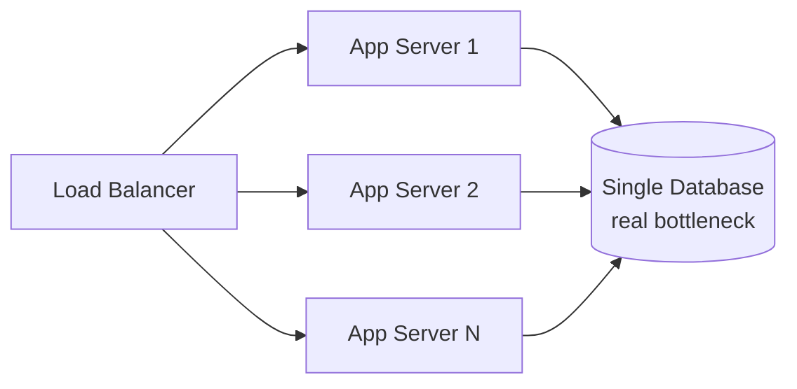

## Definition

Scalability is a system's ability to **handle growing amounts of work** — more users, more data, more requests — by adding resources, ideally without a redesign and without a proportional increase in cost or a drop in performance.

## Why it exists

Every component in a system has a capacity limit: a server has finite CPU and memory, a database has a finite number of connections and disk I/O bandwidth, a network link has finite throughput. Scalability, as a discipline, exists because growth is normal and expected for successful systems, and hitting one of these limits without a plan means an outage at the worst possible time — usually right when a product is succeeding.

## The problem it solves

A system built with no thought to scalability works fine at low traffic and then falls over — often suddenly — once it crosses some threshold (a database running out of connections, a single server maxing out CPU). Scalability planning identifies these ceilings **before** they're hit, and designs a path past each one.

## Real-world analogy

A single toll booth handles light traffic fine. As more cars arrive, the line grows until cars are backed up for miles — the booth hasn't failed, it's just at capacity. You can respond in two ways: build a bigger, faster booth (vertical scaling), or open five more booths side by side (horizontal scaling). Real highways almost always choose the second, for a reason that generalizes directly to computing: there's a limit to how fast one booth can physically process cars, but adding more booths scales close to linearly.

## Simple explanation

There are two fundamentally different ways to scale a system:

- **Vertical scaling (scale up)**: make a single machine more powerful — more CPU, more RAM, faster disks.
- **Horizontal scaling (scale out)**: add more machines, and distribute the work across all of them.

(See [Horizontal vs Vertical Scaling](/docs/fundamentals/horizontal-vs-vertical-scaling) for a full comparison.)

## Technical explanation

Scalability isn't a single property of a whole system — it's a property of **each component**, and a system is only as scalable as its least scalable component. A stateless application server layer might scale horizontally with ease, while the single relational database behind it becomes the bottleneck long before the app servers do.

Adding more app servers here does nothing for overall capacity once the database is the limiting factor — this is why scalability work is really about **finding and removing the current bottleneck**, one at a time, not applying one universal technique everywhere.

## Internal working — how scaling actually gets done in practice

1. **Measure** where the current system actually hits its limit under load (CPU? Database connections? Disk I/O? A specific slow query?).
2. **Remove that specific bottleneck** — add a cache, add a read replica, shard the database, or scale the specific tier horizontally.
3. **Re-measure** — the bottleneck has usually just moved somewhere else.
4. **Repeat.**

This iterative process is why scalability is a continuous engineering discipline, not a one-time architecture decision.

## Advantages of scaling well

- Handles growth without service degradation or outages.
- Horizontal scaling in particular improves availability as a side effect — losing one of many machines is far less catastrophic than losing your only machine.

## Disadvantages / costs

- Horizontal scaling adds real distributed-systems complexity: coordination, data consistency across nodes, network calls where there used to be in-process function calls.
- Vertical scaling has a hard ceiling — eventually, no bigger machine exists to buy.
- Premature horizontal scaling for a system that will never need it adds cost and complexity for no benefit.

## Trade-offs

Vertical scaling is simpler to operate but has a hard ceiling and a single point of failure. Horizontal scaling has no practical ceiling and improves resilience, but requires the application to be designed for distribution (e.g. stateless servers, a data layer that supports partitioning).

## Complexity considerations

Scaling a stateless layer (app servers behind a load balancer) is comparatively easy. Scaling a stateful layer (a database) is the hard part of almost every real system design problem — see [Sharding](/docs/databases/sharding) and [Replication](/docs/databases/replication).

## When to invest in horizontal scalability

- Any system expected to grow past what a single (even large) machine can handle.
- Systems where high availability matters — horizontal scaling gives you redundancy for free.

## When vertical scaling (or no scaling work at all) is fine

- Early-stage products with low, uncertain traffic — a single reasonably-sized server is simpler to operate and cheaper than a distributed system, and premature horizontal scaling is a common form of wasted engineering effort.
- Batch or internal tools with a small, bounded number of users.

## Common mistakes

- Scaling the wrong tier — adding more app servers when the database is the actual bottleneck does nothing.
- Designing for horizontal scale from day one on a product with no users yet, spending engineering time that would have been better spent validating the product.
- Assuming horizontal scaling is "free" — it isn't; it requires the application to tolerate distribution (no local in-memory state that other instances can't see, for example).

## Interview questions

- "Where's the bottleneck in this design as traffic grows 10x? 100x?"
- "Would you scale this component vertically or horizontally, and why?"
- "What has to be true about the application for horizontal scaling to actually help here?"

## Practical example

In the [URL Shortener case study](/docs/case-studies/url-shortener), the stateless app servers scale horizontally trivially behind a load balancer, while the database's read load is scaled separately via read replicas and a cache — two different scaling strategies for two different tiers of the same system.

## Production example

Netflix's architecture famously uses thousands of small, independently horizontally-scaled microservices rather than a small number of large, vertically-scaled ones — a deliberate choice that trades operational complexity for the ability to scale (and fail) each service independently based on its own specific load pattern.

## Best practices

- Design stateless application tiers by default, so they scale horizontally without extra work.
- Identify the current bottleneck with actual measurement, not intuition, before deciding what to scale.
- Prefer horizontal scaling for anything expected to grow significantly, since it also improves availability.

## Summary

Scalability is the ability to handle growth by adding resources — vertically (bigger machines) or horizontally (more machines). A system is only as scalable as its least scalable component, so scaling in practice is an iterative process of finding and removing the current bottleneck, not a single architecture decision made once.

## References

- Designing Data-Intensive Applications, Martin Kleppmann (Ch. 1)

<Quiz questions={[
  {
    q: "If app servers are scaled from 5 to 50 but the single database behind them is already at capacity, what happens to overall throughput?",
    options: [
      "It increases 10x, matching the app server increase",
      "It barely improves, since the database is the actual bottleneck",
      "It decreases",
      "It becomes infinite"
    ],
    answer: 1,
    explanation: "A system is only as scalable as its least scalable component — scaling a tier that isn't the bottleneck does little for overall throughput."
  }
]} />
