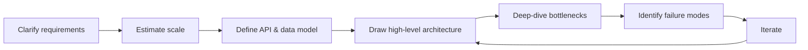

## Definition

System design is the process of defining the **architecture, components, interfaces, and data flow** of a software system so that it satisfies both what it needs to do (functional requirements) and how well it needs to do it (non-functional requirements: scale, speed, reliability, cost).

It sits one level above code. Where a programmer asks "how do I implement this function correctly?", a system designer asks "how do these ten services talk to each other, what happens when one of them dies at 3am, and does this still work when traffic is 100x higher next year?"

## Why it exists

Any system that fits on one machine, serves one user, and never needs to change doesn't need "system design" — you'd just write the program. System design exists because real systems eventually hit limits that a single machine and a single codebase can't solve alone:

- A single server runs out of CPU, memory, or disk.
- A single database becomes the bottleneck under write load.
- A single point of failure takes down the whole product when it crashes.
- A monolithic codebase becomes too large for any one team to safely change.

Once a system needs to survive failure, scale past one machine, or evolve across many teams, someone has to make deliberate structural decisions. That's system design.

## The problem it solves

Without system design, teams make architecture decisions **implicitly**, one small commit at a time, and the result is usually:

- A database that silently becomes a bottleneck because nobody planned for write volume.
- An outage that cascades across five services because there was no isolation between them.
- A rewrite, two years in, because the original structure can't support the product the company actually became.

System design front-loads these decisions. It's cheaper to argue about a whiteboard diagram for an hour than to migrate a production database under load.

## Real-world analogy

Think about the difference between building a shed and building a 40-story tower.

For a shed, you don't need blueprints, load calculations, or an elevator plan — you just start building. For the tower, an architect must decide the foundation depth, the steel structure, how water reaches the top floor, how people evacuate in a fire, and how the building will handle wind, before a single brick is laid. Get the foundation wrong, and you can't fix it later without tearing the building down.

Software is the same. A weekend project is the shed. A system serving millions of requests per second, that must never lose a payment record, is the tower — and system design is the architectural blueprint.

<Callout type="tip" title="A useful mental model">
Functional requirements are "what floors does the building have." Non-functional requirements are "does it survive an earthquake, and how fast is the elevator." Most system design interviews are actually testing whether you can reason about the second category.
</Callout>

## Simple explanation

System design is about answering four questions, roughly in this order:

1. **What does the system need to do?** (functional requirements — e.g. "users can post a photo")
2. **How well does it need to do it?** (non-functional requirements — e.g. "99.9% uptime, sub-200ms reads, 50M daily active users")
3. **What are the moving pieces, and how do they talk to each other?** (components: services, databases, caches, queues)
4. **What breaks first, and what do we do about it?** (bottlenecks, single points of failure, scaling strategy)

## Technical explanation

Formally, system design produces artifacts like:

- A **high-level architecture diagram**: boxes (services, databases, caches) and arrows (network calls, data flow).
- **API contracts**: the shape of requests and responses between components.
- A **data model**: what's stored, where, and how it's partitioned or replicated.
- **Capacity estimates**: back-of-envelope math for QPS (queries per second), storage growth, and bandwidth.
- A **failure mode analysis**: what happens when any single component goes down.

These artifacts let a team validate a design *before* writing code, and give future engineers a map of why the system looks the way it does.

## Internal working — how a design actually gets built

A typical system design process, whether in an interview or a real engineering org, follows this loop:

Notice it's a loop, not a straight line. You rarely get the architecture right on the first pass — you draw something, stress-test it against the scale numbers, find where it breaks, and redraw.

## Advantages of doing system design properly

- Prevents expensive rewrites by catching structural problems early.
- Makes scaling predictable — you know where the next bottleneck will be before it happens.
- Gives teams a shared vocabulary and diagram to reason about trade-offs.
- Makes onboarding easier: new engineers can read the architecture instead of reverse-engineering it from code.

## Disadvantages / costs

- Over-designing for scale you'll never reach wastes time and adds needless complexity (a common trap: building a Kafka-based event system for an app with 200 users).
- Design discussions can become "analysis paralysis" if not time-boxed.
- Diagrams and docs go stale if not maintained alongside the actual system.

## Trade-offs

Nearly every system design decision is a trade-off, not a free win. A few recurring ones you'll see throughout this course:

| Choose more of... | ...at the cost of |
|---|---|
| Consistency | Availability during partitions (CAP theorem) |
| Read speed (caching, denormalization) | Write complexity, staleness |
| Horizontal scalability | Operational complexity (more moving parts) |
| Strong decoupling (microservices) | Cross-service latency, debugging difficulty |

## Complexity considerations

Complexity should be proportional to actual, current or near-term, scale — not hypothetical future scale. A useful rule of thumb: design for 10x your current load, not 1000x. You can usually re-architect a specific bottleneck when you approach it, as long as the system wasn't built with hard architectural walls that prevent scaling at all.

## When to use heavyweight system design

- Systems expected to serve more than a single-machine's worth of traffic.
- Systems where downtime or data loss has real cost (money, safety, trust).
- Systems built by more than one team, where interfaces need to be explicit.

## When NOT to over-invest in it

- Prototypes and internal tools with a handful of users.
- Early-stage startups still searching for product-market fit — the "right" architecture depends on a product that doesn't exist yet.
- One-off scripts or batch jobs with no scaling requirement.

## Common mistakes

- Jumping straight to technology choices ("we'll use Kafka and Kubernetes") before clarifying requirements.
- Ignoring non-functional requirements and only designing for the happy path.
- Designing for imagined scale instead of estimated scale.
- Treating the design as a one-time exercise instead of something that evolves with the system.

## Interview questions

- "Design a system that does X" — always start by clarifying functional and non-functional requirements before drawing anything.
- "What would you do differently if this needed to support 100x the traffic?"
- "Where's the single point of failure in your design, and how would you remove it?"
- "Walk me through what happens when [component] goes down."

## Practical example

Imagine designing a simple link-sharing tool. Functional requirement: users submit a URL and get a short link back. Non-functional requirements: the redirect must be fast (under 100ms) and the system must not lose links. That single sentence of non-functional requirements already implies a cache in front of a durable database — which is exactly the shape of the [URL Shortener case study](/docs/case-studies/url-shortener) later in this course.

## Production example

Companies like Netflix, Uber, and Stripe publish detailed engineering blog posts about exactly this process — clarifying scale (Netflix serves over 300 million users), then walking through the architecture decisions (CDNs for video delivery, regional failover, chaos engineering to validate failure handling) that followed from those numbers.

## Best practices

- Always state your assumptions and requirements explicitly before designing.
- Use back-of-envelope math to justify architecture decisions, not intuition alone.
- Draw the simplest architecture that meets the stated requirements, then add complexity only where the numbers demand it.
- Explicitly call out trade-offs rather than presenting a design as having no downsides.

## Summary

System design is the discipline of deciding how a system's components fit together to meet both functional and non-functional requirements, especially at scale. It's a loop of clarifying requirements, estimating scale, drawing architecture, and stress-testing it against failure — not a single diagram drawn once. The rest of this course builds the vocabulary and tools (caching, databases, messaging, distributed systems, and full case studies) you need to do this well.

## References

- Designing Data-Intensive Applications, Martin Kleppmann
- Engineering blogs: Netflix Tech Blog, Uber Engineering, Stripe Engineering

<Quiz questions={[
  {
    q: "What best distinguishes system design from regular programming?",
    options: [
      "System design uses more advanced programming languages",
      "System design focuses on how components interact and scale, not just correctness of a single function",
      "System design is only relevant for backend engineers",
      "System design means writing more unit tests"
    ],
    answer: 1,
    explanation: "System design operates one level above code: it's about the architecture and interaction between components, especially under scale and failure, rather than the correctness of a single function."
  },
  {
    q: "Why is over-designing for imagined future scale usually a mistake?",
    options: [
      "It's technically impossible to design for future scale",
      "It adds real complexity and cost now for a benefit that may never materialize",
      "Interviewers always penalize it",
      "It makes the code run slower"
    ],
    answer: 1,
    explanation: "Unneeded complexity has an ongoing cost (harder to build, operate, and debug) for scale that may never be reached — a common anti-pattern known as over-engineering."
  }
]} />

<Flashcards cards={[
  { front: "System design (one-line definition)", back: "Deciding how a system's components fit together to meet functional and non-functional requirements, especially at scale." },
  { front: "Functional requirement (example)", back: "What the system must do — e.g. 'users can upload a photo.'" },
  { front: "Non-functional requirement (example)", back: "How well the system must do it — e.g. '99.9% uptime, sub-200ms latency.'" },
  { front: "Rule of thumb for scale", back: "Design for ~10x current load, not 1000x — re-architect specific bottlenecks as you approach them." }
]} />
