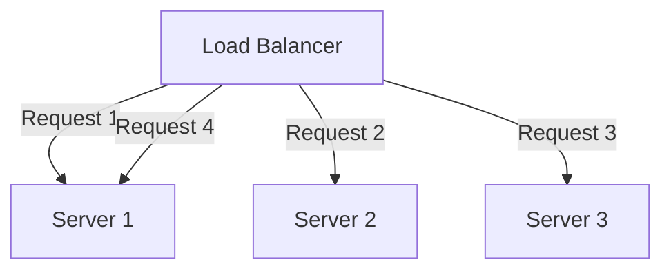

## Definition

A load balancing algorithm is the specific rule a load balancer uses to decide which of several available backend servers should handle each incoming request, aiming to distribute load evenly (or according to some deliberate weighting) across the pool.

## Why it exists

Simply having multiple backend servers doesn't automatically distribute load well — without a deliberate algorithm, requests might all pile onto one server while others sit comparatively idle, or a server already struggling under a slow, expensive request might keep receiving more work regardless. Load balancing algorithms exist to make this routing decision deliberately, based on some signal (turn order, current load, configured capacity) rather than leaving it to chance.

## The problem it solves

Without a considered algorithm, load distribution across a server pool tends to be uneven — some algorithms (like pure random selection) can by chance overload a server, while others fail to account for real differences in server capacity or current load. Choosing the right algorithm for a given workload ensures requests are actually spread in a way that reflects each server's real, current capacity to handle them.

## Real-world analogy

A busy restaurant's host can seat parties using different strategies: strictly alternating between servers regardless of how busy each currently is (round robin), specifically checking which server currently has the fewest tables and seating the new party there (least connections), or knowing that one server is training a new hire and giving them fewer tables than a fully experienced server (weighted). Each strategy makes sense in different circumstances.

## Simple explanation

- **Round robin**: cycle through servers in order, one request each, repeating.
- **Least connections**: send the next request to whichever server currently has the fewest active connections.
- **Weighted round robin / least connections**: same as above, but servers with more capacity are given a proportionally larger share.
- **IP hash**: route based on a hash of the client's IP address, consistently sending the same client to the same server.

## Technical explanation

Round robin (above) is simple and works well when all servers have roughly equal capacity and requests have roughly similar processing cost. It breaks down when either assumption is false — e.g. a mix of small and large servers, or a mix of cheap and very expensive requests.

**Least connections** instead tracks each server's current active connection count and routes new requests to whichever has the fewest — a better fit when request processing times vary significantly, since it naturally avoids piling more work onto an already-busy server.

**Weighted** variants (weighted round robin, weighted least connections) let an operator assign a relative capacity weight to each server — useful in a mixed-capacity server pool, ensuring a more powerful server receives proportionally more traffic than a smaller one.

## Internal working — health-aware routing

Load balancing algorithms are almost always combined with [Health Checks](/docs/load-balancing/health-checks) — a server that's currently unhealthy is excluded from the rotation entirely, regardless of which algorithm is otherwise in use, so an unhealthy server doesn't keep receiving new requests it can't properly handle.

## Advantages

- **Round robin**: simple, predictable, and effective when servers and request costs are roughly uniform.
- **Least connections**: adapts to real, current server load, better handling variable request processing times.
- **Weighted variants**: correctly account for genuinely mixed-capacity server pools.

## Disadvantages

- **Round robin**: doesn't account for actual current server load or differing request costs — can still overload a server handling several long-running requests simultaneously.
- **Least connections**: requires the load balancer to track real-time connection counts, adding a bit more state and complexity than simple round robin.
- **IP hash**: can create uneven distribution if client IP addresses aren't themselves evenly distributed (e.g. many users behind the same corporate NAT gateway sharing one apparent IP).

## Trade-offs

Simpler algorithms (round robin) are easier to reason about and implement but can distribute load unevenly under realistic, variable conditions; more sophisticated algorithms (least connections, weighted variants) better match real server capacity and request cost, at the cost of requiring more state and monitoring by the load balancer itself.

## Complexity considerations

Round robin requires essentially no state beyond a simple rotating pointer. Least connections requires the load balancer to continuously track each server's active connection count. Weighted variants require an operator to correctly configure and maintain accurate capacity weights as the server pool changes over time.

## When to use round robin

- A pool of roughly identical servers handling requests of roughly similar cost — the simple, common default case.

## When to use least connections (or weighted variants)

- A pool with genuinely mixed server capacity, or workloads with significantly variable request processing times, where round robin's blind rotation would create uneven real load.

## Common mistakes

- Defaulting to round robin for a workload with highly variable request costs, leading to some servers being overloaded by chance while others sit comparatively idle.
- Using IP hash for session stickiness without accounting for the possibility of many clients sharing one apparent IP (behind a shared NAT), which can undermine even distribution.
- Not combining any algorithm with health checks, allowing an unhealthy server to keep receiving new requests it can't properly serve.

## Interview questions

- "Why might round robin be a poor choice for a workload with highly variable request processing times?"
- "When would you use a weighted load balancing algorithm instead of a simple, unweighted one?"
- "How does least connections adapt better than round robin to servers under uneven current load?"

## Practical example

A service with a mix of newer, more powerful servers and older, less powerful ones uses weighted least connections — assigning higher weights to the more capable servers so they receive a proportionally larger, but still load-aware, share of traffic, rather than treating every server as equally capable under plain round robin.

## Production example

Most production load balancers (Nginx, HAProxy, cloud load balancer services) support multiple algorithms and let operators choose based on their specific server pool composition and workload characteristics — least connections and weighted variants are common choices for production web services with realistic, variable request costs.

## Best practices

- Choose round robin as a simple, effective default when server capacity and request costs are roughly uniform.
- Use least connections (or a weighted variant) when server capacity is mixed or request processing times vary significantly.
- Always combine whichever algorithm is chosen with active health checks, so unhealthy servers are excluded from routing regardless of the underlying algorithm.

## Summary

Load balancing algorithms determine how a load balancer routes each request across a pool of backend servers — round robin for simple, uniform pools, least connections for workloads with variable request costs, and weighted variants for genuinely mixed-capacity server pools. The right choice depends on matching the algorithm to your actual server pool composition and workload characteristics, and should always be combined with health checks to exclude unhealthy servers from routing.

## References

- Nginx documentation: load balancing methods
- HAProxy documentation: balance algorithms

<Quiz questions={[
  {
    q: "Why might 'least connections' be a better choice than round robin for a workload with highly variable request processing times?",
    options: [
      "Least connections is always faster to compute",
      "Least connections routes based on each server's actual current load, avoiding piling more work onto a server already handling several long-running requests - something round robin's blind rotation can't account for",
      "Round robin doesn't work with more than 2 servers",
      "There's no real difference between the two algorithms"
    ],
    answer: 1,
    explanation: "Round robin distributes requests in a fixed rotation regardless of how busy each server currently is, while least connections actively tracks and routes based on real current load — a meaningfully better fit when some requests take much longer to process than others."
  }
]} />
