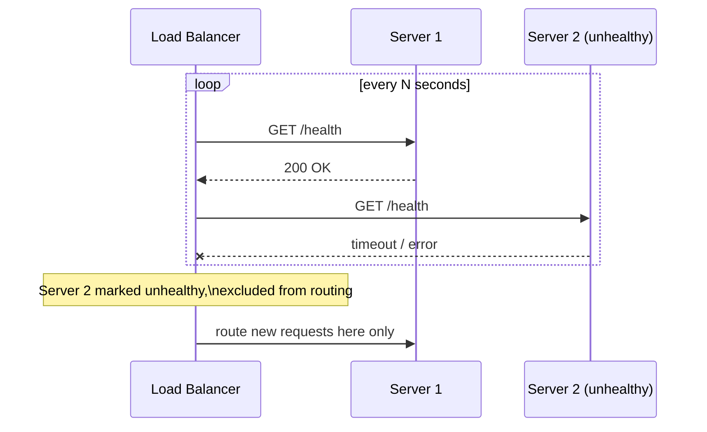

## Definition

A health check is a periodic probe a load balancer (or orchestration system) sends to a backend server to determine whether it's currently healthy and able to serve traffic — unhealthy servers are automatically excluded from receiving new requests until they pass health checks again.

## Why it exists

Servers fail, become overloaded, or get stuck in a bad state (a deadlocked process, an unresponsive database connection) without necessarily crashing outright. Health checks exist to actively and continuously verify that each server in a pool is genuinely able to serve traffic correctly, rather than assuming a server is fine simply because it hasn't visibly crashed.

## The problem it solves

Without health checks, a load balancer keeps routing traffic to every server in its configured pool, blindly, regardless of whether any of them are actually working correctly — sending real user traffic to a server that's frozen, out of memory, or unable to reach its database causes real, visible failures for those unlucky users. Health checks solve this by continuously verifying server health and automatically routing around any that fail.

## Real-world analogy

A restaurant host who periodically checks in with each section's server ("Are you doing okay, can you take more tables?") avoids seating new customers with a server who's just been informed their section's kitchen printer broke and they can't currently get any orders through — even though sending a customer to look normal to an outside observer. This kind of active check-in is exactly what a health check does for a backend server.

## Simple explanation

The load balancer periodically sends a request to each server (often hitting a specific, lightweight `/health` endpoint), and expects a specific successful response within a specific time. Servers that fail this check (wrong response, timeout, or connection refused) are marked unhealthy and excluded from receiving new traffic until they pass again.

## Technical explanation

### Types of health checks

- **Passive health checks**: inferred from real traffic — if a server's actual responses to real requests start failing or timing out, it's marked unhealthy without a separate dedicated probe.
- **Active health checks**: the load balancer proactively sends a dedicated health-check request (e.g. `GET /health`) at a regular interval, independent of real user traffic.

### What a good health check actually verifies

A naive health check that only confirms "the web server process is running" can miss real problems — a genuinely useful health check often verifies deeper dependencies too (can it reach its database? its cache?), though this needs to be balanced against making the health check itself too slow or too likely to fail from a transient, unrelated issue.

## Internal working — avoiding flapping

A server that's borderline (occasionally slow, occasionally fine) shouldn't be rapidly marked healthy, then unhealthy, then healthy again in quick succession ("flapping") — most health check implementations require a certain number of consecutive successes or failures before changing a server's status, smoothing out this noise.

## Advantages

- Automatically routes traffic away from failing or degraded servers, without requiring manual intervention.
- Enables graceful handling of deployments and rolling restarts — a server being deliberately taken down for maintenance can be marked unhealthy in advance, letting in-flight traffic drain before it's fully removed.
- Improves overall system reliability by ensuring real user traffic only reaches servers that are actually able to serve it.

## Disadvantages

- Poorly designed health checks (too shallow, or too aggressive/deep) can either miss real problems or cause unnecessary flapping/false positives.
- Adds a small amount of continuous overhead — the health check requests themselves consume some server and network resources.
- A health check that only verifies a shallow "is the process running" signal can give false confidence, missing genuine problems with deeper dependencies.

## Trade-offs

Deeper health checks (verifying downstream dependencies) catch more real problems but risk being slower and potentially failing due to a downstream issue unrelated to the server's own core ability to serve most traffic; shallow health checks are fast and simple but might miss genuine, real problems affecting actual users.

## Complexity considerations

Basic active health checks (a simple HTTP endpoint returning 200 OK) are simple to implement and widely supported by load balancers out of the box. Designing a health check that accurately reflects real service health — deep enough to catch genuine problems, shallow enough to avoid false positives from unrelated downstream blips — requires careful, ongoing tuning specific to each service.

## When to use

- Essentially always, for any production system with more than one backend server behind a load balancer — health checks are close to a baseline requirement, not an optional add-on.

## When to be careful with overly deep checks

- Avoid making a health check depend on every possible downstream dependency, especially ones that aren't strictly required for the server to handle most requests — an unrelated, minor downstream blip shouldn't take an otherwise healthy server out of rotation entirely.

## Common mistakes

- Implementing a health check that only confirms the process is running, missing real problems with critical dependencies the server actually needs to serve requests correctly.
- Making health checks too deep/strict, causing unnecessary flapping when an unrelated, minor downstream issue temporarily affects the check but not most actual user requests.
- Not tuning the failure/success threshold and check interval appropriately, causing either too-slow detection of real problems or too much sensitivity to transient noise.

## Interview questions

- "What should a good health check endpoint actually verify, and what's the risk of making it too shallow or too deep?"
- "How would you avoid a server rapidly flapping between healthy and unhealthy status?"
- "How do health checks help with a graceful rolling deployment?"

## Practical example

A `/health` endpoint on an API server checks that it can successfully reach its primary database and its cache within a short timeout, returning 200 OK if both succeed — the load balancer polls this endpoint every few seconds, and a server that starts failing this check (e.g. due to a database connectivity issue) is automatically removed from the routing pool until it recovers.

## Production example

Kubernetes uses both **liveness probes** (is the container alive at all, or should it be restarted) and **readiness probes** (is the container currently able to serve traffic) — a specific, well-established pattern distinguishing "should this be restarted" from "should this currently receive traffic," which maps closely to the general health check concept applied with more nuance.

## Best practices

- Design health checks to verify real, meaningful dependencies without becoming overly broad or slow.
- Tune consecutive success/failure thresholds to avoid flapping from transient, minor issues.
- Use health checks as part of graceful deployment processes, marking a server unhealthy before intentionally taking it down for maintenance so in-flight traffic can drain first.

## Summary

Health checks let a load balancer continuously verify that each backend server is genuinely able to serve traffic, automatically routing around any that fail — a foundational mechanism for graceful failure handling, rolling deployments, and overall system reliability. Getting the depth and sensitivity of a health check right (meaningful enough to catch real problems, not so strict it causes unnecessary flapping) requires careful, service-specific tuning.

## References

- Kubernetes documentation: Liveness, Readiness, and Startup Probes
- HAProxy / Nginx documentation on health checks

<Quiz questions={[
  {
    q: "What's the risk of a health check that only verifies 'the web server process is running,' without checking any actual dependencies?",
    options: [
      "There's no risk - this is always sufficient",
      "It can give false confidence, missing real problems like the server being unable to reach its database, even though the process itself is technically still running",
      "This type of health check is illegal to implement",
      "It makes the server run faster"
    ],
    answer: 1,
    explanation: "A shallow health check can report 'healthy' even when the server can't actually serve most real requests correctly (e.g. due to a broken database connection) — a genuinely useful health check needs to verify the dependencies actually required to serve traffic, balanced against not becoming overly deep or slow."
  }
]} />
