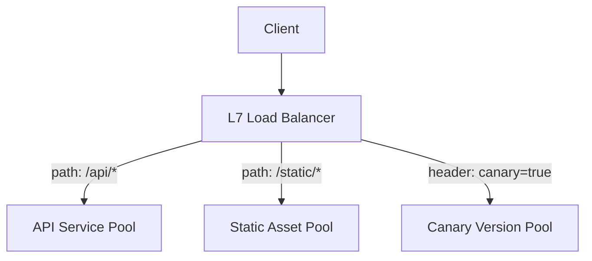

## Definition

Layer 7 (L7) load balancing operates at the application layer of the OSI model, making routing decisions based on the actual content of a request — the URL path, HTTP headers, cookies, or even the request body — rather than just network-level information.

## Why it exists

Many real routing needs genuinely depend on the content of a request, not just its source and destination — routing `/api/*` requests to one backend pool and `/static/*` to another, or routing based on an `Authorization` header to determine which version of a service a specific client should reach. [Layer 4](/docs/load-balancing/layer-4) load balancing simply can't see this information at all. L7 load balancing exists specifically to make routing decisions using this richer, application-level context.

## The problem it solves

Modern web applications and microservices architectures frequently need traffic routed differently based on what's actually being requested — different backend services for different URL paths, canary/A-B testing based on a header, or routing based on the specific API version requested. L7 load balancing solves this by fully understanding the application protocol (typically HTTP) and making routing decisions based on its actual content.

## Real-world analogy

An L7 load balancer is like a mail sorting facility that actually opens each envelope, reads the letter inside, and routes it based on its content and context — not just the outer address. This lets the facility make much more sophisticated routing decisions (this letter is a complaint, route it to customer service; this one's a job application, route it to HR) at the cost of the extra time and effort needed to actually read each one.

## Simple explanation

An L7 load balancer terminates the incoming connection, reads the actual HTTP request (path, headers, cookies, sometimes body), and uses that content to decide which backend server or service pool should handle it — the routing decision can be far more sophisticated than an L4 load balancer's IP/port-only view.

## Technical explanation

### Common L7 routing capabilities

- **Path-based routing**: `/api/*` → API service pool, `/static/*` → static asset service.
- **Header-based routing**: route based on a specific header value (e.g. an API version header, or a feature-flag header for canary releases).
- **Cookie-based routing**: used for [Sticky Sessions](/docs/load-balancing/sticky-sessions), routing based on a session-identifying cookie.
- **Content-based transformations**: some L7 load balancers can also modify requests/responses in transit (adding headers, rewriting paths).

## Internal working — why L7 has more overhead than L4

Because an L7 load balancer needs to fully parse and understand the application protocol (typically terminating the client's TCP/TLS connection and establishing a separate connection to the chosen backend), it does meaningfully more work per request than an L4 load balancer's simpler packet forwarding — a direct, deliberate trade-off for the richer routing capability it provides.

## Advantages

- Enables sophisticated, content-aware routing decisions (path, header, cookie-based) that L4 simply can't see.
- Can support advanced deployment patterns like canary releases and A/B testing based on request content.
- Often doubles as a natural place to handle TLS termination, request/response transformation, and other application-aware concerns (functionally overlapping with a [reverse proxy](/docs/networking/reverse-proxy)).

## Disadvantages

- Higher latency and resource overhead per request compared to L4, since it must fully parse and understand the application protocol.
- Limited to protocols it understands (typically HTTP/HTTPS) — not a general-purpose solution for arbitrary TCP/UDP traffic the way L4 is.

## Trade-offs

L7 load balancing trades some raw throughput and latency (compared to L4) for much richer, content-aware routing capability — the right choice whenever routing decisions genuinely depend on application-level content, and unnecessary overhead when they don't.

## Complexity considerations

Configuring L7 routing rules (path patterns, header matching) requires more upfront design than L4's simpler IP/port-based configuration, but this complexity directly buys the ability to express real, common web application routing needs that L4 can't support at all.

## When to use

- Web applications and microservices architectures needing routing based on URL path, headers, or cookies.
- Canary releases, A/B testing, or any deployment pattern needing content-aware traffic splitting.
- Combining reverse-proxy-like responsibilities (TLS termination, request routing) with load balancing in one component.

## When NOT to use (Layer 4 may be more appropriate)

- Non-HTTP TCP/UDP traffic, or extremely high-throughput, latency-sensitive workloads where application-level routing intelligence isn't actually needed.

## Common mistakes

- Using L7 load balancing (with its added overhead) for workloads that don't actually need any content-aware routing, when simpler, faster L4 load balancing would suffice.
- Over-complicating L7 routing rules unnecessarily, when a simpler routing scheme would meet the actual need.
- Not accounting for the added latency L7 load balancing introduces compared to L4, for extremely latency-sensitive use cases.

## Interview questions

- "Why might an L7 load balancer have higher latency than an L4 load balancer, and what does that overhead buy you?"
- "How would you use L7 load balancing to implement a canary release for a new service version?"
- "When would you choose L4 over L7 despite L7's richer capabilities?"

## Practical example

A microservices architecture uses an L7 load balancer (functioning much like an [API Gateway](/docs/networking/api-gateway)) to route `/users/*` requests to the Users service, `/orders/*` to the Orders service, and requests carrying a specific `X-Canary: true` header to a newer, in-testing version of a service — none of which would be possible with L4 load balancing's IP/port-only visibility.

## Production example

Most cloud "application load balancer" offerings (e.g. AWS Application Load Balancer) and API gateway products operate at Layer 7 specifically to support the path-based and header-based routing patterns common in modern web and microservices architectures.

## Best practices

- Use L7 load balancing whenever routing decisions genuinely need to consider application-level content (path, headers, cookies).
- Combine L7 routing with health checks and appropriate timeouts, since it's doing more per-request work and needs to handle backend failures gracefully.
- Consider a layered L4-in-front-of-L7 architecture for very high-scale systems needing both raw connection throughput and content-aware routing.

## Summary

Layer 7 load balancing makes routing decisions based on actual application-level content — URL paths, headers, cookies — enabling sophisticated routing patterns like path-based service routing, canary releases, and A/B testing that Layer 4's IP/port-only visibility simply can't support. This richer capability comes at the cost of higher per-request overhead compared to Layer 4, making the right choice between them a direct function of whether your routing decisions actually need to inspect application content.

## References

- AWS documentation: Application Load Balancer
- Nginx documentation: HTTP load balancing

<Quiz questions={[
  {
    q: "Which routing capability requires Layer 7 load balancing, and could not be done with Layer 4 alone?",
    options: [
      "Routing based on the destination IP address",
      "Routing based on the HTTP URL path (e.g. sending /api/* to one service and /static/* to another)",
      "Routing based on the destination port number",
      "Distributing raw TCP connections across a server pool"
    ],
    answer: 1,
    explanation: "URL path is application-layer (HTTP) content, invisible to a Layer 4 load balancer, which only sees transport-layer information like IP and port — routing based on the path requires Layer 7's ability to parse and understand the actual HTTP request."
  }
]} />
