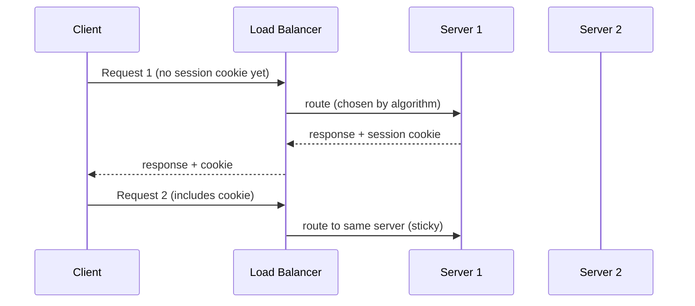

## Definition

Sticky sessions (also called session affinity) is a load balancing technique that consistently routes all requests from a specific client to the same backend server, rather than distributing that client's requests across the pool as if each request were independent.

## Why it exists

Some application designs store session-specific state directly in a server's local memory (an in-memory shopping cart, a WebSocket connection, an in-progress file upload) — if a client's next request is routed to a *different* server that doesn't have that state, the request fails or behaves incorrectly. Sticky sessions exist to accommodate exactly this: applications that (for whatever reason, often historical) keep state on a specific server, rather than in shared, externally accessible storage.

## The problem it solves

An application storing session state in a specific server's local memory breaks entirely under normal load balancing, where a client's requests can land on any server in the pool — each new request might hit a server that has no idea who this client is or what state they were in. Sticky sessions solve this narrowly and pragmatically by ensuring the same client always reaches the same server, preserving that server-local state's usefulness.

## Real-world analogy

If you've been working with a specific tailor on a custom suit, having every subsequent visit routed to that exact same tailor — who remembers your measurements and the specific fitting adjustments discussed — makes far more sense than being randomly assigned to a different tailor each visit who has no memory of that context. Sticky sessions is exactly this: consistently routing you back to "your" specific server.

## Simple explanation

The load balancer remembers (via a cookie, or a hash of the client's identifying information) which specific server a given client was previously routed to, and sends all of that client's subsequent requests to that same server, rather than distributing them according to the normal load balancing algorithm.

## Technical explanation

### Common implementation mechanisms

- **Cookie-based**: the load balancer sets a cookie identifying which server the client was routed to; subsequent requests carrying that cookie are routed back to the same server.
- **IP-hash-based**: the client's IP address is hashed to consistently determine which server they're routed to — simpler (no cookie needed), but less reliable if a client's apparent IP changes (e.g. switching networks) or many clients share one IP (behind a corporate NAT).

## Internal working — the tension with horizontal scaling

Sticky sessions work directly against one of horizontal scaling's core assumptions: that any server can handle any request, making load distribution simple and resilient. With sticky sessions, if "your" specific server becomes overloaded or fails, your session either suffers degraded performance (stuck on an overloaded server while others sit idle) or is lost entirely (if the server crashes and no other server has your session state) — precisely the fragility horizontal scaling and stateless servers are usually designed to avoid.

## Advantages

- Lets applications with server-local session state work correctly across a load-balanced pool, without requiring an immediate architectural change.
- Simple to configure at the load balancer level, requiring no code changes to the application itself in many cases.

## Disadvantages

- Undermines even load distribution — a server handling many "sticky" long sessions can become overloaded while others remain comparatively idle, and the load balancer can't simply redistribute that load.
- A server failing loses all sessions stuck to it (unless some form of session replication is separately implemented), a real availability risk.
- Complicates deployments and scaling — removing a server from the pool (for a deployment or scale-down) disrupts every client currently stuck to it.

## Trade-offs

Sticky sessions trade the resilience and even load distribution of stateless, horizontally scalable servers for compatibility with applications that store state server-side — a pragmatic short-term fix, and generally considered a sign that the application's session state should eventually move to shared, external storage (a database or [Redis](/docs/caching/redis)) rather than a permanent architectural choice.

## Complexity considerations

Configuring sticky sessions at the load balancer level is simple. The real complexity is what sticky sessions are compensating for — server-local state — which, left unaddressed, continues to limit the system's resilience and scalability regardless of how well the stickiness itself is configured.

## When to use

- As a pragmatic, short-term accommodation for existing applications that store session state server-side and can't immediately be refactored to use shared, external session storage.
- Specific technical requirements genuinely needing a persistent connection to a specific server (e.g. an active WebSocket connection, which is inherently stateful and tied to a specific server for its duration — see [WebSockets](/docs/networking/websockets)).

## When NOT to use (or to actively avoid)

- New applications, which should generally be designed to be stateless from the start — storing session data in a shared external store (a database or Redis) rather than server-local memory, so any server can handle any request without needing stickiness at all.

## Common mistakes

- Relying on sticky sessions as a permanent architectural solution rather than as a stopgap, while never actually migrating session state to shared, external storage.
- Not accounting for the load-distribution and availability risks sticky sessions introduce — assuming it's a "free" configuration option with no real downside.
- Using sticky sessions where genuinely stateless design (with shared session storage) would have been straightforward to implement from the start.

## Interview questions

- "Why do sticky sessions work against the core assumption that makes horizontal scaling straightforward?"
- "What's a better long-term alternative to sticky sessions for an application storing session state server-side?"
- "When is sticky session-like behavior actually unavoidable, rather than just a workaround?"

## Practical example

A legacy web application stores users' shopping cart contents in each server's local memory; rather than immediately refactoring this (a larger undertaking), the team configures cookie-based sticky sessions at the load balancer as an interim fix, while planning a longer-term migration to store cart contents in Redis instead — at which point stickiness can be removed entirely, since any server would then be able to serve any request correctly.

## Production example

Many legacy enterprise applications, originally designed before horizontal scaling and stateless server design became standard practice, rely on sticky sessions as a practical accommodation — while modern, cloud-native application design generally avoids the need for it entirely by keeping servers stateless from the start.

## Best practices

- Treat sticky sessions as a pragmatic, temporary accommodation, not a permanent architectural choice — plan to migrate server-local session state to shared, external storage.
- Design new applications to be stateless from the start, storing session data in a shared store (database, Redis) so any server can handle any request without needing stickiness.
- Understand and accept the real trade-offs (uneven load distribution, session loss on server failure) if choosing to rely on sticky sessions in the interim.

## Summary

Sticky sessions route a specific client's requests consistently to the same backend server, accommodating applications that store session state in server-local memory — at the direct cost of the even load distribution and resilience horizontal scaling and stateless servers are designed to provide. It's best treated as a pragmatic, temporary fix while migrating toward shared, external session storage, rather than a permanent architectural pattern for new systems.

## References

- Nginx documentation: session persistence
- AWS documentation: Elastic Load Balancing sticky sessions

<Quiz questions={[
  {
    q: "What core assumption of horizontal scaling do sticky sessions work against?",
    options: [
      "That servers should never be added or removed from a pool",
      "That any server can handle any request - sticky sessions instead require a specific client's requests to go to one specific server",
      "That load balancers are unnecessary",
      "That databases should never be replicated"
    ],
    answer: 1,
    explanation: "Horizontal scaling's simplicity and resilience come from any server being able to handle any request; sticky sessions specifically break this by requiring a given client to always be routed to the one particular server holding their session state."
  }
]} />
