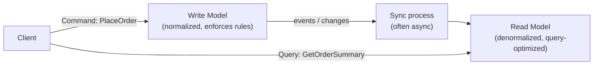
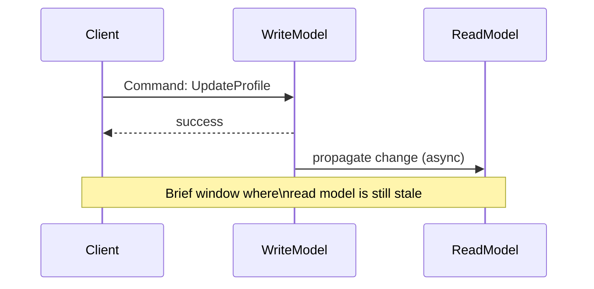

## Definition

CQRS (Command Query Responsibility Segregation) is a pattern that separates the model used for writing data (**commands** — actions that change state) from the model used for reading data (**queries**) — rather than using a single, shared model for both, as is typical in traditional CRUD applications.

## Why it exists

A single data model optimized for both writing (enforcing business rules, validation, normalized structure) and reading (fast, flexible, often denormalized queries) inevitably makes compromises for both use cases. CQRS exists to remove that compromise entirely: the write side can be modeled around correctness and business rules, while the read side can be modeled and optimized purely around what queries actually need — independently.

## The problem it solves

A single normalized schema, ideal for enforcing write-side business rules and integrity, often requires expensive joins to answer common read queries efficiently. Denormalizing the whole schema to speed up reads, in turn, complicates write-side integrity. CQRS solves this tension by not forcing one model to serve both purposes — writes go through a model optimized for correctness, and a separate, often denormalized read model is built (and kept updated) specifically to answer queries fast.

## Real-world analogy

A restaurant's kitchen operates on detailed, precise recipes and inventory tracking (the "write model" — optimized for correctness and process). The menu customers see is a completely different, simplified representation (the "read model" — optimized for quick, easy consumption) — nobody hands a customer the kitchen's raw recipe cards and inventory ledger to decide what to order. The kitchen's internal process and the customer-facing menu are different models serving different purposes, derived from the same underlying reality.

## Simple explanation

Writes (commands) go through one model — often the normalized, rule-enforcing model (potentially built with [Event Sourcing](/docs/messaging/event-sourcing)). Reads (queries) go through a separate, often denormalized model specifically built and optimized for how the data actually needs to be displayed or queried — kept in sync with the write model, typically asynchronously.

## Technical explanation

The read model is often a materialized, denormalized view specifically shaped for the application's actual queries — updated asynchronously as the write model changes, commonly via events (a natural pairing with [Event-Driven Architecture](/docs/messaging/event-driven-architecture) and Event Sourcing).

## Internal working — eventual consistency between models

Because the read model is typically updated asynchronously after a write, there's a real, if often brief, window where a just-completed write hasn't yet been reflected in the read model — the same [replication lag](/docs/databases/replication)-style trade-off that shows up throughout distributed systems.

## Advantages

- Read and write models can each be independently optimized — the write side for correctness and business rules, the read side for fast, flexible querying shaped exactly around actual usage.
- Read and write workloads can be scaled independently — a read-heavy system can scale its read model's infrastructure separately from the write model's.
- Enables building multiple, differently-shaped read models from the same underlying write model, for different consumers with different query needs.

## Disadvantages

- Introduces real complexity — maintaining two models (and the synchronization between them) instead of one.
- Eventual consistency between write and read models means a user can briefly see stale data immediately after their own write — the same read-your-writes consideration seen with [read replicas](/docs/databases/read-replicas).
- Not every domain benefits enough from this separation to justify the added complexity — simple CRUD applications with straightforward, matching read/write needs often don't need it.

## Trade-offs

CQRS trades the simplicity of one shared model for the ability to independently optimize (and scale) reads and writes — a valuable trade for systems with genuinely different, demanding read and write requirements, and unnecessary complexity for simpler applications where one model comfortably serves both.

## Complexity considerations

CQRS is often paired with Event Sourcing (though the two are independent patterns and can be used separately) specifically because an event-sourced write model naturally provides the stream of changes needed to build and update one or more derived read models. Adopting both together is a significant architectural commitment, generally reserved for the specific parts of a system where it's genuinely warranted.

## When to use

- Systems with significantly different read and write patterns/requirements — e.g. complex write-side business rules alongside high-volume, varied read queries that would be awkward or slow against the write-optimized model directly.
- Systems already using Event Sourcing, where a derived read model is a natural, low-additional-cost way to make that event log efficiently queryable.

## When NOT to use

- Simple CRUD applications where a single model comfortably serves both reading and writing needs without meaningful compromise on either side.

## Common mistakes

- Adopting CQRS (and often Event Sourcing alongside it) for simple applications that don't have a genuine mismatch between read and write needs, taking on real complexity for little benefit.
- Not accounting for the eventual consistency window between write and read models in application logic or user experience design.
- Building only one read model when multiple different consumers actually need differently-shaped views of the same underlying data — a key benefit of CQRS is being able to build several, tailored read models, not just one generic "the read side" model.

## Interview questions

- "Why might you separate your read and write models instead of using one shared model for both?"
- "What consistency trade-off does CQRS introduce, and how would you handle a user needing to see their own very recent write reflected immediately?"
- "How does CQRS commonly pair with Event Sourcing, and are the two independent patterns?"

## Practical example

An order management system uses a normalized write model enforcing strict business rules (inventory checks, payment validation) for placing orders, while a separate, heavily denormalized read model — updated asynchronously from order events — powers a fast, flexible order-history dashboard that would be awkward and slow to query directly against the normalized write-side schema.

## Production example

Many large-scale e-commerce and financial platforms use CQRS specifically to let their order-processing (write) systems focus on strict correctness and business rule enforcement, while separate, purpose-built read models (sometimes several, for different internal teams' needs) serve fast, flexible reporting and dashboard queries without impacting the write path's performance or correctness guarantees.

## Best practices

- Adopt CQRS specifically where a genuine mismatch exists between read and write needs — not as a default architectural pattern for every system.
- Design explicitly for the eventual consistency window between write and read models, especially for user-facing flows where "I just did this, why don't I see it yet" would be a real usability problem.
- Consider building multiple, differently-shaped read models when different consumers genuinely need different views of the same underlying data, rather than forcing one generic read model to serve everyone.

## Summary

CQRS separates the model used for writing data (optimized for correctness and business rules) from the model used for reading data (optimized for fast, flexible querying), allowing each to be independently designed, optimized, and scaled. It pairs naturally with Event Sourcing and Event-Driven Architecture, at the cost of real added complexity and an eventual-consistency window between the write and read sides — a trade worth making specifically when read and write requirements genuinely diverge, not as a default pattern for simple CRUD systems.

## References

- Fowler, M. "CQRS" (martinfowler.com)
- Microsoft: CQRS pattern documentation (Azure Architecture Center)

<Quiz questions={[
  {
    q: "What's the main benefit of separating read and write models under CQRS?",
    options: [
      "It eliminates the need for a database entirely",
      "Each model can be independently optimized and scaled for its specific purpose - the write model for correctness/rules, the read model for fast, flexible querying",
      "It guarantees immediate consistency between reads and writes",
      "It removes the need for any synchronization logic"
    ],
    answer: 1,
    explanation: "CQRS's core value is letting the write side focus purely on correctness and business rules while the read side is shaped and optimized purely around actual query needs — a compromise-free split that a single shared model can't achieve, at the cost of needing to keep the two in sync, typically asynchronously."
  }
]} />
