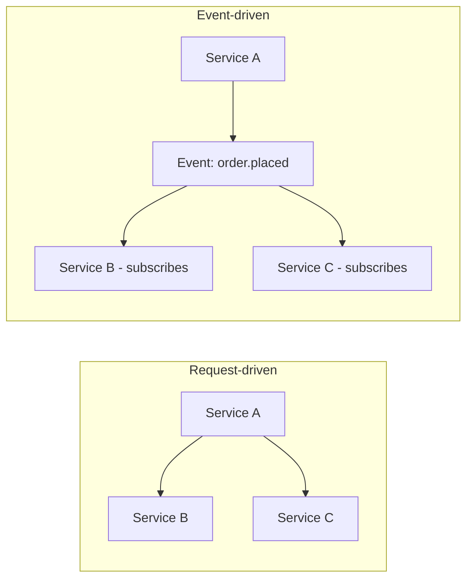

## Definition

Event-Driven Architecture (EDA) is an architectural style where system components communicate by producing and reacting to **events** — records of something that happened — rather than through direct, synchronous calls to specific other services.

## Why it exists

In a traditional, request-driven architecture, Service A directly calls Service B, which directly calls Service C — a chain of tight, synchronous coupling where A must know about B, and a failure or slowdown anywhere in the chain propagates immediately back to the caller. EDA exists to break this chain: instead of directly calling downstream services, a service simply announces "this happened," and any interested party can react independently, without the original service needing to know who's listening or what they do about it.

## The problem it solves

Tightly coupled, synchronous service chains make systems fragile (a failure anywhere cascades) and hard to extend (adding a new reaction to an existing event requires modifying the original caller to add yet another direct call). EDA solves both problems: publishing an event doesn't require knowing who reacts to it, new reactions can be added by simply subscribing to the event (no change to the publisher), and a failure in one subscriber's reaction doesn't directly break the original publisher's flow.

## Real-world analogy

A fire alarm doesn't personally call the fire department, alert building occupants, and notify building management one at a time, in sequence, waiting for each to confirm before moving to the next. It simply sounds — an event — and each interested party (occupants, the fire department, building management systems) reacts independently and in parallel, without the alarm needing to know any of their specific numbers or wait for any of them to respond before "finishing its job."

## Simple explanation

Instead of Service A directly calling Service B and Service C, Service A publishes an event ("order placed") and moves on; Service B and Service C (and any future Service D) independently subscribe to and react to that event, entirely decoupled from Service A's own logic and availability.

## Technical explanation

In the request-driven version, Service A's request isn't done until both B and C respond — a failure in either directly blocks A. In the event-driven version, Service A's job is done the moment the event is published; B and C react independently, on their own time, and a failure in one doesn't block the other or A's original flow.

## Internal working — event notification vs. event-carried state transfer

Two common EDA sub-patterns:

- **Event notification**: the event is a lightweight signal ("order 123 was placed") — subscribers that need more detail must call back to fetch it.
- **Event-carried state transfer**: the event itself carries the relevant data ("order 123 was placed, here's the full order payload") — subscribers don't need to call back at all, at the cost of a larger event payload and the need to keep that payload's schema stable over time.

## Advantages

- Strong decoupling — publishers don't need to know about subscribers, and new subscribers can be added without touching the publisher.
- Improved resilience — a failure in one subscriber's processing doesn't directly cascade back to the publisher or other subscribers.
- Naturally supports scaling reactions independently — each subscriber can be scaled based on its own specific load.

## Disadvantages

- Harder to trace and debug — understanding the full consequences of an event (who reacts, and how) requires knowing about every current subscriber, unlike a direct call chain that's visible in the calling code itself.
- Eventual consistency becomes the norm — subscribers react asynchronously, so there's a real, if often brief, window where downstream state hasn't caught up to the event yet.
- Event schema changes need careful, backward-compatible evolution, since many independent subscribers may depend on a given event's shape.

## Trade-offs

EDA trades direct visibility and immediate consistency (which a request-driven chain provides) for decoupling and resilience — an excellent trade for systems that need to evolve independently and tolerate eventual consistency, and a less natural fit for flows genuinely requiring an immediate, synchronous, guaranteed-consistent result.

## Complexity considerations

A small number of well-documented events and subscribers is manageable. As an organization's event-driven surface grows, understanding "what actually happens when this event is published" across many independent, evolving teams and services becomes a genuine architectural and documentation challenge — often addressed with event schema registries and clear ownership conventions.

## When to use

- Systems with multiple independent components that need to react to the same business events, especially when those reactions can happen asynchronously without blocking the original flow.
- Microservices architectures aiming for loose coupling between independently deployed services.

## When NOT to use

- Flows genuinely requiring an immediate, synchronous, strongly consistent result — a direct request-response call remains a better fit than routing through an asynchronous event.

## Common mistakes

- Using events for flows that actually need a synchronous, immediate response, forcing an awkward "publish an event and then poll for the result" pattern instead of a simple direct call.
- Not versioning event schemas carefully, breaking existing subscribers when the event's shape changes.
- Underestimating the debugging and tracing complexity that comes with a growing, decoupled event surface — distributed tracing and good documentation become essential, not optional, at scale.

## Interview questions

- "Why might you choose an event-driven approach over having Service A directly call Services B and C?"
- "What's the difference between event notification and event-carried state transfer, and when would you choose each?"
- "What makes event-driven systems harder to debug than a direct request-response chain, and how would you address that?"

## Practical example

An e-commerce platform's checkout service publishes an `order.placed` event; independently, an inventory service decrements stock, a notification service sends a confirmation email, and an analytics service records the sale — none of these reactions block the checkout service's response to the user, and a new reaction (say, a loyalty-points service) can be added later without any change to checkout's code.

## Production example

Uber's engineering blog has described extensive use of event-driven architecture (built on Kafka) to decouple the many independent services involved in a single ride — pricing, matching, notifications, and analytics all react to the same underlying stream of ride-lifecycle events, rather than being directly, synchronously chained together.

## Best practices

- Reserve event-driven patterns for genuinely asynchronous reactions — keep synchronous, immediate-result flows as direct calls.
- Version event schemas deliberately and evolve them in a backward-compatible way, since many independent subscribers may depend on them.
- Invest in distributed tracing and clear documentation of event producers/subscribers as the event-driven surface of a system grows, to keep debugging tractable.

## Summary

Event-Driven Architecture designs systems around publishing and reacting to events — records of what happened — rather than direct, synchronous calls between services. This provides strong decoupling and resilience (new reactions can be added without touching the publisher, and failures don't directly cascade), at the cost of harder debugging/tracing and an inherent shift to eventual consistency across the system.

## References

- Designing Data-Intensive Applications, Martin Kleppmann (Ch. 11)
- Uber Engineering Blog: event-driven architecture at scale

<Quiz questions={[
  {
    q: "What is a key trade-off of adopting event-driven architecture compared to direct, synchronous service calls?",
    options: [
      "Event-driven systems are always faster with no downsides",
      "Stronger decoupling and resilience, at the cost of harder debugging/tracing and a shift toward eventual consistency",
      "Event-driven architecture eliminates the need for any data storage",
      "There is no real trade-off"
    ],
    answer: 1,
    explanation: "EDA decouples publishers from subscribers and improves resilience to individual failures, but this comes at the cost of losing the direct visibility of a synchronous call chain and accepting that subscribers react asynchronously, introducing eventual consistency."
  }
]} />
