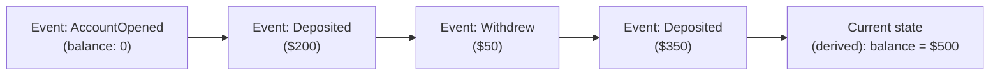
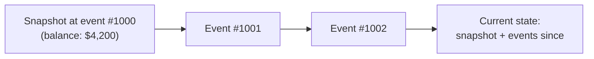

## Definition

Event Sourcing is a data storage pattern where, instead of storing only the current state of an entity, a system stores the complete, ordered sequence of events that led to that state — the current state is then derived by replaying those events, rather than being stored directly as the primary source of truth.

## Why it exists

Traditional storage (a row in a database updated in place) only keeps the current state — once a value is overwritten, the history of how it got there is gone unless explicitly logged elsewhere. Event Sourcing exists to make that history itself the source of truth: every change is captured as an immutable, permanent event, so nothing about the past is ever lost, and current state is always just one specific, reproducible view derived from that full history.

## The problem it solves

Many real systems eventually need to answer questions a simple "current state" table can't: "What was this account's balance at any point in the past?", "Why did this value change to what it is now?", "Can we replay history to rebuild a new feature's data that didn't exist when the original events happened?" Event Sourcing solves this by making the full history the primary, permanent record, rather than a nice-to-have side log.

## Real-world analogy

A bank doesn't store only "your current balance" — it maintains a permanent, ordered ledger of every single deposit and withdrawal, and your current balance is simply the running total derived from that ledger. If a dispute arises, or the bank needs to reconstruct exactly what happened on a specific day, the full ledger (not just today's snapshot) is what actually answers the question. Event Sourcing applies this same ledger-based thinking to general application data.

## Simple explanation

Instead of storing "account balance = $500" directly, you store the full sequence of events — "deposited $200," "withdrew $50," "deposited $350," and so on — and compute the current balance ($500) by replaying (summing) those events. The events are the permanent record; the current-state view is just a derived, recomputable projection of them.

## Technical explanation

### Rebuilding state

Current state is computed by replaying all events for a given entity, in order, applying each one's effect — this "replay" can happen on every read (for low-volume entities) or, more commonly at scale, be periodically cached as a **snapshot** so a full replay from the very beginning isn't needed every time.

## Internal working — snapshots

For entities with a very long event history, replaying every single event from the beginning on every read becomes slow. A common optimization: periodically save a **snapshot** of the computed state at a specific point, and on subsequent reads, start from the most recent snapshot and only replay events that occurred after it.

## Advantages

- Complete, permanent audit history — every change is recorded, answering "what happened and when" precisely, which is invaluable for debugging, compliance, and analytics.
- Enables rebuilding entirely new views/projections of past data later — a new feature needing a different aggregation of historical data can simply replay existing events, rather than requiring that data to have been captured in its final form from the start.
- Naturally fits systems already built around an event log (see [Kafka](/docs/messaging/kafka)).

## Disadvantages

- Querying current state directly is more complex than a simple row lookup — it requires either replaying events or maintaining a derived, up-to-date projection (commonly paired with [CQRS](/docs/messaging/cqrs) for exactly this reason).
- Event schemas need careful, backward-compatible evolution — old events must remain interpretable by current replay logic indefinitely, since they can never be "corrected" retroactively, only compensated for with new events.
- Adds real conceptual and implementation complexity compared to simply storing and updating current state directly.

## Trade-offs

Event Sourcing trades query simplicity (a simple table lookup) for a complete, permanent, replayable history — a valuable trade for domains where history genuinely matters (financial transactions, audit-heavy systems) and often unnecessary complexity for simple CRUD data where only the current state is ever actually needed.

## Complexity considerations

Adopting event sourcing for an entire system is a significant architectural commitment — most teams adopt it selectively, for the specific entities/domains where history and replayability provide real, needed value, rather than applying it universally across an entire application.

## When to use

- Financial systems, audit-critical domains, or any data where "how did we get here" is as important as "what's the current value."
- Systems that anticipate needing to build new views or aggregations of historical data that don't exist yet, where replaying past events is valuable.

## When NOT to use

- Simple CRUD data where only current state matters, and the complexity of managing an event log and derived projections isn't justified by any real need for history or replay.

## Common mistakes

- Adopting event sourcing broadly across an entire system rather than scoping it to the specific domains where its benefits (history, replayability) are actually needed.
- Not planning for event schema evolution carefully — since past events can never be edited, only compensated for, poor initial schema design can be a long-lived source of complexity.
- Underestimating the need for a derived, queryable "current state" projection — pure event replay on every single read doesn't scale well without snapshots or a maintained projection (see CQRS).

## Interview questions

- "Why might you choose event sourcing for a financial ledger, rather than simply storing and updating an account balance directly?"
- "How would you efficiently compute current state for an entity with millions of historical events?"
- "What challenge does event sourcing introduce for schema evolution, compared to a traditional mutable data model?"

## Practical example

A banking system stores every deposit, withdrawal, and transfer as an immutable event — the account's current balance is a derived projection, but the system can also answer far richer questions later, like "reconstruct the exact sequence of transactions leading to this balance on this specific date," which a simple "current balance" column could never answer after the fact.

## Production example

Many financial and trading systems, along with platforms like GitHub (whose entire data model is fundamentally an event-sourced log of commits and changes), are built around exactly this pattern — the full history of changes is the actual source of truth, and current state (a repository's current file contents) is a derived, replayable projection of that history.

## Best practices

- Adopt event sourcing selectively, for the specific domains where history, audit, and replayability provide real, measured value.
- Use snapshots for entities with long event histories, to avoid needing a full replay from the beginning on every read.
- Pair event sourcing with a maintained, queryable projection (often via [CQRS](/docs/messaging/cqrs)) rather than relying on replaying raw events for every single read.

## Summary

Event Sourcing stores the complete, ordered history of events that led to an entity's current state, rather than just that current state directly — making the full history the permanent source of truth, and current state a derived, replayable projection of it. It's a powerful pattern for domains where history, audit, and the ability to rebuild new views of the past matter, and real, deliberate complexity for simple CRUD data that doesn't need any of that.

## References

- Fowler, M. "Event Sourcing" (martinfowler.com)
- Designing Data-Intensive Applications, Martin Kleppmann (Ch. 11)

<Quiz questions={[
  {
    q: "In an event-sourced system, what is the 'current state' of an entity?",
    options: [
      "It's stored directly and updated in place, just like a traditional database row",
      "It's derived by replaying the full ordered sequence of past events for that entity",
      "Current state doesn't exist in event sourcing",
      "It's chosen randomly from past events"
    ],
    answer: 1,
    explanation: "Event sourcing's defining characteristic is that the events themselves are the permanent source of truth, and current state is computed (derived) by replaying them — often optimized with periodic snapshots rather than replaying from the very beginning every time."
  }
]} />
