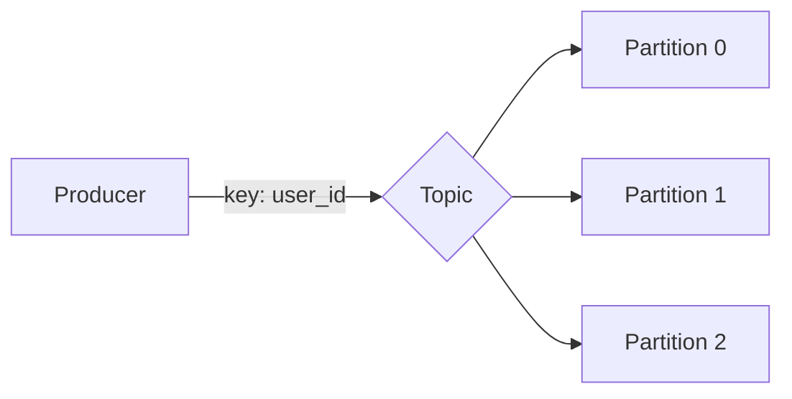
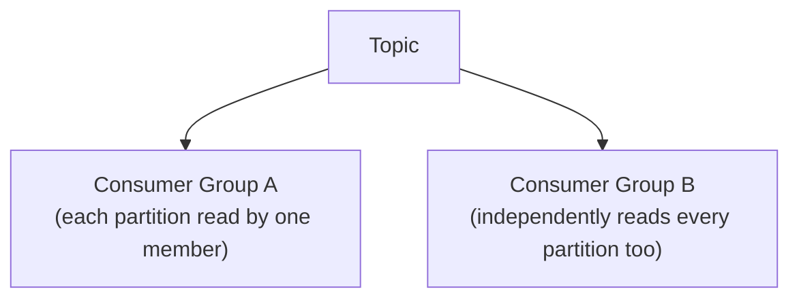
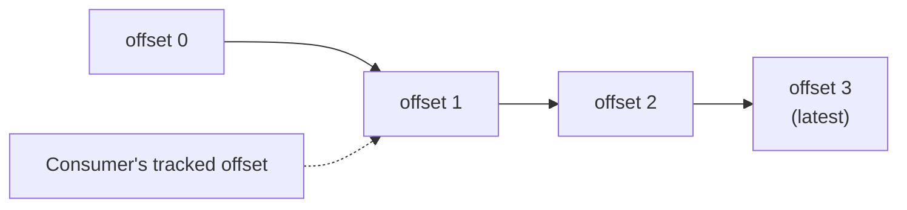

## Definition

Apache Kafka is a distributed event streaming platform built around a durable, append-only log. Producers append messages to **topics** (split into **partitions** for scale), and consumers read from those partitions independently, at their own pace — with messages retained for a configurable period, allowing consumers to replay history, not just consume the latest event.

## Why it exists

Traditional message queues typically remove a message once it's consumed, and simple Pub/Sub systems often don't retain history at all. Kafka exists to combine the durability of a log (messages are kept, in order, for a configured retention period) with the scale of a distributed system (partitioned across many machines) — letting it serve as both a high-throughput queue-like system and a replayable event store simultaneously.

## The problem it solves

Many systems need more than "deliver this message once, to one consumer, then forget it" — they need a durable, ordered record of everything that happened, that multiple independent consumers (some of which may not even exist yet) can read at their own pace, and that can be replayed from any point in history (e.g. to rebuild a service's state, or backfill a new consumer that didn't exist when the events originally happened). Kafka solves this by treating the message store itself as a durable, distributed log rather than a transient queue.

## Real-world analogy

Most message queues are like a doorman who lets each person in once and doesn't remember who came through afterward. Kafka is more like a detailed, permanent security camera log of everyone who entered a building — anyone can review the full history at any later point, rewind to any specific moment, and multiple independent security teams can each review the same footage in their own way, at their own pace, without interfering with each other.

## Simple explanation

Producers append messages to a **topic**. A topic is split into multiple **partitions** for parallelism and scale. Each partition preserves the order messages were written in. Consumers (organized into **consumer groups**) read from partitions at their own pace, and Kafka retains messages for a configured period — so a consumer group can replay from an earlier point if needed, not just consume new messages.

## Technical explanation

### Partitions and ordering

Kafka guarantees message order *within* a partition, but not across partitions of the same topic. Producers typically use a message key (e.g. a user ID) to consistently route related messages to the same partition — ensuring all events for a given user, say, are processed in order, even though different users' events might be processed out of order relative to each other across partitions.

### Consumer groups

Within a single consumer group, each partition is consumed by exactly one member of that group (load-balanced, queue-like behavior). Different consumer groups each independently receive every message (Pub/Sub-like behavior across groups) — this is exactly how Kafka provides both patterns simultaneously.

## Internal working — the log and offsets

Each partition is literally an append-only log on disk. Each message has a sequential **offset** within its partition, and consumers track which offset they've processed up to — this is what allows replay: a consumer (or a brand new one) can simply reset its tracked offset to an earlier point and reprocess from there.

## Advantages

- Extremely high throughput and horizontal scalability via partitioning.
- Durable retention (configurable, often days or longer) enables replay — new consumers can process historical events, and existing consumers can recover and reprocess after a bug fix.
- Combines queue-like load balancing (within a consumer group) and Pub/Sub-like broadcasting (across consumer groups) in one system.

## Disadvantages

- Significantly more operationally complex to run and tune than a simpler queue (like SQS) or broker (like RabbitMQ) — partition count, replication, and retention all require deliberate configuration and understanding.
- Ordering is only guaranteed within a partition, not across an entire topic — application logic needs to account for this when designing the partitioning key.
- Higher latency for a single message compared to some simpler systems, since Kafka is optimized more for high sustained throughput than for the absolute lowest possible per-message latency.

## Trade-offs

Kafka trades operational simplicity for very high throughput, durability, and replayability — the right trade for large-scale event streaming and systems that genuinely benefit from replaying history, and often unnecessary complexity for simpler background-job queueing needs that a simpler system (SQS, RabbitMQ) would handle just as well with far less operational overhead.

## Complexity considerations

Running Kafka reliably at scale (or using a managed offering like Confluent Cloud or AWS MSK) requires real operational expertise — partition rebalancing, consumer group coordination, and retention/storage planning are all genuine, ongoing concerns that a simpler managed queue largely abstracts away.

## When to use

- High-throughput event streaming where multiple independent systems need to consume the same stream of events, potentially at different times (some processing live, others backfilling historical data).
- Systems built around [Event Sourcing](/docs/messaging/event-sourcing) or needing a durable, replayable log of everything that's happened.

## When NOT to use

- Simple background job queueing needs where a much simpler managed queue (SQS, RabbitMQ) would suffice with far less operational overhead.
- Use cases needing the absolute lowest possible per-message latency, where Kafka's throughput-oriented design isn't the ideal fit.

## Common mistakes

- Adopting Kafka for a simple background-job use case that a much simpler queue would handle just as well, taking on unnecessary operational complexity.
- Choosing a poor partitioning key, leading to uneven load across partitions (a "hot partition") or losing needed ordering guarantees for related events.
- Not planning retention and storage capacity deliberately, given that Kafka (unlike many queues) is explicitly designed to retain data, not just transiently pass it through.

## Interview questions

- "Why does Kafka guarantee ordering only within a partition, not across an entire topic?"
- "How do consumer groups let Kafka support both queue-like and Pub/Sub-like consumption patterns simultaneously?"
- "When would you choose Kafka over a simpler managed queue like SQS?"

## Practical example

A ride-sharing platform publishes every ride-status-change event to a Kafka topic partitioned by `ride_id` — a billing consumer group processes events to charge riders, an analytics consumer group independently processes the same events for reporting, and a new fraud-detection consumer group added months later can replay the full historical stream to build its initial model, all without any change needed to the original producer.

## Production example

LinkedIn originally built Kafka specifically to handle their massive internal event-streaming needs (activity data, operational metrics) at a scale and durability level existing queue systems of the time didn't provide — it was later open-sourced and has since become the dominant technology for large-scale event streaming across the industry.

## Best practices

- Choose a partitioning key that both distributes load evenly and preserves the ordering guarantees your use case actually needs (e.g. partition by user ID or entity ID for per-entity ordering).
- Use consumer groups deliberately — one per independent system that needs its own view of the stream, rather than sharing a single group across unrelated consumers.
- Only adopt Kafka when its specific strengths (very high throughput, replay, multiple independent consumer groups) are genuinely needed — a simpler queue is often the better choice otherwise.

## Summary

Kafka is a distributed, durable, partitioned log that combines the throughput and scale of a distributed system with the durability and replayability of a persistent log — supporting both queue-like (within a consumer group) and Pub/Sub-like (across consumer groups) consumption patterns simultaneously. It's the right choice for high-throughput event streaming and systems needing replay, and meaningful operational overkill for simpler background-job queueing needs.

## References

- Kafka: The Definitive Guide (O'Reilly)
- Apache Kafka official documentation

<Quiz questions={[
  {
    q: "Why might a producer deliberately use a message key (like user_id) when publishing to a Kafka topic?",
    options: [
      "Keys are required for encryption",
      "Kafka uses the key to consistently route related messages to the same partition, preserving their relative order",
      "Keys determine which consumer group receives the message",
      "Keys have no functional effect in Kafka"
    ],
    answer: 1,
    explanation: "Kafka guarantees ordering only within a single partition — using a consistent key (like user_id) ensures all messages for that entity land on the same partition, preserving their relative order even though ordering isn't guaranteed across the whole topic."
  }
]} />
