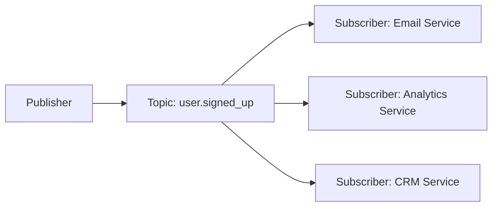
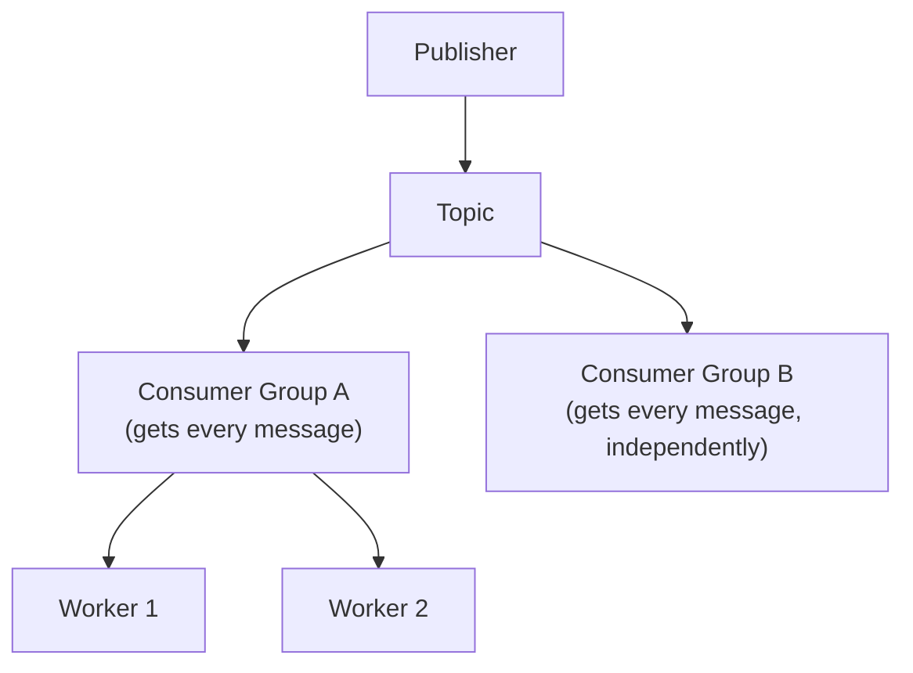

## Definition

Publish-Subscribe (Pub/Sub) is a messaging pattern where publishers send messages to a topic without knowing who (if anyone) is listening, and any number of independent subscribers can receive a copy of each message, each processing it independently.

## Why it exists

A [queue](/docs/messaging/queues) is fundamentally point-to-point — one message is typically processed by exactly one consumer. But many real scenarios need the *same* event to trigger multiple, entirely independent reactions: a new user signup might need to trigger a welcome email, an analytics event, and a CRM update — three unrelated systems, all needing to know about the same event. Pub/Sub exists specifically to let one event fan out to many independent subscribers, without the publisher needing to know or care who's listening.

## The problem it solves

Without Pub/Sub, a publisher wanting multiple independent systems to react to the same event would need to know about, and directly call, every single one of them — tightly coupling the publisher to every current (and future) consumer of that event. Pub/Sub decouples this entirely: the publisher just announces "this happened," and any number of subscribers can independently choose to react, without the publisher's code ever needing to change as subscribers are added or removed.

## Real-world analogy

A radio broadcast is Pub/Sub: the radio station (publisher) transmits on a frequency (topic) without knowing or caring how many people are tuned in, or who they are. Anyone with a receiver (subscriber) can independently listen in, and the station doesn't need to change anything about its broadcast when a new listener tunes in or an old one stops listening.

## Simple explanation

`Publisher → Topic → [Subscriber A, Subscriber B, Subscriber C, ...]`. Every subscriber to a topic independently receives a copy of every message published to it — unlike a queue, where one message typically goes to exactly one consumer.

## Technical explanation

Each subscriber processes the message independently — a failure or slowness in the Analytics Service subscriber doesn't affect whether the Email Service subscriber successfully sends its welcome email, since they're entirely separate consumption paths, not competing for the same message.

## Pub/Sub vs. queues (the key distinction)

| | Queue | Pub/Sub |
|---|---|---|
| Message consumed by | Typically one consumer (from a competing pool) | Every subscriber, independently |
| Use case | Distributing work across a pool of workers | Broadcasting an event to multiple independent systems |
| Coupling | Producer doesn't know consumers, but message goes to just one | Publisher doesn't know or care about subscribers at all; any number can react |

Many real messaging systems (like [Kafka](/docs/messaging/kafka)) actually support both patterns via **consumer groups** — multiple independent groups can each receive every message (Pub/Sub-like across groups), while within a single group, messages are distributed across that group's consumers (queue-like within the group).

## Internal working

This hybrid model (topics with independent consumer groups, each group internally load-balancing across its own workers) is exactly how Kafka combines the broadcasting benefit of Pub/Sub with the horizontal scaling benefit of queues.

## Advantages

- Decouples publishers from subscribers completely — new subscribers can be added without any change to the publisher.
- Naturally supports multiple, independent systems reacting to the same event, without the publisher needing to orchestrate or know about any of them.
- Enables event-driven architectures where systems react to what happened, rather than being directly, synchronously called.

## Disadvantages

- Debugging can be harder — tracing "what happens when this event is published" requires knowing about every current subscriber, which can be less immediately obvious than following a direct function call or API request.
- If a specific consumer's processing matters to the publisher's own logic (e.g. the publisher genuinely needs to know the outcome), Pub/Sub's fire-and-forget nature is a poor fit — a direct call or a different pattern is needed instead.
- Message ordering across multiple subscribers/partitions can be subtle to reason about, especially at scale.

## Trade-offs

Pub/Sub trades direct visibility and control (the publisher doesn't know who's listening, or what happens after) for strong decoupling — an excellent trade for event-driven systems where multiple independent reactions are genuinely desired, and a poor fit when the publisher's own logic depends on knowing a specific outcome.

## Complexity considerations

Simple Pub/Sub with a small number of well-understood subscribers is manageable. As the number of subscribers to a given topic grows across a large organization, understanding the full "blast radius" of publishing an event (who reacts, and how) becomes a genuine documentation and discoverability challenge.

## When to use

- Broadcasting a business event that multiple, independent systems need to react to (a new order, a user signup, a status change).
- [Event-Driven Architecture](/docs/messaging/event-driven-architecture) generally, where systems are designed to react to what happened rather than being directly invoked.

## When NOT to use

- When the publisher genuinely needs a specific result back from processing (Pub/Sub is fire-and-forget by nature) — a direct request-response call, or a queue with a defined single consumer, is more appropriate.

## Common mistakes

- Using Pub/Sub when the publisher actually needs a specific outcome or response — Pub/Sub's decoupled nature makes this awkward and usually signals a request-response pattern would fit better.
- Not documenting or tracking who subscribes to a given topic, making it hard to understand the full impact of publishing (or changing the format of) an event.
- Assuming Pub/Sub delivers messages in a strict global order across all subscribers — actual ordering guarantees vary by system and are often only guaranteed within a specific partition or key, not globally.

## Interview questions

- "Why would you use Pub/Sub instead of directly calling each interested system from the publisher?"
- "What's the difference between a queue and a Pub/Sub topic, in terms of how many consumers process a given message?"
- "How would Kafka's consumer groups let you achieve both Pub/Sub-style broadcasting and queue-style load balancing at the same time?"

## Practical example

A ride-sharing app publishes a `ride.completed` event; independently, a billing subscriber charges the rider, an analytics subscriber records trip data, and a driver-payout subscriber calculates the driver's earnings — three entirely separate systems, none aware of the others, all reacting to the same single published event.

## Production example

Google Cloud Pub/Sub and AWS SNS are both managed Pub/Sub services widely used specifically to let one published event fan out to multiple independent downstream systems (often each backed by its own queue for reliable, ordered processing) without the publisher needing to know about any of them.

## Best practices

- Use Pub/Sub specifically for broadcasting events that multiple independent systems should react to — not as a substitute for direct request-response calls where a specific result is needed.
- Maintain clear documentation of what subscribes to each topic, especially as the number of subscribers grows across an organization.
- Combine Pub/Sub's topic-based broadcasting with queue-like consumer groups (as in Kafka) when you need both independent reactions and horizontally scaled processing within each reaction.

## Summary

Pub/Sub lets a publisher broadcast a message to a topic without knowing or caring who's listening, and any number of independent subscribers can each receive and react to every message — a fundamentally different consumption model from a queue, where a message typically goes to just one consumer. It's the foundational pattern behind event-driven architectures, decoupling publishers completely from an evolving, potentially unknown set of subscribers.

## References

- Google Cloud Pub/Sub documentation
- Designing Data-Intensive Applications, Martin Kleppmann (Ch. 11)

<Quiz questions={[
  {
    q: "In a typical Pub/Sub system, how many subscribers receive a copy of a given published message?",
    options: [
      "Exactly one, chosen at random",
      "Every subscriber to that topic, independently",
      "Zero, unless explicitly requested",
      "Only the first subscriber to respond"
    ],
    answer: 1,
    explanation: "Pub/Sub's defining characteristic is that every independent subscriber to a topic receives its own copy of each message — unlike a queue, where a message is typically consumed by just one consumer from a competing pool."
  }
]} />
