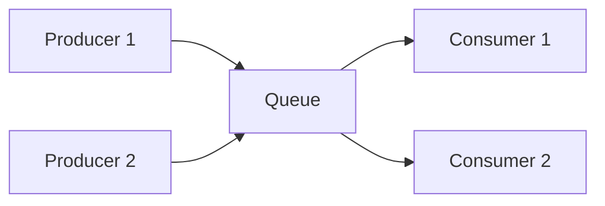
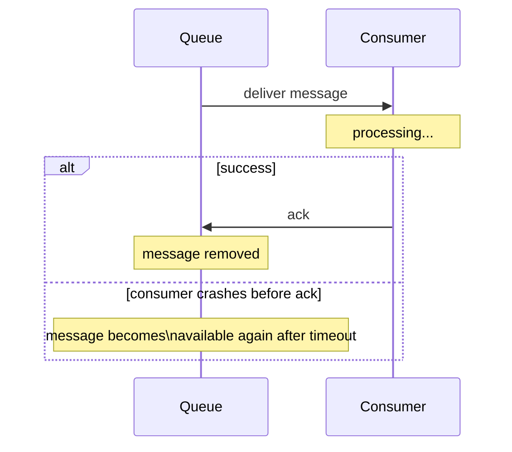

## Definition

A message queue is a component that stores messages sent by producers until they're retrieved and processed by consumers, decoupling the two in time — the producer doesn't need the consumer to be available or fast at the exact moment the message is sent.

## Why it exists

Many operations don't need to happen synchronously within a user's request — sending a confirmation email, resizing an uploaded image, generating a report. Forcing these into the synchronous request path makes the user wait for work that doesn't need to block their response. Queues exist to let a producer hand off that work and move on immediately, while a separate consumer processes it whenever it can.

## The problem it solves

Without a queue, a producer calling a consumer directly (a synchronous function call or API request) requires the consumer to be available, fast enough, and successful right now — any slowness or failure on the consumer's side directly becomes the producer's (and the user's) problem in real time. A queue solves this by sitting between them: the producer's work is done the moment the message is safely queued, regardless of how quickly (or whether) the consumer is currently able to process it.

## Real-world analogy

A restaurant's order ticket system is a queue: the server (producer) writes an order and clips it to the line, then immediately moves on to the next table — they don't stand at the kitchen window waiting for the dish to be cooked. The kitchen (consumer) works through tickets at its own pace. If the kitchen gets briefly backed up, tickets just wait in line — the server's job (taking the order) was already done, unaffected by the kitchen's current speed.

## Simple explanation

`Producer → Queue → Consumer`. The producer pushes a message onto the queue and moves on; the consumer pulls messages off the queue (often one at a time, sometimes in batches) and processes them, independently and at its own pace.

## Technical explanation

### Core properties

- **Decoupling in time**: the producer and consumer don't need to be active simultaneously — the queue holds messages in between.
- **Buffering / load leveling**: a burst of incoming messages is smoothed out — the queue absorbs the spike, and the consumer processes at a steady, sustainable rate rather than being overwhelmed instantly.
- **At-least-once delivery (commonly)**: most queue systems guarantee a message will be delivered at least once, meaning consumers generally need to handle the possibility of processing the same message more than once (idempotency matters here, same as with HTTP retries).

Multiple consumers can pull from the same queue, each processing different messages — a natural way to scale consumption horizontally as message volume grows.

## Internal working — acknowledgment and redelivery

A well-designed queue doesn't remove a message the instant it's handed to a consumer — instead, the consumer must explicitly **acknowledge** successful processing. If a consumer crashes or times out before acknowledging, the message becomes available again for another consumer to pick up.

## Advantages

- Decouples producer and consumer availability and speed — a slow or temporarily unavailable consumer doesn't block the producer.
- Smooths out traffic spikes (load leveling) — the queue absorbs a burst, and consumers process at a sustainable rate.
- Enables horizontal scaling of consumers independently of producers.

## Disadvantages

- Adds a real component (and potential point of failure) between producer and consumer — the queue itself needs to be reliable and monitored.
- Introduces asynchronicity — the producer no longer knows immediately whether/when the work actually completed, which some use cases genuinely need to know synchronously.
- At-least-once delivery semantics mean consumers must be designed to handle duplicate message delivery safely (idempotency).

## Trade-offs

Queues trade immediate, synchronous confirmation of completed work for decoupled, resilient, and more scalable processing — the right trade for background work that doesn't need to block the user, and the wrong trade for operations genuinely requiring an immediate, synchronous result.

## Complexity considerations

A simple point-to-point queue (one producer type, one consumer type) is straightforward to reason about. More complex topologies — multiple consumer groups, prioritized messages, dead-letter queues for repeatedly failing messages — add real design and operational complexity as a system's messaging needs grow.

## When to use

- Background jobs that don't need to block the user's request: sending emails, processing uploaded files, generating reports.
- Smoothing out bursty traffic before it hits a slower or more expensive downstream system.

## When NOT to use

- Operations where the caller genuinely needs an immediate, synchronous result (e.g. checking whether a specific username is available) — a direct request-response call is more appropriate than adding queue-induced asynchronicity.

## Common mistakes

- Not designing consumers to be idempotent, causing bugs when a message is (as is common and expected) occasionally delivered more than once.
- Not implementing a dead-letter queue or similar mechanism for messages that repeatedly fail processing — without one, a single malformed message can be redelivered and retried indefinitely, consuming resources.
- Treating queued work as if it completes synchronously from the producer's perspective, when in fact the producer has no immediate confirmation the consumer has (or will) succeed.

## Interview questions

- "Why would you use a queue instead of calling the downstream service directly?"
- "What happens if a consumer crashes while processing a message, before acknowledging it?"
- "Why do consumers typically need to be designed for idempotency when working with queues?"

## Practical example

An e-commerce checkout flow pushes an "order placed" message onto a queue immediately after confirming payment, returning a fast response to the user — a separate consumer then asynchronously handles sending the confirmation email and updating inventory, work that doesn't need to block the user waiting for their checkout confirmation.

## Production example

Amazon's own internal systems, and countless production architectures generally, use managed queue services (like [SQS](/docs/messaging/sqs)) specifically to decouple order processing, notification sending, and other background work from the synchronous, latency-sensitive checkout path.

## Best practices

- Design consumers to be idempotent, since most queue systems provide at-least-once (not exactly-once) delivery guarantees.
- Implement a dead-letter queue (or equivalent) to handle messages that repeatedly fail processing, rather than retrying them forever.
- Reserve queues for genuinely asynchronous work — don't force synchronous, immediate-result operations through a queue unnecessarily.

## Summary

A message queue decouples producers from consumers in time, letting a producer hand off work and move on immediately while a consumer processes it independently, at its own pace. This smooths bursty traffic, improves resilience to slow or unavailable consumers, and enables horizontal scaling of processing — at the cost of asynchronicity and the need for idempotent consumer logic to handle at-least-once delivery.

## References

- Designing Data-Intensive Applications, Martin Kleppmann (Ch. 11)
- AWS documentation: Amazon SQS

<Quiz questions={[
  {
    q: "Why do consumers of a message queue typically need to be designed as idempotent?",
    options: [
      "Queues always deliver every message exactly once, so idempotency isn't actually needed",
      "Most queues provide at-least-once delivery, meaning the same message could be delivered and processed more than once",
      "Idempotency is only relevant for producers, not consumers",
      "Queues never redeliver messages under any circumstances"
    ],
    answer: 1,
    explanation: "Because a consumer might crash after processing a message but before acknowledging it, most queue systems guarantee at-least-once delivery — the same message can be redelivered, so consumers must handle processing it more than once without causing incorrect duplicate side effects."
  }
]} />
