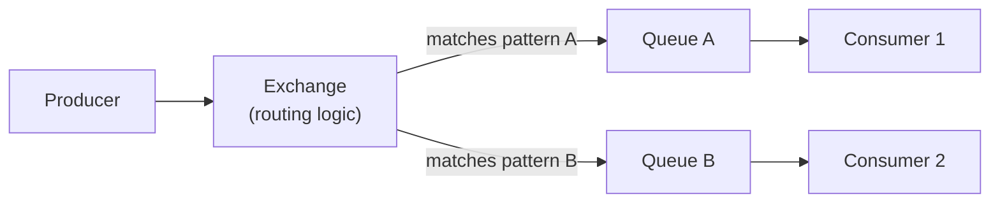

## Definition

RabbitMQ is a general-purpose message broker implementing traditional messaging protocols (primarily AMQP), providing flexible message routing (via exchanges), reliable delivery, and support for both simple queue and Pub/Sub-style patterns.

## Why it exists

Before Kafka's log-based streaming model became widely adopted, applications needing reliable messaging — task queues, request routing, Pub/Sub — used traditional message brokers. RabbitMQ exists as a mature, flexible, broker-centric solution: it actively manages message routing and delivery state, giving it a different (often simpler, for traditional queueing use cases) operational model than Kafka's distributed log approach.

## The problem it solves

Applications need reliable delivery of messages between producers and consumers, often with sophisticated routing logic (e.g. "route this message to consumer A if it matches pattern X, otherwise to consumer B"). RabbitMQ solves this with a broker that actively understands and manages routing, acknowledgment, and retry logic — the broker does more of the "thinking" compared to Kafka, where much of the routing logic (partitioning, offset tracking) lives more on the client/consumer side.

## Real-world analogy

If Kafka is like a shared, durable central log everyone reads from at their own pace, RabbitMQ is more like a smart mail-sorting facility: you drop off a letter (message) with some routing information, and the facility (broker) actively decides — based on configured rules — which specific mailboxes (queues) should receive a copy, then tracks whether each recipient has actually picked up their mail.

## Simple explanation

Producers publish messages to an **exchange**, which routes them to one or more **queues** based on configured rules (routing keys, patterns). Consumers subscribe to queues and receive messages, acknowledging them once processed — similar to the queue mental model, but with a flexible routing layer (the exchange) in front.

## Technical explanation

### Exchange types

- **Direct exchange**: routes a message to queues bound with an exact matching routing key.
- **Fanout exchange**: routes a message to *all* bound queues, regardless of routing key — the Pub/Sub broadcasting pattern.
- **Topic exchange**: routes based on pattern matching against the routing key (e.g. `orders.*.created`), enabling flexible, wildcard-based routing.

This routing flexibility — deciding which queues receive a message based on configurable rules at the broker level — is one of RabbitMQ's key differentiators from a simpler queue or from Kafka's topic/partition model.

## Internal working — acknowledgment and delivery guarantees

RabbitMQ supports both **at-least-once delivery** (the default, requiring consumer acknowledgment, with redelivery if a consumer fails to acknowledge in time) and configurations closer to **at-most-once** (auto-acknowledge, risking message loss if a consumer crashes mid-processing) — the choice depends on whether losing an occasional message or processing a message twice is the more acceptable failure mode for a given use case.

## Advantages

- Flexible, broker-managed routing (exchanges) supports sophisticated message distribution patterns without needing custom logic in every consumer.
- Mature, well-documented, widely supported across many languages and frameworks.
- Generally simpler operational model than Kafka for traditional queueing use cases that don't need Kafka's log-based replay capabilities.

## Disadvantages

- Doesn't retain messages after they've been consumed and acknowledged (by default) — it's not designed for replaying historical event streams the way Kafka is.
- Throughput, while solid, generally doesn't match Kafka's raw scale for very high-volume event streaming use cases.
- The broker does more active work (routing decisions, tracking per-message state) than Kafka's simpler append-only log model, which can become a scaling consideration at very high message volumes.

## Trade-offs

RabbitMQ trades Kafka's massive throughput and replayability for more flexible, broker-managed routing and a generally simpler operational model for traditional task-queue and routing use cases — the right choice when sophisticated routing matters more than event-stream replay, and Kafka is the better fit when durability and replay across a very high-throughput event stream matter most.

## Complexity considerations

RabbitMQ's exchange/routing model requires some upfront design thought (which exchange type, what routing keys) but is generally more approachable operationally than running and tuning a Kafka cluster, especially for teams whose needs are closer to "reliable task queue with some routing flexibility" than "durable, replayable, massive-scale event stream."

## When to use

- Task queues needing sophisticated routing (e.g. route by message type or priority to different specialized consumer queues).
- Traditional request/reply or work-distribution messaging patterns where Kafka's log-retention and replay capabilities aren't specifically needed.

## When NOT to use

- Very high-throughput event streaming where message replay and long-term retention are core requirements — Kafka is generally the better fit.

## Common mistakes

- Choosing RabbitMQ when the actual need is event-stream replay and very high sustained throughput, better served by Kafka.
- Not configuring appropriate acknowledgment and retry behavior, leading to either message loss (with auto-ack) or unexpected reprocessing behavior consumers weren't designed to handle.
- Over-engineering routing topology (many exchanges and bindings) for a use case that a much simpler, single queue would have served just as well.

## Interview questions

- "When would you choose RabbitMQ over Kafka for a messaging use case?"
- "How does a topic exchange's routing key pattern matching work, and when would you use it over a direct exchange?"
- "What's the trade-off between RabbitMQ's default acknowledgment behavior and its auto-acknowledge alternative?"

## Practical example

An e-commerce platform uses a RabbitMQ topic exchange with routing keys like `order.created`, `order.cancelled`, and `order.refunded` — different consumer queues bind to specific patterns (e.g. a fraud-detection service binds only to `order.created`, while a customer-support tool binds to all `order.*` events) without the producer needing to know about any of these specific downstream consumers.

## Production example

Many traditional enterprise and e-commerce systems have relied on RabbitMQ for years specifically for its mature, flexible routing capabilities and straightforward operational model for classic task-queue and work-distribution patterns, predating (and in many cases continuing alongside) the rise of Kafka for event-streaming use cases.

## Best practices

- Choose the exchange type (direct, fanout, topic) deliberately based on the actual routing logic needed, rather than defaulting to the most flexible (and complex) option unnecessarily.
- Configure acknowledgment behavior deliberately based on whether message loss or reprocessing is the more acceptable failure mode for your specific use case.
- Reach for Kafka instead when replay and very high sustained throughput are genuine requirements, rather than trying to stretch RabbitMQ beyond its traditional broker-centric model.

## Summary

RabbitMQ is a mature, flexible message broker built around active, broker-managed routing (exchanges), well-suited to traditional task-queue and sophisticated message-routing use cases. It trades Kafka's massive throughput and event-replay capabilities for a generally simpler operational model and more flexible per-message routing — the right choice when routing flexibility matters more than durable, replayable event streaming.

## References

- RabbitMQ official documentation
- AMQP 0-9-1 specification

<Quiz questions={[
  {
    q: "What's a key structural difference between RabbitMQ and Kafka?",
    options: [
      "RabbitMQ cannot be used for messaging at all",
      "RabbitMQ's broker actively manages flexible message routing (via exchanges), while Kafka is built around a durable, replayable, partitioned log with less active broker-side routing logic",
      "Kafka doesn't support consumer acknowledgment",
      "There is no meaningful difference"
    ],
    answer: 1,
    explanation: "RabbitMQ centers on broker-managed routing rules (exchanges deciding which queues get which messages), while Kafka centers on a durable, partitioned, replayable log with routing logic (partitioning by key) determined more by producers and consumer group configuration."
  }
]} />
