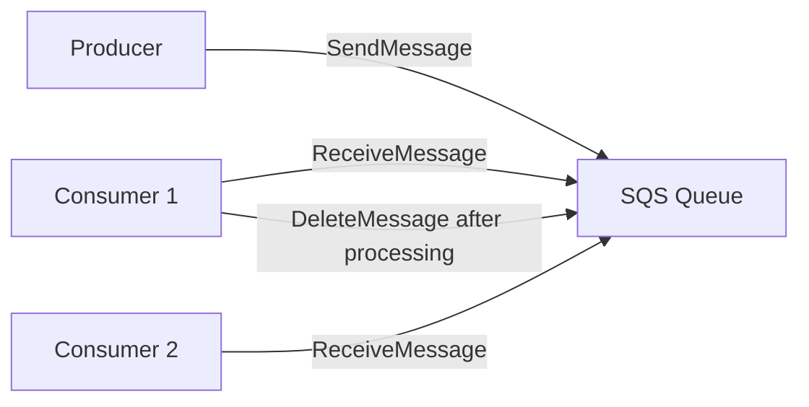
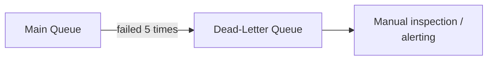

## Definition

Amazon SQS (Simple Queue Service) is a fully managed message queuing service — a straightforward, highly available queue that requires no infrastructure to provision or operate, commonly used for decoupling and buffering work between producers and consumers within AWS-based architectures.

## Why it exists

Running and operating your own message queue infrastructure (whether RabbitMQ, Kafka, or otherwise) requires real, ongoing operational effort — provisioning, scaling, patching, monitoring. SQS exists to remove that operational burden entirely for the common case: teams that need reliable queueing without wanting to run and maintain the underlying broker infrastructure themselves.

## The problem it solves

Standing up and operating a self-managed queue (even a relatively simple one) is nontrivial work that many teams would rather not take on, especially for straightforward background-job use cases that don't need Kafka's replay capabilities or RabbitMQ's sophisticated routing. SQS solves this by offering queueing as a fully managed service — you create a queue via an API call, and AWS handles all the underlying infrastructure, scaling, and availability.

## Real-world analogy

Running your own message broker is like owning and maintaining a delivery truck fleet yourself — powerful and flexible, but you're responsible for every truck's maintenance, fuel, drivers, and breakdowns. SQS is like using a reputable, fully-staffed shipping company instead — you just drop off a package and pick one up; all the operational complexity of actually running the delivery infrastructure is someone else's job.

## Simple explanation

Producers send messages to a named SQS queue via an API call; consumers poll the queue for messages, process them, and explicitly delete them once done — AWS handles all the underlying storage, replication, and availability of the queue itself.

## Technical explanation

### Standard vs. FIFO queues

- **Standard queues**: at-least-once delivery, best-effort ordering (messages might occasionally be delivered out of order), extremely high throughput.
- **FIFO queues**: strict ordering and exactly-once processing within a message group, at somewhat lower throughput than standard queues.

### Visibility timeout

When a consumer receives a message, SQS doesn't delete it immediately — instead, it becomes temporarily invisible to other consumers for a configurable **visibility timeout**. If the consumer doesn't explicitly delete the message before that timeout expires (e.g. because it crashed mid-processing), the message becomes visible again for another consumer to pick up — the mechanism behind SQS's at-least-once delivery guarantee.

## Internal working — dead-letter queues

SQS supports configuring a **dead-letter queue (DLQ)**: after a message has failed processing (been received but not deleted) a configurable number of times, it's automatically moved to a separate DLQ instead of being retried indefinitely — letting engineers inspect and handle persistently failing messages separately, without them clogging up the main queue's processing.

## Advantages

- Zero infrastructure to manage — creating and scaling a queue is just an API call, with AWS handling availability and durability behind the scenes.
- Scales automatically to handle very high throughput without capacity planning on the user's part.
- Tight integration with other AWS services (Lambda, EC2, etc.), simplifying common architectural patterns within an AWS-based system.

## Disadvantages

- Standard queues don't guarantee strict ordering (though FIFO queues do, at some throughput cost) — application logic needs to account for this if not using FIFO.
- Less flexible routing than RabbitMQ's exchange model, and no built-in replay/retention model comparable to Kafka's durable log.
- Ties you to AWS specifically — a consideration for multi-cloud or cloud-agnostic architecture strategies.

## Trade-offs

SQS trades some flexibility (routing sophistication, replay capability) and cloud-provider independence for essentially zero operational overhead — an excellent trade for straightforward queueing needs within an AWS-based architecture, and a less natural fit for use cases specifically needing Kafka's replay model or RabbitMQ's flexible routing.

## Complexity considerations

Using SQS for a simple producer/consumer queueing pattern requires very little setup — create a queue, send messages, poll and delete. The main complexity that remains is application-level: designing idempotent consumers (since standard queues are at-least-once) and appropriately configuring visibility timeouts and dead-letter queues for your specific processing characteristics.

## When to use

- Straightforward background job queueing within an AWS-based architecture, where the operational simplicity of a fully managed service outweighs the need for Kafka-level throughput/replay or RabbitMQ-level routing flexibility.

## When NOT to use

- Use cases specifically needing durable, replayable event streams at very high throughput (Kafka) or sophisticated broker-managed routing across many patterns (RabbitMQ).
- Multi-cloud or cloud-agnostic architectures where tying a core piece of infrastructure to a single cloud provider is a deliberate concern.

## Common mistakes

- Assuming standard SQS queues guarantee strict message ordering — they don't; use FIFO queues specifically when ordering matters.
- Not configuring a dead-letter queue, allowing a persistently failing message to be retried indefinitely and potentially block or slow processing of other messages.
- Setting the visibility timeout too short relative to actual processing time, causing a message to become visible again (and picked up by another consumer) while still legitimately being processed by the first one — leading to unintended duplicate processing.

## Interview questions

- "When would you choose SQS over running your own Kafka or RabbitMQ cluster?"
- "What's the difference between SQS standard and FIFO queues, and when would you choose each?"
- "What is a visibility timeout, and what happens if it's set too short for your actual processing time?"

## Practical example

A serverless image-processing pipeline uses SQS to queue uploaded-image events: an upload handler pushes a message to SQS the moment a file lands in storage, and a separate AWS Lambda function, triggered by SQS, resizes and processes the image asynchronously — all without provisioning or managing any queue infrastructure directly.

## Production example

Countless AWS-based architectures use SQS specifically as the "boring, reliable default" for decoupling producers and consumers, precisely because it requires no infrastructure management and integrates tightly with the rest of the AWS ecosystem (Lambda, EC2 Auto Scaling based on queue depth, etc.).

## Best practices

- Use FIFO queues specifically when strict ordering and exactly-once-within-a-group processing genuinely matter; use standard queues (higher throughput) otherwise.
- Configure a dead-letter queue for every production queue, to catch and separately handle persistently failing messages.
- Set the visibility timeout based on realistic, measured processing time (with some margin), and consider extending it dynamically for messages that are taking longer than expected rather than letting them become prematurely visible again.

## Summary

SQS is a fully managed queue service that removes the operational burden of running your own message broker, trading some routing flexibility and replay capability for essentially zero infrastructure management — an excellent default choice for straightforward background job queueing within an AWS-based architecture, especially when Kafka's or RabbitMQ's more specialized capabilities aren't specifically needed.

## References

- AWS documentation: Amazon SQS

<Quiz questions={[
  {
    q: "What's the purpose of SQS's visibility timeout?",
    options: [
      "It controls how long a message can be stored before being deleted automatically",
      "It temporarily hides a message from other consumers while one consumer is processing it, so it isn't picked up twice - but makes it visible again if not deleted in time (e.g. after a crash)",
      "It encrypts messages while in transit",
      "It has no functional purpose"
    ],
    answer: 1,
    explanation: "The visibility timeout prevents other consumers from picking up a message currently being processed, while also providing a safety net: if the processing consumer crashes and never deletes the message, it becomes visible again after the timeout so another consumer can retry it."
  }
]} />
