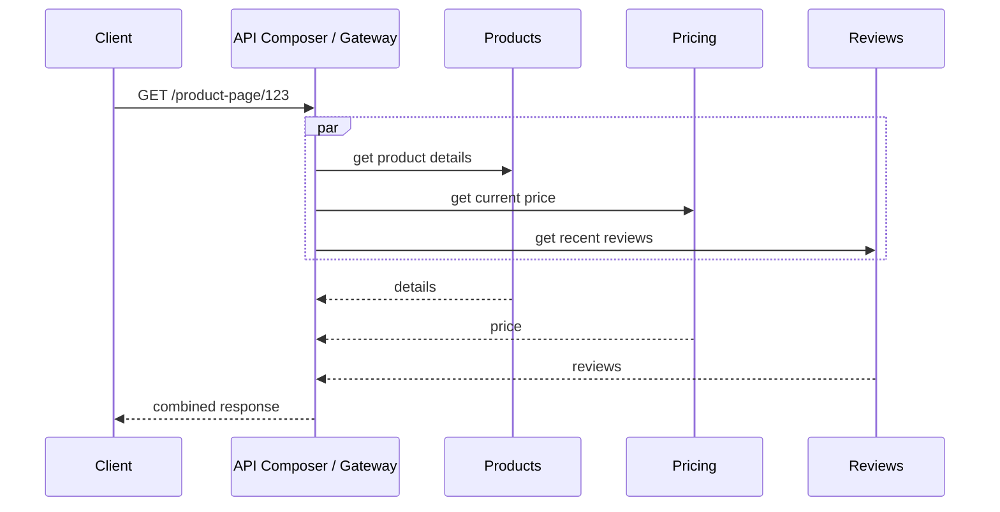
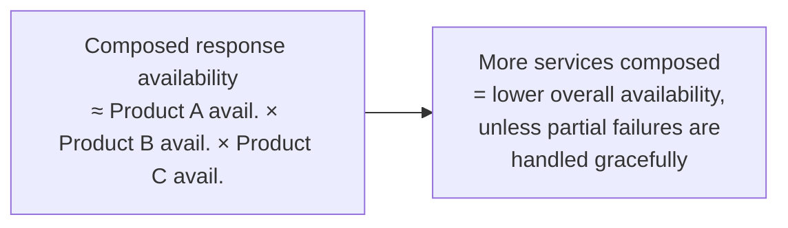

## Definition

API Composition is a pattern for querying data that's spread across multiple independently-owned microservices by having a composer (often an [API Gateway](/docs/networking/api-gateway) or a dedicated aggregation service) call each relevant service and combine their results into a single, unified response for the client.

## Why it exists

In a microservices architecture with [Database per Service](/docs/microservices/database-per-service), data related to a single business concept (a customer's full order history, say) is often spread across multiple independently-owned databases, with no single query able to join across them directly the way a query within one database could. API Composition exists to solve exactly this query problem, at the application layer, by fanning out to each relevant service and assembling the combined result.

## The problem it solves

A client needing data that spans multiple services (a "product page" view needing product details, current price, and recent reviews, each owned by a different service) can't issue one simple database query the way it could against a single, unified database. API Composition solves this by explicitly calling each service and combining their responses, so the client still gets one unified answer despite the underlying data being genuinely distributed.

## Real-world analogy

Assembling a complete customer profile for a bank's customer service representative — pulling account balance from one system, recent transactions from another, and support ticket history from yet another — is API Composition in the real world: no single system has the complete picture, so a composing layer (or the representative themselves) gathers from each and presents it as one unified view to whoever needs it.

## Simple explanation

Instead of one query joining across multiple services' data (which isn't possible when each owns its own separate database), a composer calls each relevant service — often in parallel, to minimize latency — and merges their individual responses into the single response the client actually wants.

## Technical explanation

Calling the three services **in parallel** (rather than sequentially) is a key practical detail — sequentially calling each one, waiting for each response before starting the next, would multiply the total latency; parallel calls keep the overall response time close to the slowest individual call rather than the sum of all of them.

## Internal working — the availability trade-off

A composed response's overall availability is the product of each individual service's availability — if any one of the three services being composed is down, the composed response either fails entirely, or needs a defined fallback/partial-response strategy (e.g. show the product page without reviews, rather than failing the whole page, if only the Reviews service is unavailable).

## Advantages

- Lets a client get a single, unified response spanning data from multiple independently-owned services, without needing to know about or call each one individually itself.
- Parallel composition keeps latency close to the slowest individual call, rather than the sum of all calls.
- Keeps each underlying service's data ownership and independence intact — composition happens at the query layer, not by merging the services' actual databases.

## Disadvantages

- Overall availability of a composed response degrades as more services are composed together, unless partial-failure handling is deliberately designed.
- More complex ad-hoc composition logic (filtering, sorting, or aggregating across combined data from multiple services) can be awkward and inefficient compared to a single database query with native join/filter/sort capabilities.
- Adds real latency (multiple network calls, even in parallel) compared to a single query against one unified database.

## Trade-offs

API Composition trades some latency and availability (compared to a single query against one database) for the ability to keep each service's data genuinely independent and separately owned — a necessary trade in a microservices architecture, and one that requires deliberate design (parallel calls, partial-failure handling) to keep its costs manageable.

## Complexity considerations

Simple composition (calling a few services in parallel and merging their results) is straightforward. Composition involving more complex cross-service filtering, sorting, or aggregation (e.g. "top 10 products by combined popularity across two different services' data") is considerably harder to do efficiently, and sometimes signals that a dedicated, denormalized read model (see [CQRS](/docs/messaging/cqrs)) would be a better fit than ad-hoc runtime composition.

## When to use

- Assembling a client-facing view that genuinely spans data owned by multiple independent microservices, for relatively simple combination logic (fetch and merge, rather than complex cross-service filtering or sorting).

## When NOT to use (consider CQRS instead)

- Complex, frequently-needed cross-service queries (filtering, sorting, aggregating across multiple services' data) where ad-hoc runtime composition becomes inefficient or awkward — a dedicated, pre-built denormalized read model updated asynchronously (CQRS) is often a better fit for this kind of recurring, complex query need.

## Common mistakes

- Calling composed services sequentially rather than in parallel, unnecessarily multiplying total latency.
- Not designing explicit partial-failure/fallback behavior, causing an entire composed response to fail if just one of several composed services is temporarily unavailable.
- Using ad-hoc composition for complex, frequently-needed cross-service queries that would be much better served by a dedicated, pre-built read model instead.

## Interview questions

- "Why can't you use a single database query to assemble a response spanning multiple microservices' data?"
- "How would you handle one of several composed services being temporarily unavailable?"
- "When would you choose API Composition versus building a dedicated denormalized read model (CQRS) for a cross-service query need?"

## Practical example

An API Gateway composing a mobile app's "product page" response calls the Products, Pricing, and Reviews services in parallel, combining their results into one response — if the Reviews service is temporarily down, the gateway is designed to return the product page without a reviews section, rather than failing the whole request over one non-critical, unavailable service.

## Production example

Many microservices architectures implement API Composition directly within their [API Gateway](/docs/networking/api-gateway) layer, fanning out to multiple backend services for a single client-facing endpoint — a pattern widely used across e-commerce and content platforms with genuinely distributed underlying data ownership.

## Best practices

- Call composed services in parallel wherever their results don't depend on each other, to minimize overall response latency.
- Design explicit, graceful partial-failure behavior for when one of several composed services is unavailable, rather than failing the entire response.
- Consider a dedicated, pre-built read model (CQRS) instead of ad-hoc composition for complex, frequently-needed cross-service queries that don't fit a simple fetch-and-merge pattern well.

## Summary

API Composition assembles a single, unified client response from data spread across multiple independently-owned microservices, by calling each relevant service (ideally in parallel) and merging their results — the query-side counterpart to how the Saga pattern coordinates writes across the same kind of distributed ownership. It requires deliberate design around latency (parallel calls) and partial-failure handling (graceful degradation), and complex, frequently-needed cross-service queries are often better served by a dedicated read model than ad-hoc composition.

## References

- microservices.io: API Composition pattern
- Newman, S. "Building Microservices"

<Quiz questions={[
  {
    q: "Why should services being composed in an API Composition pattern typically be called in parallel rather than sequentially?",
    options: [
      "Parallel calls are always more secure",
      "Calling services sequentially would multiply the total response latency, while parallel calls keep the overall response time close to the slowest individual call",
      "Sequential calls are not technically possible",
      "There's no real difference in latency between the two approaches"
    ],
    answer: 1,
    explanation: "If each composed service call waits for the previous one to finish, the total latency is the sum of all of them; calling them in parallel instead means the overall response only has to wait for the slowest single call, not the combined total of all the calls."
  }
]} />
