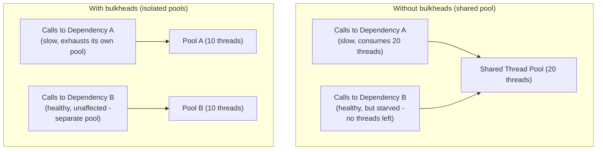

## Definition

The Bulkhead pattern isolates resources (like thread pools or connection pools) allocated to different downstream dependencies or functionalities, so that a failure or overload affecting one doesn't consume all shared resources and take down unrelated parts of the system as well.

## Why it exists

Without isolation, a single struggling dependency can consume an entire shared resource pool (e.g. all available threads waiting on slow calls to it), starving *every other* dependency and functionality of the resources they need, even ones that have nothing to do with the actual problem. The Bulkhead pattern exists to contain this kind of resource exhaustion to just the affected area, protecting everything else.

## The problem it solves

A service calling five different downstream dependencies from one shared thread pool is vulnerable to a specific, dangerous failure mode: if just one of those five dependencies becomes slow, calls to it can occupy more and more of the shared pool's threads while they wait, eventually leaving no threads available for calls to the other four, perfectly healthy dependencies — a single struggling dependency effectively takes down access to everything else too. Bulkheads solve this by giving each dependency (or functional area) its own isolated resource pool.

## Real-world analogy

The pattern is named after a ship's bulkheads — physical, watertight compartment walls that divide the hull into separate sections. If the hull is breached and one compartment floods, the bulkheads contain that flooding to just that one section, keeping the rest of the ship afloat — rather than the entire ship sinking because of damage to just one area. Bulkheads in software apply the same containment principle to resource pools.

## Simple explanation

Instead of one shared thread pool (or connection pool) serving calls to every downstream dependency, each dependency gets its own dedicated, limited pool — if one dependency's pool is exhausted because it's slow or failing, calls to other dependencies (using their own separate pools) are entirely unaffected.

## Technical explanation

## Internal working — sizing bulkhead pools

Each isolated pool needs to be sized deliberately, based on that specific dependency's expected call volume and latency characteristics — too small, and a healthy dependency might be artificially constrained even under normal load; too large, and the isolation benefit is diminished (a very large pool for one dependency could still consume a disproportionate share of overall system resources if it becomes slow).

## Advantages

- Contains a failure or overload in one dependency to just that dependency's own resource pool, protecting unrelated functionality from being starved.
- Makes a system's resilience characteristics more predictable — a known, bounded amount of resources can be exhausted by any single dependency's problems, not an unbounded, shared amount.

## Disadvantages

- Requires deliberate capacity planning and sizing for each isolated pool, adding real configuration overhead compared to one simple, shared pool.
- Can lead to some resource underutilization — a pool sized for a dependency's peak needs sits partially idle during that dependency's quieter periods, resources that couldn't be "borrowed" by another dependency under a shared pool.

## Trade-offs

Bulkheads trade some resource utilization efficiency (isolated pools can't share slack capacity with each other) and added configuration complexity for meaningfully better failure containment — a valuable trade for critical systems where one dependency's problems shouldn't be able to take down unrelated functionality, and less critical for systems where all dependencies are similarly reliable and the containment benefit is smaller.

## Complexity considerations

Bulkheading a small number of clearly distinct dependencies (with different reliability and latency characteristics) is straightforward and valuable. Over-applying bulkheads to every conceivable resource, with many finely-sliced isolated pools, adds configuration overhead that may not be justified if the dependencies involved are all similarly reliable anyway.

## When to use

- Systems calling multiple downstream dependencies with meaningfully different reliability or latency characteristics, where one dependency's problems shouldn't be allowed to affect calls to the others.
- Critical functionality that must remain available even if an unrelated, less critical dependency is currently struggling.

## When it might be unnecessary

- Systems with very few dependencies, all similarly reliable, where the added configuration complexity of separate resource pools provides limited real benefit.

## Common mistakes

- Using one large, shared resource pool across all dependencies, allowing one struggling dependency to starve calls to every other, unrelated one.
- Sizing isolated pools without real capacity planning, leading to either artificial constraints on healthy dependencies or insufficient isolation for problematic ones.
- Over-applying bulkheads to every possible resource without considering whether the added complexity is actually justified for dependencies with similar reliability profiles.

## Interview questions

- "What specific failure mode does the Bulkhead pattern prevent that a single shared resource pool doesn't?"
- "How would you decide how to size an isolated thread pool for a specific downstream dependency?"
- "Why might bulkheads be less necessary in a system where all dependencies have very similar reliability characteristics?"

## Practical example

A service calling both a critical payment-processing API and a non-critical recommendations API uses separate, isolated thread pools for each — if the recommendations API becomes slow or unresponsive, calls to it exhaust only its own dedicated pool, while payment processing continues operating normally using its own, entirely separate pool of resources.

## Production example

Netflix's Hystrix library (and similar modern resilience libraries) explicitly supports bulkhead-style thread pool isolation per downstream dependency, specifically to prevent exactly the kind of resource-starvation cascading failure the pattern is named for, across their large, deeply interconnected microservices architecture.

## Best practices

- Isolate resource pools (threads, connections) per dependency, especially for dependencies with meaningfully different reliability or criticality.
- Size each isolated pool deliberately based on that specific dependency's actual expected load and latency characteristics.
- Combine bulkheads with circuit breakers and retries for comprehensive resilience — bulkheads contain the damage, circuit breakers stop calling a failing dependency, and retries handle transient failures gracefully.

## Summary

The Bulkhead pattern isolates resource pools (typically threads or connections) per downstream dependency, so a failure or overload affecting one dependency can't exhaust shared resources and starve calls to unrelated, healthy dependencies as well — directly modeled on a ship's watertight compartments containing flooding to just one section. It's a valuable resilience pattern for systems calling multiple dependencies with different reliability profiles, often used alongside circuit breakers and retries for comprehensive protection against cascading failure.

## References

- Netflix Tech Blog: Hystrix (bulkhead pattern implementation)
- Nygard, M. "Release It!" (the book that popularized the bulkhead pattern for software)

<Quiz questions={[
  {
    q: "What specific problem does the Bulkhead pattern solve that isn't addressed by a single shared thread pool?",
    options: [
      "It makes all API calls faster",
      "It prevents one slow or failing dependency from exhausting shared resources and starving calls to unrelated, healthy dependencies, by giving each dependency its own isolated resource pool",
      "It eliminates the need for circuit breakers",
      "It only applies to database connections"
    ],
    answer: 1,
    explanation: "With a single shared resource pool, a struggling dependency can consume all available threads/connections while waiting on slow calls, starving unrelated, healthy dependencies of the resources they need — bulkheads solve this by giving each dependency its own isolated pool, containing any resource exhaustion to just that one dependency."
  }
]} />
