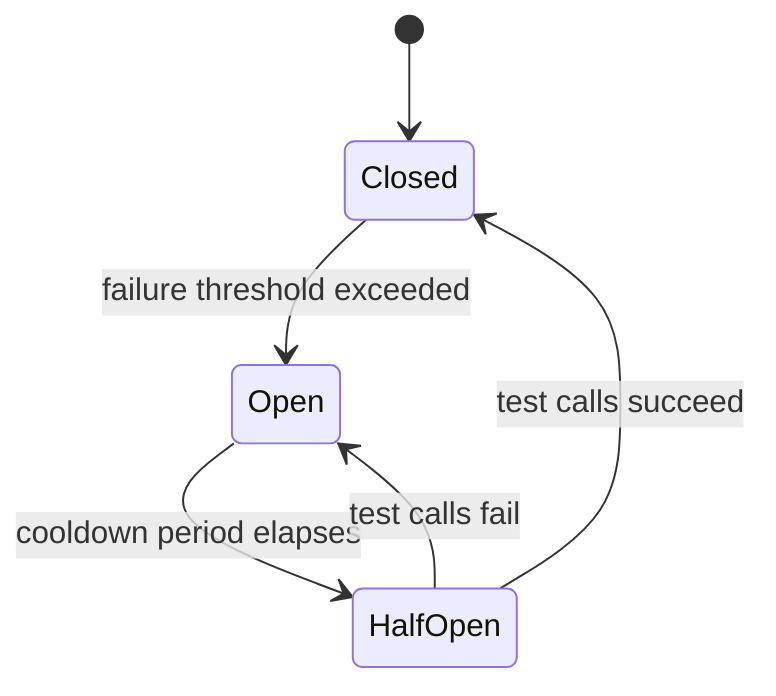
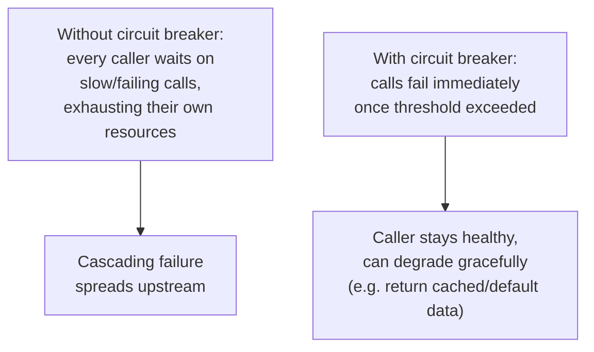

## Definition

The Circuit Breaker pattern prevents a service from repeatedly calling a downstream dependency that's currently failing, by "tripping" after a threshold of failures and immediately rejecting further calls (without even attempting them) for a period, before cautiously testing whether the dependency has recovered.

## Why it exists

When a downstream dependency fails or becomes very slow, a calling service that keeps sending requests to it anyway wastes resources (threads, connections) waiting on calls that are likely to fail or time out — and can itself become unresponsive as a result, propagating the failure upstream to *its* callers. The Circuit Breaker pattern exists to stop this cascade: once a dependency is clearly failing, stop calling it immediately, protecting the calling service's own health and resources.

## The problem it solves

Without a circuit breaker, a struggling downstream dependency can cause cascading failure: callers pile up waiting on slow or failing requests, exhausting their own thread pools or connection limits, becoming unresponsive themselves, and causing *their* callers to experience the same problem — a failure that started in one small dependency spreading through an entire system. The circuit breaker solves this by failing fast once a problem is detected, rather than letting every caller keep hitting the same wall.

## Real-world analogy

The pattern is directly modeled on an electrical circuit breaker: when a fault causes too much current to flow, the breaker trips, cutting power immediately to prevent damage or fire — rather than letting the dangerous condition continue. Once the underlying issue is fixed, the breaker can be reset (or, in software, automatically tests periodically) to restore normal operation.

## Simple explanation

A circuit breaker sits in front of calls to a downstream dependency and tracks recent failures. If failures exceed a threshold, the breaker "opens" — subsequent calls fail immediately (without even attempting the network call) for a cooldown period. After that period, the breaker allows a small number of test calls through; if they succeed, it "closes" again (resuming normal calls); if they still fail, it stays open for another cooldown period.

## Technical explanation

### The three states

- **Closed**: normal operation — calls pass through to the dependency, and failures are tracked.
- **Open**: calls fail immediately, without even attempting the dependency — protecting the caller from wasting resources on a call likely to fail.
- **Half-Open**: after the cooldown, a limited number of test calls are allowed through to check if the dependency has recovered.

## Internal working — why "fail fast" actually helps

Failing fast (returning an error or fallback immediately) is almost always better for overall system health than waiting on a call that's likely to fail anyway — it frees up the caller's own resources and lets it potentially degrade gracefully (e.g. show slightly stale cached data) rather than becoming unresponsive itself.

## Advantages

- Prevents cascading failure by stopping calls to a known-failing dependency, protecting the calling service's own resources and responsiveness.
- Enables graceful degradation — a service can fall back to cached data or a simplified response while a dependency is unavailable, rather than failing entirely.
- Automatically tests for recovery (half-open state) without requiring manual intervention to resume normal operation.

## Disadvantages

- Adds implementation and configuration complexity — choosing the right failure threshold, cooldown period, and half-open test volume requires careful tuning specific to each dependency.
- A poorly tuned circuit breaker (too sensitive) can trip unnecessarily on brief, self-resolving blips, itself becoming a source of unnecessary failures.

## Trade-offs

Circuit breakers trade a small amount of configuration complexity and tuning effort for significant protection against cascading failure — a trade that's almost always worth making for any call to a genuinely unreliable or potentially slow external dependency, and less critical for calls to extremely reliable, low-latency internal dependencies.

## Complexity considerations

Using an existing, well-tested circuit breaker library (rather than implementing the state machine and tuning logic from scratch) is strongly preferred — getting the failure detection and half-open testing logic exactly right, especially under concurrent load, is more subtle than it first appears.

## When to use

- Any call to a downstream dependency (especially external services, or ones known to be occasionally unreliable) where a failure or slowdown could otherwise cascade back to affect the calling service's own health.

## When it might be unnecessary

- Calls to extremely reliable, low-latency, tightly-controlled internal dependencies where the risk of cascading failure is genuinely minimal — though even here, circuit breakers are often still considered good defensive practice.

## Common mistakes

- Not implementing any fallback behavior for the "open" state, simply returning an error to the end user instead of degrading gracefully (e.g. serving cached data) where possible.
- Setting the failure threshold or cooldown period without real tuning, causing either too many unnecessary trips (over-sensitive) or too slow a response to genuine, sustained failures (under-sensitive).
- Implementing custom circuit breaker logic from scratch rather than using a mature, well-tested library.

## Interview questions

- "Why is 'failing fast' via a circuit breaker often better for overall system health than letting every caller keep retrying a failing dependency?"
- "What are the three states of a circuit breaker, and what does each one do?"
- "How would you decide on an appropriate fallback behavior for when a circuit breaker is open?"

## Practical example

An e-commerce product page calls a recommendations service to show "customers also bought" suggestions; if that service starts failing, a circuit breaker trips and the product page immediately stops calling it (rather than waiting on repeated timeouts), instead simply omitting the recommendations section entirely — a graceful degradation that keeps the rest of the page working normally.

## Production example

Netflix's Hystrix library (now in maintenance mode, with modern alternatives like resilience4j commonly used instead) was one of the most widely adopted circuit breaker implementations, built specifically to prevent cascading failures across Netflix's large, deeply interconnected microservices architecture.

## Best practices

- Use a mature, existing circuit breaker library rather than implementing the pattern from scratch.
- Define explicit, graceful fallback behavior for the open state wherever possible, rather than simply surfacing an error to the end user.
- Tune failure thresholds and cooldown periods based on the specific dependency's real-world behavior, and revisit this tuning as that behavior changes over time.

## Summary

The Circuit Breaker pattern prevents cascading failure by "tripping" after a threshold of failures to a downstream dependency, failing fast on subsequent calls rather than letting callers keep waiting on a dependency likely to fail, and automatically testing for recovery via a half-open state. It's an essential resilience pattern for calls to any potentially unreliable dependency in a distributed system, protecting the calling service's own health and enabling graceful degradation.

## References

- Fowler, M. "CircuitBreaker" (martinfowler.com)
- Netflix Tech Blog: Hystrix

<Quiz questions={[
  {
    q: "Why is 'failing fast' with a circuit breaker often better for overall system health than letting every caller keep waiting on a failing dependency?",
    options: [
      "Failing fast always fixes the underlying problem immediately",
      "It frees up the calling service's own resources (threads, connections) rather than exhausting them waiting on calls likely to fail, preventing the failure from cascading upstream",
      "It has no real benefit over waiting",
      "It permanently disables the failing dependency"
    ],
    answer: 1,
    explanation: "Waiting on calls to a failing dependency ties up the caller's own resources, risking the caller itself becoming unresponsive and spreading the failure to its own callers — failing fast avoids this by immediately rejecting calls once a problem is detected, protecting the caller's health and enabling graceful degradation."
  }
]} />
