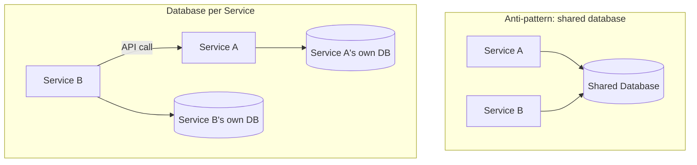

## Definition

Database per Service is the principle that each microservice owns and exclusively accesses its own database — no other service is allowed to directly query or modify it — with all access to that data going through the owning service's own API.

## Why it exists

If multiple services directly share and query the same database, they become tightly coupled at the data layer regardless of how independently their application code is otherwise deployed — a schema change needed by one service can break another service silently relying on that same table's structure. Database per Service exists to make the independence [Microservices](/docs/microservices/microservices) are supposed to provide actually real, not just superficial at the application code layer while remaining tightly coupled underneath at the data layer.

## The problem it solves

A shared database between services means any service can (and, over time in a real organization, eventually will) start directly querying or depending on another service's internal table structure — creating hidden coupling that undermines independent deployability, since a schema change now risks breaking other teams' services in ways that aren't visible in their own codebase. Database per Service solves this by making the owning service's API the *only* sanctioned way to access its data, containing the impact of internal schema changes entirely within that one service.

## Real-world analogy

If several departments in a company all directly access and modify the same shared filing cabinet without any established protocol, one department reorganizing "their" section of the cabinet can break another department's process that had (undocumented, informally) come to rely on the old organization — even though the departments are nominally independent. Giving each department their own filing cabinet, accessible to others only by formally requesting specific information through that department (their API), avoids this hidden coupling entirely.

## Simple explanation

Service A's database is accessed only by Service A's own code. If Service B needs data that lives in Service A's database, it must call Service A's API to get it — never query Service A's database directly, no matter how convenient that might seem in the moment.

## Technical explanation

This has a real, direct consequence: any query needing to combine data owned by multiple services can no longer be a single database join — it needs either [API Composition](/docs/microservices/api-composition) at query time, or a dedicated, pre-built cross-service read model (see [CQRS](/docs/messaging/cqrs)).

## Internal working — heterogeneous data stores

Database per Service also means different services are free to choose the data store type that best fits their own specific needs — a service handling relational, transactional data might use PostgreSQL, while a service handling flexible, document-shaped data might use MongoDB, and a service needing extremely fast key-value lookups might use Redis — each choice made independently, without needing to compromise for a single, shared database technology serving every service's differing needs.

## Advantages

- Makes independent deployability genuinely real — a service's internal schema can change freely without directly breaking other services, since nothing outside it directly depends on that schema.
- Lets each service choose the data store technology best suited to its own specific access patterns, rather than compromising on one shared choice for every service.
- Contains the blast radius of a database-level problem (a slow query, a runaway migration) to just the one owning service, rather than risking impact on every service sharing that database.

## Disadvantages

- Cross-service queries and joins become genuinely harder, requiring API Composition or a dedicated read model rather than a simple database join.
- Cross-service transactions lose ACID guarantees spanning multiple services' data, requiring patterns like [Saga](/docs/microservices/saga-pattern) instead.
- More operational overhead — many separate databases to provision, back up, and maintain, rather than one shared instance.

## Trade-offs

Database per Service trades the convenience of simple cross-service joins and transactions (available with one shared database) for genuine service independence and deployability — a necessary trade for microservices to actually deliver on their core promise, and one that requires real, deliberate design (API Composition, Sagas, CQRS) to handle the cross-service query and transaction needs that a shared database would have made trivial.

## Complexity considerations

Database per Service is often considered one of the more disciplined, harder-to-maintain rules in a microservices architecture — the convenience of "just querying the other service's table directly" is a constant, real temptation that erodes the whole architecture's independence if allowed even occasionally, so it requires genuine organizational discipline, not just initial design intent.

## When to use

- Any genuine microservices architecture — this principle is close to a defining characteristic of microservices done correctly, not an optional add-on.

## When it's less relevant

- Monolithic architectures, where a single shared database is a natural, appropriate fit since there's only one application accessing it in the first place.

## Common mistakes

- Allowing "just this once" direct cross-service database access for convenience, which tends to become a recurring, architecture-eroding pattern once it's allowed even a single time.
- Not planning for how cross-service queries and transactions will actually work (API Composition, Sagas, CQRS) before adopting Database per Service, leading to awkward, ad-hoc workarounds discovered under pressure later.
- Choosing a database technology per service without real justification, adding unnecessary operational diversity when a shared technology choice would have served multiple services' similar needs just as well.

## Interview questions

- "Why is Database per Service considered essential to microservices actually delivering independent deployability?"
- "What are the real costs of Database per Service, and how would you address them?"
- "What's the risk of allowing one service to directly query another service's database, even just occasionally?"

## Practical example

An e-commerce platform's Orders service uses its own PostgreSQL database, and its Inventory service uses its own separate PostgreSQL database — when Orders needs current stock information, it calls Inventory's API rather than querying Inventory's database tables directly, so Inventory's team remains free to restructure their own schema (or even switch database technologies entirely) without needing to coordinate with or risk breaking the Orders team's service.

## Production example

Amazon's well-known internal mandate (part of their broader shift toward service-oriented architecture, predating the term "microservices") explicitly required that all inter-team data access happen through service interfaces, never through direct database access — a foundational discipline widely credited with enabling their large organization's many independent teams to actually deploy and evolve their services independently.

## Best practices

- Enforce Database per Service as a firm architectural rule, not a loose guideline — even occasional exceptions tend to erode the whole architecture's independence over time.
- Plan explicitly for cross-service query and transaction needs (API Composition, Sagas, CQRS) as part of the initial microservices design, not as an afterthought discovered under pressure.
- Choose each service's data store technology based on genuine fit for that service's own access patterns, not merely to maximize technological diversity for its own sake.

## Summary

Database per Service requires each microservice to exclusively own and access its own database, with all cross-service data access going through the owning service's API rather than direct database queries — the structural discipline that makes microservices' promised independent deployability genuinely real, rather than superficial. It trades the convenience of simple cross-service joins and transactions for real service independence, requiring deliberate patterns (API Composition, Sagas, CQRS) to handle the cross-service query and transaction needs a shared database would otherwise have made trivial.

## References

- Newman, S. "Building Microservices"
- microservices.io: Database per Service pattern

<Quiz questions={[
  {
    q: "Why does allowing one service to directly query another service's database, even occasionally, undermine the microservices architecture over time?",
    options: [
      "It has no real negative effect",
      "It creates hidden coupling at the data layer - a schema change in the queried service can silently break the querying service, undermining the independent deployability microservices are meant to provide",
      "Direct database queries are always faster and should be encouraged",
      "This is only a problem for databases larger than 1TB"
    ],
    answer: 1,
    explanation: "Direct cross-service database access creates a coupling that isn't visible in either service's own codebase — the owning service's team might change their schema, breaking the other service in a way neither team anticipated, exactly undermining the real independence Database per Service is meant to guarantee."
  }
]} />
