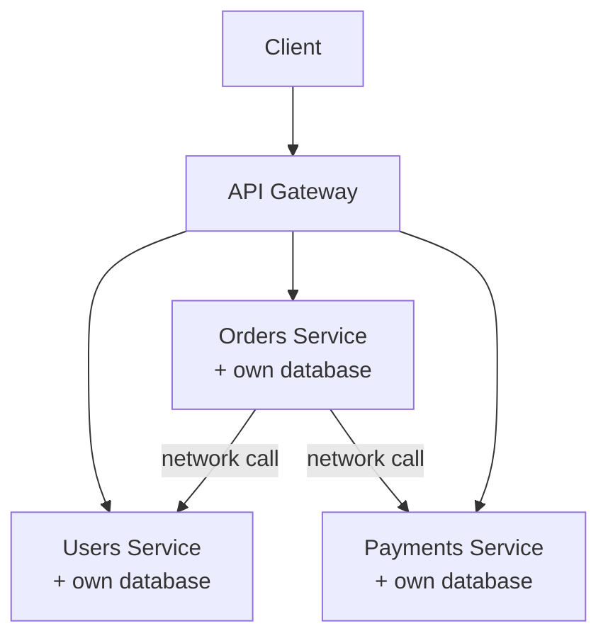

## Definition

Microservices is an architectural style where a system is composed of many small, independently deployable services, each typically owning a specific business capability and its own data, communicating over the network — the counterpart to a [Monolith](/docs/microservices/monolith)'s single, unified deployment.

## Why it exists

As applications and the organizations building them grow, a single monolithic codebase can become a coordination bottleneck — many teams working in the same codebase, needing to coordinate a single shared deployment, unable to scale or evolve different parts of the system independently. Microservices exist to remove this bottleneck, letting each team own, deploy, and scale their specific service independently of every other team's pace and decisions.

## The problem it solves

A large monolith worked on by many teams simultaneously creates real coordination costs: a bug in one team's code can block another team's release; scaling requires scaling the entire application even when only one part actually needs more capacity; and a large, tangled codebase becomes harder for any individual engineer to fully understand. Microservices solve this specifically by giving each team an independently deployable, independently scalable unit of ownership.

## Real-world analogy

A large, unified department store where every department shares the same single checkout system, the same single inventory system, and the same expansion/renovation schedule is efficient at a certain scale, but becomes a coordination burden as it grows — every department's changes have to go through the same shared processes and the same shared risk. Splitting into genuinely independent, specialized shops (each with their own systems, own staff, own ability to renovate or expand on their own schedule) trades away some shared efficiency for real independence — the same trade-off microservices make relative to a monolith.

## Simple explanation

Instead of one large application containing all functionality, a system is split into many smaller services (Users, Orders, Payments, Inventory, each independently deployable), communicating with each other over the network (typically via [REST](/docs/networking/rest) or [gRPC](/docs/networking/grpc)), each owned by a specific team that can develop, deploy, and scale it independently.

## Technical explanation

A key structural principle: each service typically owns its own data (see [Database per Service](/docs/microservices/database-per-service)) rather than sharing a single database — services communicate through well-defined APIs, not by directly querying each other's databases.

## Internal working — the real cost of the network boundary

Every call that used to be a simple, fast, reliable in-process function call in a monolith becomes a network call between microservices — subject to latency, partial failure, and the need for resilience patterns like [Circuit Breaker](/docs/microservices/circuit-breaker), [Retry](/docs/microservices/retry), and [Bulkhead](/docs/microservices/bulkhead) that a monolith's internal function calls never needed to worry about.

## Advantages

- Independent deployability — each team can ship changes to their service on their own schedule, without coordinating a single shared release.
- Independent scalability — each service can be scaled based on its own specific load, rather than scaling an entire monolith uniformly.
- Clearer ownership boundaries, letting teams specialize and move faster within their own service's scope.

## Disadvantages

- Introduces genuine distributed systems complexity — network failures, latency, partial failures, and the need for resilience patterns that simply don't exist within a single process.
- Operationally more complex — many more services to deploy, monitor, and secure, compared to one monolithic deployment.
- Cross-service transactions and data consistency become genuinely harder (see [Saga Pattern](/docs/microservices/saga-pattern)), since ACID transactions don't naturally span multiple independent databases.

## Trade-offs

Microservices trade a monolith's simplicity for independent scalability and deployability — a trade that pays off specifically once an organization or system has genuinely outgrown what a well-structured monolith can handle, and a trade that adds significant, often premature complexity when adopted before that point.

## Complexity considerations

Splitting into microservices is a substantial, ongoing operational commitment — service discovery, distributed tracing, circuit breakers, and cross-service data consistency all become real, ongoing concerns that a monolith simply doesn't have to deal with. This complexity should be taken on deliberately, in response to an actual, measured need, not adopted preemptively because it's a popular architectural trend.

## When to use

- Large organizations where many teams need to deploy independently, without coordinating a single shared release.
- Systems with genuinely divergent scaling needs across different components (e.g. one component needing to handle 100x the load of another).

## When NOT to use

- Small teams or early-stage products, where the coordination and operational overhead of microservices isn't yet justified by any real, present scaling or team-ownership problem — see [Monolith](/docs/microservices/monolith).

## Common mistakes

- Adopting microservices prematurely, before an organization or system has genuinely outgrown a well-structured monolith, taking on real distributed-systems complexity for no corresponding benefit yet.
- Splitting services along the wrong boundaries (e.g. by technical layer rather than business capability), creating services that are tightly coupled and need to change together anyway, without any of the independence benefit.
- Not investing in the operational tooling (observability, service discovery, resilience patterns) that microservices genuinely require to operate reliably at scale.

## Interview questions

- "What specific problems does splitting a monolith into microservices actually solve, and what does it cost you in exchange?"
- "How would you decide the right service boundaries when splitting a system into microservices?"
- "What resilience patterns become necessary in a microservices architecture that weren't needed in a monolith?"

## Practical example

A large e-commerce platform splits into independently deployable Users, Orders, Payments, and Inventory services, each with its own database and its own dedicated team — the Orders team can deploy new features on their own schedule without needing to coordinate with or wait on the Payments team's release cycle, and Inventory (which handles much higher read volume during sales events) can be scaled independently of the other, less-loaded services.

## Production example

Amazon and Netflix are both widely cited examples of large organizations that adopted microservices specifically to let many independent teams deploy and scale their own services without needing centralized coordination — a transition each company has described as directly tied to their organizational scale and the coordination bottlenecks a shared monolith had created at that scale.

## Best practices

- Split services along genuine business capability boundaries (Orders, Payments, Inventory), not technical layers, so each service can evolve with real independence.
- Invest in the operational tooling (observability, service discovery, circuit breakers) microservices genuinely require, rather than treating them as optional extras.
- Adopt microservices deliberately, in response to an actual, measured organizational or scaling need — not preemptively, and not because it's currently a popular architectural trend.

## Summary

Microservices split a system into many small, independently deployable services, each typically owning its own data and business capability — trading a monolith's simplicity for independent scalability and deployability. This trade genuinely pays off for large organizations and systems with real, divergent scaling or team-ownership needs, but introduces substantial distributed-systems complexity (network failures, cross-service data consistency, operational overhead) that should be taken on deliberately, not preemptively.

## References

- Newman, S. "Building Microservices"
- Fowler, M. "Microservices" (martinfowler.com)

<Quiz questions={[
  {
    q: "What genuinely new class of problems does splitting a monolith into microservices introduce?",
    options: [
      "None - microservices have no downsides",
      "Distributed systems complexity: network failures, latency, partial failures, and the need for resilience patterns that simply don't exist for in-process function calls within a monolith",
      "Microservices eliminate the need for databases entirely",
      "Microservices make deployment simpler in every case"
    ],
    answer: 1,
    explanation: "What used to be a fast, reliable, in-process function call within a monolith becomes a network call between independently deployed services in a microservices architecture — introducing latency, partial failure risk, and the need for resilience patterns (circuit breakers, retries, bulkheads) a monolith never had to deal with."
  }
]} />
