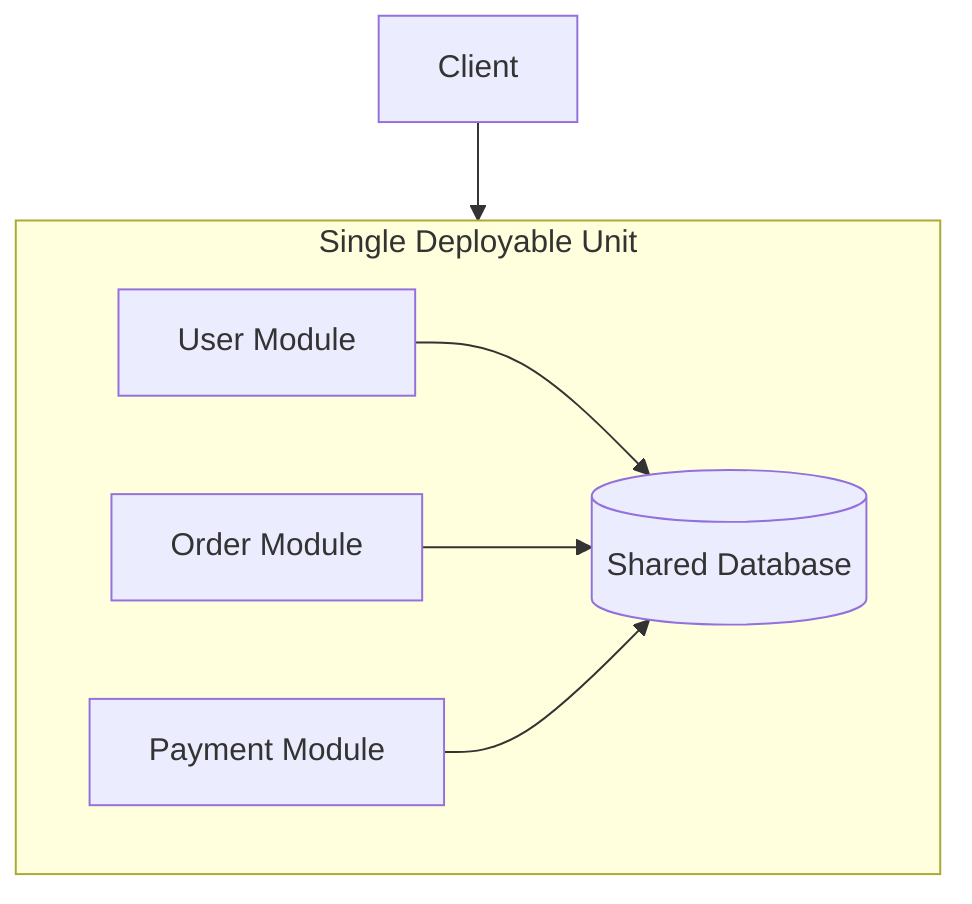

## Definition

A monolith is an application built and deployed as a single, unified unit — all functionality (user management, orders, payments, etc.) lives in one codebase, is developed together, and is deployed as one artifact, in contrast to [Microservices](/docs/microservices/microservices)' many independently deployable services.

## Why it exists

Building an application as a single, unified codebase is the natural, simplest starting point for most software — one place to write code, one thing to deploy, one process to debug. The monolithic architecture isn't a mistake or a legacy relic; it's simply the default, lowest-complexity way to build software, and it remains the right choice for a very large fraction of real systems.

## The problem it solves

For most applications — especially early-stage ones, or ones without genuinely independent scaling or team-ownership needs — a monolith solves the fundamental problem of "how do I build and ship software" with the least possible operational and architectural overhead: no network calls between internal components, no service-to-service authentication, no distributed transaction complexity, just function calls within one process.

## Real-world analogy

A single, well-organized general store — one building, one set of staff, one set of systems — serves most small towns perfectly well. It doesn't need to split into a dozen specialized, independently-run shops (a butcher, a baker, a hardware store, each with their own staff and systems) unless it actually grows large enough, or its different departments have different enough needs, that the coordination overhead of staying unified starts costing more than the benefits of independence would provide.

## Simple explanation

All of an application's functionality — its various modules and features — is built, tested, and deployed together as one single application, running as one (or more, identical, horizontally-scaled) process, rather than being split into many independently deployable services.

## Technical explanation

Internally, a well-structured monolith can still have clear modular boundaries (separate packages/modules for users, orders, payments) — the key distinguishing characteristic isn't a lack of internal structure, but that it's all built, tested, deployed, and scaled together as one unit.

## Internal working — scaling a monolith

A monolith can still scale horizontally — running many identical copies of the whole application behind a load balancer — it just can't scale *individual pieces* of functionality independently the way microservices can (e.g. scaling just the Orders functionality separately from Payments, since they're all bundled into the same deployable unit).

## Advantages

- Dramatically simpler to develop, test, and deploy — one codebase, one deployment pipeline, no network calls between internal components.
- No distributed systems complexity (network failures between internal modules, distributed transactions, service discovery) since everything runs in one process.
- Easier to reason about end-to-end behavior, since a single request typically stays within one process rather than spanning many independently deployed services.

## Disadvantages

- The entire application must be redeployed for any single change, even a small one — no independent deployment of individual pieces.
- Can't scale individual pieces of functionality independently — if only the Orders module needs more capacity, the entire monolith must be scaled, even the parts that don't need it.
- As a monolith grows very large, with many teams working in the same codebase, coordination and testing overhead can increase significantly, and a poorly maintained large monolith can become genuinely difficult to understand and safely modify (sometimes called a "big ball of mud").

## Trade-offs

A monolith trades independent scalability and independent deployability (which [Microservices](/docs/microservices/microservices) provide) for dramatically lower operational and architectural complexity — the right trade for most applications, especially early on, and a trade that becomes less favorable specifically once a system grows large enough, or its components' scaling/team-ownership needs diverge enough, that the coordination costs of staying unified start to outweigh the simplicity benefits.

## Complexity considerations

A well-structured monolith, with clear internal module boundaries, can scale a surprisingly long way (in both team size and traffic) before genuinely needing to be split into microservices — many of the real-world problems attributed to "monoliths" are actually the result of poor internal structure (tangled dependencies between modules) rather than the monolithic deployment model itself.

## When to use

- Most new applications, especially early-stage ones without yet-proven, genuinely divergent scaling or team-ownership needs.
- Systems where the coordination and complexity overhead of microservices isn't yet justified by an actual, present problem.

## When NOT to use (consider microservices instead)

- Large systems with genuinely independent scaling needs across different components, or large engineering organizations needing many teams to deploy independently without coordinating a single shared release.

## Common mistakes

- Assuming a monolith is inherently a poor architectural choice or "legacy" — for many systems, especially at moderate scale, it remains genuinely the simpler, more appropriate choice.
- Splitting into microservices prematurely, before an organization or system has actually outgrown what a well-structured monolith can handle, taking on real distributed-systems complexity for no corresponding benefit yet.
- Letting a monolith's internal structure become tangled and poorly modularized over time, creating the genuinely difficult-to-maintain "big ball of mud" that gives monoliths an undeserved reputation.

## Interview questions

- "What are the genuine advantages of a monolithic architecture, and when would you choose it over microservices?"
- "How can a monolith maintain clear internal structure as it grows, without needing to split into separate services?"
- "What specific signal would indicate a monolith has actually outgrown its architecture and needs to be split?"

## Practical example

An early-stage startup builds its entire product — user accounts, core product features, billing — as a single monolithic application, deployed as one unit, deliberately choosing not to adopt microservices until (and unless) specific, measured scaling or team-coordination problems actually emerge that a monolith can no longer handle well.

## Production example

Shopify famously runs a large, deliberately maintained monolith (with strong internal modular boundaries) at massive scale, having publicly discussed their choice to keep a well-structured monolith rather than fully decomposing into microservices, specifically because it continues to serve their needs well at their actual scale and organizational structure.

## Best practices

- Start with a well-structured monolith for most new applications, maintaining clear internal module boundaries from the beginning.
- Only split into microservices once a genuine, measured need (independent scaling, independent team deployment) actually emerges — not preemptively.
- Invest in keeping a monolith's internal structure clean and modular as it grows, to avoid the "big ball of mud" failure mode that gives monoliths their sometimes undeserved reputation.

## Summary

A monolith is a single, unified codebase and deployment unit — the simplest, lowest-overhead way to build most applications, especially early on, trading independent scalability and deployability for dramatically reduced operational and architectural complexity. Many of monoliths' perceived problems stem from poor internal structure rather than the monolithic model itself, and splitting into microservices should be a deliberate response to an actual, measured need — not a default architectural starting point.

## References

- Shopify Engineering Blog: on their monolith architecture
- Fowler, M. "MonolithFirst" (martinfowler.com)

<Quiz questions={[
  {
    q: "What is a key advantage a monolithic architecture has over microservices?",
    options: [
      "Monoliths always scale better under high traffic",
      "Dramatically simpler development, testing, and deployment, with no network calls or distributed transaction complexity between internal components",
      "Monoliths cannot have any internal modular structure",
      "Monoliths never need to be redeployed"
    ],
    answer: 1,
    explanation: "Since all functionality runs within a single process, a monolith avoids the network calls, service discovery, and distributed transaction complexity inherent to microservices, making it dramatically simpler to develop, test, and reason about — a real advantage for many systems, especially early on."
  }
]} />
