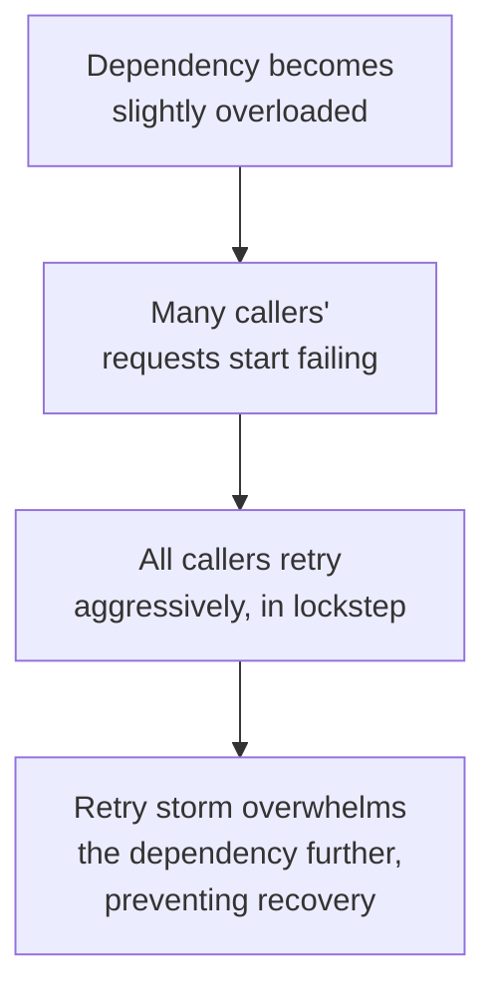

## Definition

The Retry pattern automatically re-attempts a failed operation, on the assumption that many failures in distributed systems are transient (a brief network blip, a momentarily overloaded server) and will succeed if simply tried again — typically with a delay, and often with an increasing delay between successive attempts.

## Why it exists

Distributed systems experience frequent, brief, self-resolving failures — a packet gets dropped, a server is momentarily overloaded, a network blip causes a timeout — that have nothing to do with a persistent, underlying problem and would succeed if simply attempted again a moment later. The Retry pattern exists to automatically handle exactly this common case, without requiring a human or the calling code to manually notice and re-attempt a failed operation.

## The problem it solves

Without automatic retries, every transient, self-resolving failure would need to be surfaced all the way up to a human or calling application to decide whether to try again — needlessly fragile and slow for failures that are often gone within milliseconds. Retry solves this by handling the common, transient case automatically and transparently.

## Real-world analogy

If you call someone and get a brief busy signal, you don't give up permanently — you simply try calling again a moment later, since a busy signal is often a brief, transient condition rather than a sign the person can never be reached. The Retry pattern automates exactly this common-sense behavior for network calls.

## Simple explanation

When an operation fails, instead of immediately giving up (or immediately surfacing the failure to the caller), the system waits briefly and tries again, typically up to some maximum number of attempts, with the delay between attempts often increasing each time (exponential backoff).

## Technical explanation

### Exponential backoff with jitter

Each retry waits roughly twice as long as the previous one (exponential backoff) — this gives a struggling dependency increasing breathing room to recover, rather than hammering it with immediate, repeated retries that could make its overload even worse. Adding random **jitter** to each delay (rather than a precise, fixed backoff schedule) prevents many clients retrying in lockstep from all hitting the dependency again simultaneously, which could itself cause a new overload spike.

<Callout type="warning" title="Retries and idempotency">
Retrying a non-idempotent operation (like a payment charge) without additional safeguards risks duplicating its side effect if the original request actually succeeded but the response was lost. Safe retries generally require the operation itself to be idempotent, or protected by an idempotency key the server can use to detect and ignore a duplicate retry of an already-processed request.
</Callout>

## Internal working — the retry storm risk

A naive, widely-deployed retry policy can itself cause or worsen an outage: if a downstream dependency becomes slow or fails, and every one of its many callers immediately and aggressively retries (especially without backoff or jitter), the resulting flood of retries can overwhelm the dependency even further, actually preventing its recovery — a phenomenon sometimes called a "retry storm."

This is exactly why retries are almost always paired with a [Circuit Breaker](/docs/microservices/circuit-breaker) in production systems — the circuit breaker stops the retry storm by failing fast once a dependency is clearly struggling, rather than letting every caller keep retrying indefinitely.

## Advantages

- Automatically and transparently handles the common case of brief, transient failures, improving overall reliability without requiring manual intervention.
- Exponential backoff with jitter gives struggling dependencies room to recover, rather than compounding their overload.

## Disadvantages

- Naive retry policies (no backoff, no jitter, unlimited attempts) can cause or worsen outages via retry storms.
- Retrying non-idempotent operations without additional safeguards risks duplicating side effects.
- Adds latency to the failure path — a caller waiting through several retry attempts before finally giving up takes longer to receive a final failure than one that fails immediately.

## Trade-offs

Retries trade some added latency on the failure path (waiting through several attempts) for improved overall reliability against common, transient failures — a trade that's almost always worth making, provided the retry policy is well-designed (backoff, jitter, a sensible maximum attempt count) and paired with a circuit breaker to prevent retry storms during genuine, sustained outages.

## Complexity considerations

A well-designed retry policy (exponential backoff, jitter, a maximum attempt count, and idempotency awareness) requires real, deliberate design — a naive "just try again immediately, forever" retry loop is a common and genuinely dangerous anti-pattern in production systems.

## When to use

- Calls to dependencies where transient, self-resolving failures are expected and common (most network calls), especially when the operation being retried is idempotent or protected by an idempotency key.

## When to be cautious

- Non-idempotent operations without idempotency protection, where a retry risks duplicating a side effect (like a duplicate charge).
- Situations where a dependency is clearly experiencing a sustained (not transient) outage — this is exactly when a circuit breaker should stop retries from continuing to hammer it.

## Common mistakes

- Retrying immediately, without backoff or jitter, risking a retry storm that worsens an ongoing outage.
- Retrying non-idempotent operations without any safeguard against duplicating their side effects.
- Not setting a maximum retry count, allowing a persistently failing call to retry indefinitely rather than eventually surfacing a clear failure.

## Interview questions

- "Why is exponential backoff with jitter preferred over immediately retrying a failed call repeatedly?"
- "What's the risk of retrying a non-idempotent operation like a payment charge?"
- "How do retries and circuit breakers work together to handle both transient and sustained failures appropriately?"

## Practical example

A service calling a downstream inventory API retries a failed request up to 3 times, with exponential backoff and jitter between attempts, and only for idempotent read operations (checking stock levels) — while a separate call to actually decrement stock uses an idempotency key, so even if a retry is needed after an ambiguous failure, the decrement is guaranteed not to be applied twice.

## Production example

AWS SDKs and most major cloud provider client libraries build exponential backoff with jitter directly into their default retry behavior for API calls, specifically because this pattern has proven essential for handling the common, transient failures inherent to any large-scale distributed system, without exacerbating overload during genuine outages.

## Best practices

- Use exponential backoff with jitter, not immediate or fixed-interval retries.
- Set a sensible maximum retry count, so a persistently failing call eventually surfaces a clear failure rather than retrying forever.
- Ensure retried operations are idempotent, or protected by an idempotency key, especially for anything with a real side effect (payments, order creation).
- Pair retries with a circuit breaker to avoid retry storms during genuine, sustained dependency outages.

## Summary

The Retry pattern automatically re-attempts failed operations, handling the common case of brief, transient distributed-systems failures transparently — done well, with exponential backoff, jitter, a sensible maximum attempt count, and awareness of idempotency, it meaningfully improves reliability. Done naively, it risks causing or worsening a "retry storm" during genuine, sustained outages, which is exactly why retries are almost always paired with a circuit breaker in production systems.

## References

- AWS Architecture Blog: Exponential Backoff and Jitter
- Google SRE Book: Addressing Cascading Failures

<Quiz questions={[
  {
    q: "Why is adding random jitter to a retry's backoff delay recommended, in addition to exponential backoff itself?",
    options: [
      "Jitter has no real purpose and is purely cosmetic",
      "Without jitter, many clients retrying in lockstep (at the same fixed intervals) could all hit the struggling dependency again simultaneously, causing a new overload spike",
      "Jitter makes retries happen instantly",
      "Jitter is only relevant for database calls"
    ],
    answer: 1,
    explanation: "Exponential backoff alone can still result in many clients retrying at the exact same moments if their delays are perfectly synchronized; adding random jitter spreads out those retry attempts over time, avoiding a coordinated spike of retries hitting the dependency all at once."
  }
]} />
