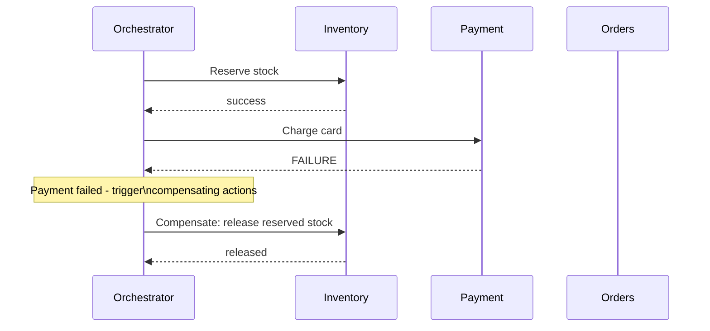

## Definition

The Saga pattern manages a business transaction that spans multiple independently-owned services (each with its own database, per [Database per Service](/docs/microservices/database-per-service)) as a sequence of local transactions, each with a corresponding **compensating transaction** that can undo its effect if a later step in the sequence fails.

## Why it exists

A traditional [ACID](/docs/databases/acid) transaction spanning multiple operations works cleanly within a single database, but a microservices architecture, by design, spreads related data across many independently-owned databases — there's no single database transaction that can atomically span "debit this account in Service A" and "create this order in Service B." The Saga pattern exists to provide correctness guarantees for these genuinely multi-service business transactions, without requiring a distributed ACID transaction (which is impractical across independently owned, often heterogeneous data stores).

## The problem it solves

A business process like "place an order" might need to: reserve inventory (Inventory Service), charge a payment (Payment Service), and create an order record (Orders Service) — each in its own database. If the payment charge fails after inventory was already reserved, something needs to explicitly undo that reservation — there's no automatic, database-level rollback spanning both services the way a single ACID transaction would provide. The Saga pattern solves this by defining an explicit compensating action for each step, invoked in reverse order if a later step fails.

## Real-world analogy

Booking a multi-leg vacation package (flight, hotel, rental car) through three separate companies, each with its own booking system, is a saga in the real world: if the flight and hotel are booked successfully but the rental car is unavailable, you don't get an automatic, magical rollback across all three companies — you (or an orchestrating travel agent) explicitly cancel the flight and hotel bookings you already made, using each company's own cancellation process, since no single system spans all three bookings.

## Simple explanation

Instead of one atomic transaction spanning multiple services, a saga is a sequence of separate, local transactions (each within one service's own database), where every step has a defined compensating action — if a later step fails, the saga executes the compensating actions for every already-completed step, in reverse order, to undo their effects and leave the overall system in a consistent state.

## Technical explanation

### Choreography vs. orchestration

- **Choreography**: each service publishes events when it completes its local transaction, and other services react to those events (via [Pub/Sub](/docs/messaging/pub-sub)) to perform their own next step or compensating action — fully decentralized, no single coordinator.
- **Orchestration**: a central orchestrator explicitly calls each service in sequence and directs compensating actions if something fails — more centralized, but easier to follow and debug the overall saga's logic in one place.

## Internal working — compensating transactions aren't a perfect rollback

A crucial, often-overlooked nuance: a compensating transaction doesn't necessarily restore the exact prior state the way a database rollback would — it takes a corrective business action. "Cancel this reservation" might not be identical to "as if it never happened" if, say, the reserved item was briefly unavailable to other customers in the meantime. Saga design needs to account for this — compensating actions are business-level undos, not literal database rollbacks.

## Advantages

- Enables correctness guarantees for multi-step business transactions spanning multiple independently-owned services, without requiring a fragile, hard-to-scale distributed ACID transaction.
- Choreography-based sagas keep services fully decoupled, communicating only via events.
- Orchestration-based sagas keep the overall multi-step business logic clearly visible and easy to follow in one place.

## Disadvantages

- Genuinely more complex to design and reason about than a single ACID transaction — every step needs an explicit, carefully designed compensating action.
- There's a window during a saga's execution where the overall system is in an intermediate, not-yet-fully-consistent state (e.g. inventory reserved, but payment not yet confirmed) — application logic needs to account for this.
- Choreography-based sagas, while decoupled, can become hard to trace and debug as the number of participating services and events grows, since there's no single place describing the overall flow.

## Trade-offs

Sagas trade the simplicity of a single ACID transaction for the ability to maintain correctness across genuinely independent, separately-owned services — a necessary trade in a microservices architecture where a single distributed transaction spanning many services isn't practical, at the cost of real additional design complexity (compensating actions, intermediate-state handling).

## Complexity considerations

Choreography-based sagas add less centralized infrastructure but can become hard to trace as complexity grows; orchestration-based sagas are more centralized and easier to follow but introduce the orchestrator itself as a critical component. The right choice often depends on the number of services involved and how complex the overall saga's logic actually is.

## When to use

- Business transactions genuinely spanning multiple independently-owned microservices, where a distributed ACID transaction isn't practical or available.

## When NOT to use

- Transactions that can be contained within a single service's own database — a normal, local ACID transaction is simpler and should be preferred whenever the data involved isn't genuinely spread across multiple services.

## Common mistakes

- Not designing a genuine, correct compensating action for every step, leaving some failure scenarios able to leave the overall system in an inconsistent state.
- Not accounting for the intermediate, not-yet-fully-consistent state a saga passes through during its execution, in application logic or user-facing behavior.
- Choosing choreography for a saga complex enough that its overall flow becomes genuinely hard to trace and debug without a central orchestrator describing it.

## Interview questions

- "Why can't you use a single ACID transaction to guarantee correctness across a multi-step business process spanning several microservices?"
- "What's the difference between choreography-based and orchestration-based sagas, and when would you choose each?"
- "Why isn't a compensating transaction necessarily a perfect undo of the original action?"

## Practical example

An e-commerce "place order" saga: reserve inventory, charge payment, create the order record — if payment fails after inventory was reserved, the saga's compensating action releases the reserved inventory, ensuring the overall system doesn't end up with permanently, incorrectly reserved stock for an order that was never actually completed.

## Production example

Uber's engineering team has publicly discussed using saga-like patterns (built on their internal event-driven infrastructure) to coordinate multi-step processes spanning many of their independently owned microservices — like the sequence of steps involved in completing a ride and processing its associated payment and driver payout.

## Best practices

- Design an explicit, carefully considered compensating action for every step in a saga, not just the happy path.
- Choose orchestration for genuinely complex sagas where a clear, centralized view of the overall flow aids understanding and debugging; choose choreography for simpler sagas where full decoupling is more valuable.
- Design application logic and user-facing behavior to account for the intermediate, not-yet-fully-consistent state a saga passes through during execution.

## Summary

The Saga pattern manages a multi-step business transaction spanning multiple independently-owned microservices as a sequence of local transactions, each with an explicit compensating action to undo its effect if a later step fails — providing correctness guarantees without requiring a distributed ACID transaction. It can be implemented via choreography (decentralized, event-driven) or orchestration (a central coordinator), and requires careful, deliberate design of every compensating action, since these are business-level undos rather than literal database rollbacks.

## References

- Garcia-Molina, H. & Salem, K. "Sagas" (1987, the original database systems paper the pattern is named after)
- microservices.io: Saga pattern

<Quiz questions={[
  {
    q: "Why can't a saga's compensating transaction always be considered a perfect, exact undo of the original action?",
    options: [
      "Compensating transactions always perfectly restore the exact prior state",
      "A compensating transaction is a corrective business action, not a literal database rollback - conditions may have changed in the meantime (e.g. an item was briefly unavailable to others), so it's an undo at the business level, not a perfect state restoration",
      "Sagas don't actually support compensating transactions",
      "This is only a concern for financial transactions"
    ],
    answer: 1,
    explanation: "Since each step in a saga is a separate, committed local transaction (not part of one atomic, isolated transaction), other activity can occur in the meantime — a compensating action corrects the business state going forward, but can't literally erase everything that happened as if the original action never occurred at all."
  }
]} />
