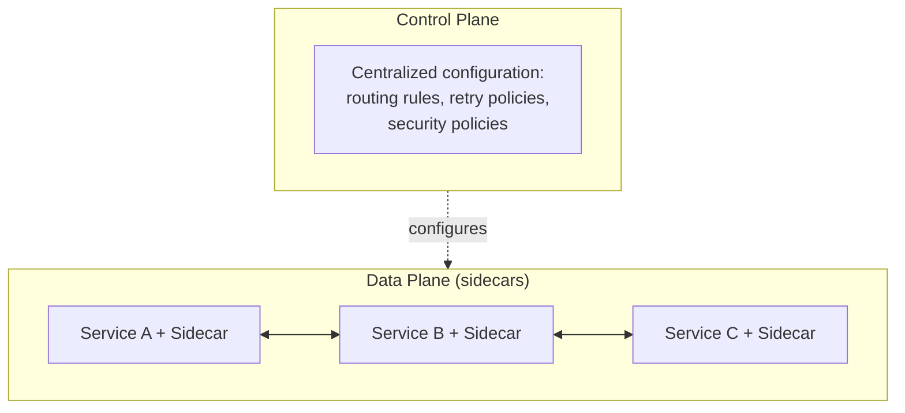

## Definition

A service mesh is a dedicated infrastructure layer that handles service-to-service communication concerns — traffic routing, retries, circuit breaking, TLS encryption, and observability — consistently across an entire microservices fleet, typically implemented via a [Sidecar](/docs/patterns/sidecar) proxy deployed alongside every service instance.

## Why it exists

As a microservices architecture grows to include dozens or hundreds of services, each needing consistent handling of retries, TLS, circuit breaking, and observability, implementing this logic separately (even via shared libraries) in every service becomes a real, ongoing burden — especially across multiple languages. A service mesh exists to move all of this logic out of individual services entirely, into a dedicated, uniformly-configured infrastructure layer.

## The problem it solves

Without a service mesh, ensuring consistent retry policies, circuit breaker thresholds, TLS configuration, and observability across dozens of independently developed, potentially polyglot services requires either painstaking manual consistency across many codebases, or shared libraries that still need each team to correctly adopt and keep updated. A service mesh solves this by centralizing this logic in a uniform, sidecar-based data plane, configured consistently from one control plane.

## Real-world analogy

Instead of every individual store in a large shopping mall needing to independently negotiate and manage its own security, power, and communications infrastructure, a well-run mall provides these as shared, centrally managed infrastructure that every store plugs into uniformly — each store focuses purely on its own retail business, while the mall's infrastructure ensures consistent, reliable service across all of them. A service mesh plays exactly this role for microservices' communication infrastructure.

## Simple explanation

Every service instance gets a sidecar proxy deployed alongside it; all traffic to and from that service passes through its sidecar, which handles retries, circuit breaking, TLS, and telemetry uniformly — a central control plane configures this behavior consistently across the entire fleet, so individual services' application code doesn't need to implement any of this itself.

## Technical explanation

### Data plane and control plane

The **data plane** is the actual traffic-handling layer — the sidecar proxies (commonly Envoy) attached to every service instance, doing the real work of routing, retrying, and encrypting traffic. The **control plane** is the centralized system that configures all of those sidecars' behavior consistently, without requiring changes to individual services.

## Internal working — mutual TLS across the mesh

A commonly cited service mesh capability: automatic **mutual TLS (mTLS)** between every service, encrypting and authenticating all internal service-to-service traffic, configured and rotated centrally by the control plane — without any individual service's application code needing to implement certificate handling itself.

## Advantages

- Consistent handling of retries, circuit breaking, TLS, and observability across an entire microservices fleet, regardless of the language each service is written in.
- Centralized configuration lets operators change traffic routing, security policies, or resilience behavior fleet-wide without redeploying individual services.
- Rich, uniform observability (metrics, traces) across all service-to-service communication, since it all passes through the mesh's sidecars.

## Disadvantages

- Significant operational complexity to deploy, configure, and maintain — a service mesh is itself a substantial piece of infrastructure requiring real expertise.
- Adds latency and resource overhead to every service-to-service call, since traffic now passes through sidecar proxies rather than going directly.
- Can become a "black box" that's hard to debug if the team operating it doesn't have deep expertise in how it actually works.

## Trade-offs

A service mesh trades significant operational complexity and some added latency for consistent, centrally-manageable service-to-service communication behavior across an entire fleet — a trade that pays off specifically at meaningful microservices scale (many services, likely polyglot), and is generally excessive overhead for a small number of services.

## Complexity considerations

Adopting a service mesh (like Istio or Linkerd) is a substantial commitment — teams need real expertise not just in their own application code, but in operating and troubleshooting the mesh infrastructure itself, which becomes a critical, fleet-wide dependency.

## When to use

- Large, polyglot microservices architectures where consistent service-to-service communication behavior (retries, TLS, observability) needs to be enforced uniformly across many services and teams.

## When NOT to use

- Small numbers of services, or systems in a single language already using a well-maintained shared library effectively for these concerns — the operational overhead of a full service mesh likely isn't justified.

## Common mistakes

- Adopting a service mesh prematurely, for a small number of services, taking on substantial operational complexity without a correspondingly large benefit.
- Underestimating the expertise required to operate and troubleshoot a service mesh effectively — treating it as a "set it and forget it" solution rather than critical, ongoing infrastructure.
- Not accounting for the added latency and resource overhead of mesh sidecars in overall system capacity planning.

## Interview questions

- "What problem does a service mesh solve that individual services' shared libraries don't fully address?"
- "What's the difference between a service mesh's data plane and control plane?"
- "When would adopting a full service mesh be excessive for a given microservices architecture?"

## Practical example

A company running 200+ microservices across multiple languages adopts Istio to uniformly enforce mutual TLS between all services, apply consistent retry and circuit-breaking policies fleet-wide, and gain rich, standardized observability across all service-to-service traffic — all configured centrally, without needing to modify any individual service's application code.

## Production example

Lyft originally built Envoy (now a widely adopted, CNCF-graduated project) specifically to solve their own service-to-service communication challenges at scale, and it has since become the most common data-plane proxy underlying major service mesh implementations like Istio.

## Best practices

- Adopt a service mesh specifically once a microservices architecture has reached a scale (many services, likely polyglot) where consistent, centrally-managed communication behavior provides real, measurable value.
- Invest in genuine operational expertise for operating and troubleshooting the mesh, since it becomes a critical, fleet-wide dependency.
- Account for the mesh's added latency and resource overhead in overall capacity planning, rather than treating it as free.

## Summary

A service mesh provides a dedicated, uniformly-configured infrastructure layer for service-to-service communication — routing, retries, circuit breaking, TLS, and observability — built on sidecar proxies attached to every service instance, configured centrally by a control plane. It trades significant operational complexity and some added latency for consistent, fleet-wide communication behavior, a trade that pays off specifically at meaningful microservices scale, particularly in polyglot environments.

## References

- Istio documentation
- Envoy Proxy documentation
- Lyft Engineering Blog: origins of Envoy

<Quiz questions={[
  {
    q: "What's the difference between a service mesh's 'data plane' and 'control plane'?",
    options: [
      "They are the same thing",
      "The data plane (sidecar proxies) does the actual traffic handling (routing, retries, TLS); the control plane centrally configures that behavior consistently across the fleet",
      "The control plane handles all actual network traffic directly",
      "Data planes and control planes only exist in monolithic architectures"
    ],
    answer: 1,
    explanation: "The data plane consists of the sidecar proxies actually processing every service-to-service request (applying retries, TLS, routing rules), while the control plane is the centralized system that configures and updates that behavior consistently across all the sidecars in the mesh."
  }
]} />
