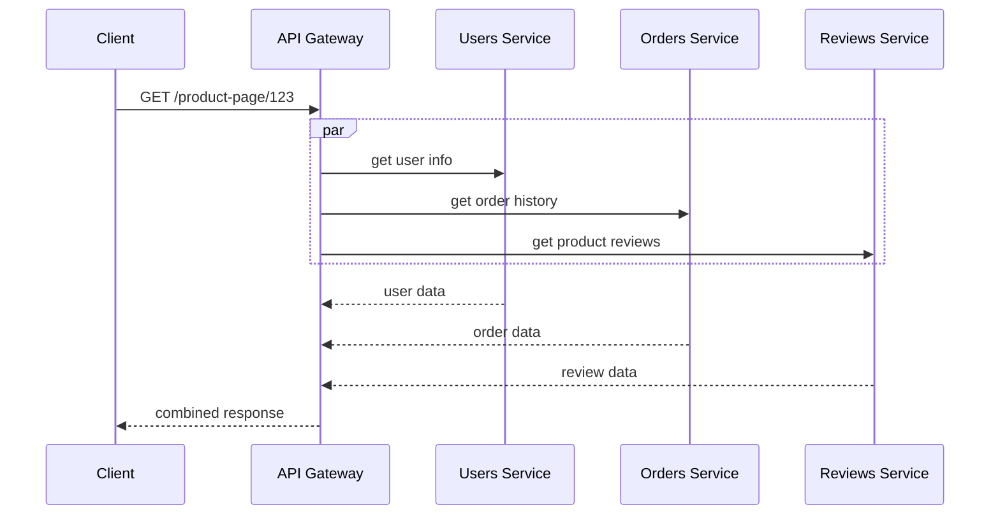

## Definition

An API Gateway is a server that acts as the single entry point for client requests into a system built from multiple backend services (typically [microservices](/docs/microservices/microservices)), handling cross-cutting concerns like routing, authentication, rate limiting, and response aggregation before forwarding requests to the appropriate internal service.

## Why it exists

In a microservices architecture, a single client action (loading a product page, say) might need data from five different backend services. Without a gateway, the client would need to know about, authenticate to, and call all five services directly — tightly coupling the client to internal architecture that should be free to change. The API Gateway exists to hide that internal complexity behind one stable, client-facing interface.

## The problem it solves

Directly exposing every internal microservice to clients creates several problems at once: clients must implement authentication and error handling against many different services, internal services can't be restructured (split, merged, renamed) without breaking clients, and there's no single place to enforce cross-cutting policies like rate limiting or logging. An API Gateway centralizes all of this.

## Real-world analogy

An API Gateway is like a hotel concierge desk. As a guest, you don't personally coordinate directly with housekeeping, room service, and the spa — you ask the concierge, and they route your request to the right internal department, often combining multiple internal actions (booking a spa treatment *and* arranging a taxi) into what feels like a single, simple request from your side.

## Simple explanation

`Client → API Gateway → [Service A, Service B, Service C, ...]`. The client only ever talks to the gateway; the gateway handles authentication, decides which internal service(s) should handle the request, and — often — combines multiple internal calls into a single response.

## Technical explanation

Common responsibilities of an API Gateway:

- **Routing** — directing each incoming request to the correct backend service based on path or other request attributes.
- **Authentication / authorization** — verifying the caller's identity and permissions once, centrally, rather than in every backend service.
- **Rate limiting** — enforcing per-client request limits in one place.
- **Request/response transformation** — adapting between what clients expect and what internal services actually provide.
- **Aggregation** (API composition) — combining data from multiple backend services into a single response for the client, avoiding multiple round trips from the client itself.

## Internal working — aggregation example

This is a specific pattern called [API Composition](/docs/microservices/api-composition) — the gateway (or a dedicated composition layer) fans out to multiple services in parallel and assembles one response, so the client makes one request instead of three.

## Advantages

- Clients interact with one stable interface, insulated from internal service restructuring.
- Centralizes authentication, rate limiting, and logging instead of duplicating that logic across every backend service.
- Reduces the number of round trips a client needs by aggregating multiple backend calls into one response.

## Disadvantages

- Becomes a new critical, shared dependency — if it goes down, it can take down access to the entire system, so it needs to be highly available itself.
- Can become a bottleneck if not scaled properly, since all traffic passes through it.
- Risk of becoming a dumping ground for business logic that should live in individual services (an anti-pattern sometimes called a "God gateway").

## Trade-offs

Centralizing cross-cutting concerns in a gateway simplifies backend services considerably, but concentrates operational risk and importance onto the gateway layer, which must now be built and scaled with the same care as any other business-critical, high-traffic component.

## Complexity considerations

A simple routing-only gateway is relatively straightforward. A gateway that also does response aggregation, request transformation, and complex authorization logic is a substantial piece of infrastructure in its own right, and needs to be designed, tested, and scaled deliberately — not treated as an afterthought.

## When to use

- Microservices architectures with more than a couple of independently deployed backend services, especially ones consumed by external or mobile clients that benefit from a simplified, stable interface.

## When NOT to use

- Simple systems with only one or two backend services, where the added complexity and operational overhead of a dedicated gateway layer isn't justified yet — a direct client-to-service call, or a simple reverse proxy, may be sufficient.

## Common mistakes

- Letting business logic creep into the gateway layer, which should generally stay focused on cross-cutting, infrastructure-level concerns rather than domain logic that belongs in the actual services.
- Not scaling or making the gateway redundant with the same care as backend services, even though literally all traffic depends on it.
- Using a single monolithic gateway to serve very different client types (web, mobile, third-party partners) with very different needs, when a "backend for frontend" pattern (a tailored gateway per client type) might fit better.

## Interview questions

- "Why would you introduce an API Gateway into a microservices architecture rather than having clients call services directly?"
- "What cross-cutting concerns would you centralize at the gateway vs. leave to individual services?"
- "How would you prevent the API Gateway itself from becoming a single point of failure?"

## Practical example

A mobile app's product detail screen calls a single `GET /product-page/:id` endpoint on the API Gateway, which internally fans out to the Users, Orders, and Reviews services in parallel and returns one combined JSON response — sparing the mobile client three separate round trips (and three separate sets of retry/error-handling logic) over a mobile network.

## Production example

Netflix's Zuul (and later, Spring Cloud Gateway) was built specifically to serve as the API Gateway in front of Netflix's large microservices architecture, handling routing, authentication, and resiliency patterns (like circuit breaking) for traffic entering their system from many different client device types.

## Best practices

- Keep the gateway focused on cross-cutting infrastructure concerns (auth, rate limiting, routing, aggregation) rather than business logic.
- Deploy the gateway itself redundantly and scale it proportionally to total system traffic, since everything passes through it.
- Consider a "backend for frontend" pattern — a tailored gateway per client type — when different clients (web, mobile, partners) have significantly different needs.

## Summary

An API Gateway is the single, client-facing entry point in front of a multi-service architecture, centralizing routing, authentication, rate limiting, and often response aggregation. It simplifies the client's interaction with an otherwise complex backend, at the cost of becoming a critical, high-traffic component that must itself be built for high availability and scale.

## References

- Netflix Tech Blog: Zuul
- Microservices.io: API Gateway pattern

<Quiz questions={[
  {
    q: "What is 'API Composition' in the context of an API Gateway?",
    options: [
      "Writing API documentation",
      "The gateway combining data from multiple backend services into a single response for the client",
      "A method of compressing API responses",
      "A type of database index"
    ],
    answer: 1,
    explanation: "API composition is the pattern where the gateway (or a dedicated layer) fans out to multiple backend services in parallel and assembles their results into one response, sparing the client multiple round trips."
  }
]} />
