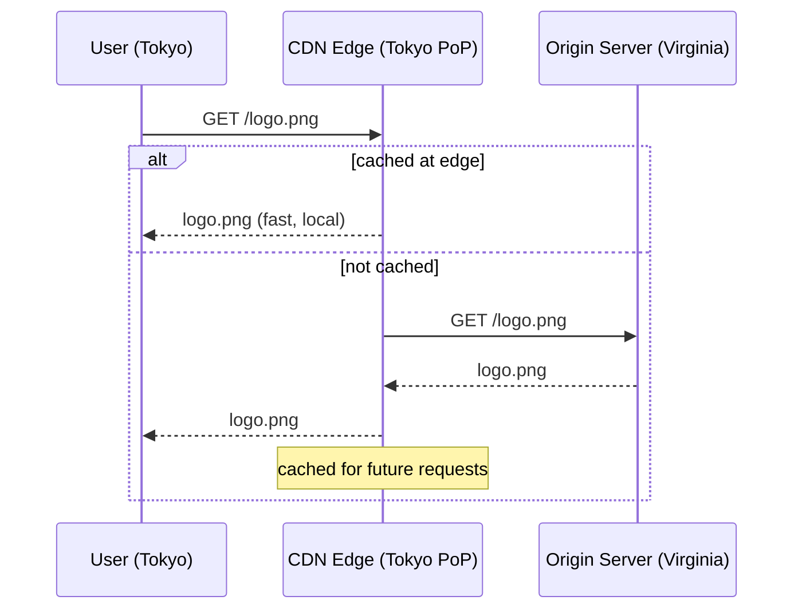

## Definition

A CDN (Content Delivery Network) is a geographically distributed network of servers that caches and serves content from locations physically close to end users, reducing the distance (and therefore latency) data has to travel compared to serving everything from one origin server.

## Why it exists

Network latency is bounded by the speed of light — a request from Tokyo to a single server in Virginia will always take longer than a request to a server in Tokyo, no matter how fast that server is. CDNs exist because for many kinds of content, the fix for that latency isn't a faster server, it's a **closer** one.

## The problem it solves

Without a CDN, every user worldwide hits the same origin server (or origin region), meaning users far from that location experience meaningfully worse latency, and the origin has to handle 100% of all traffic itself — both a performance problem and a scalability/resilience one.

## Real-world analogy

Instead of every customer in the world ordering directly from one central bakery and waiting for delivery, a CDN is like having smaller, stocked bakery outposts in every major city — most customers get their order from the nearby outpost instantly, and only truly custom orders (or a first-time item nowhere has in stock yet) need to go back to the central bakery.

## Simple explanation

A CDN sits between users and your origin server, at many points of presence (PoPs) around the world. A user's request goes to the nearest PoP; if that PoP already has the requested content cached, it serves it directly — fast, and without touching your origin server at all.

## Technical explanation

CDNs work extremely well for **static, cacheable content** — images, videos, JS/CSS bundles, and anything with a URL that returns the same content for every user. They're less directly useful (though still valuable for TLS termination and DDoS protection) for highly dynamic, personalized responses that differ per request.

## Internal working

- **Points of presence (PoPs)**: physical server locations distributed globally.
- **Anycast or geo-DNS routing**: routes each user's request to their nearest PoP.
- **Cache rules**: determined by HTTP caching headers (`Cache-Control`, `ETag`) set by the origin, telling the CDN how long content can be cached and how to validate it.
- **Origin fetch (cache miss)**: on a miss, the edge PoP fetches from the origin, caches the response, and serves it — subsequent nearby users get a cache hit.

## Advantages

- Dramatically reduced latency for users far from the origin server.
- Absorbs a large fraction of total traffic at the edge, reducing load on the origin.
- Improves resilience — a traffic spike or even a DDoS attack is absorbed across many distributed edge locations rather than hitting the origin directly.

## Disadvantages

- Only helps for cacheable content — highly dynamic or personalized responses still need to reach the origin (or a smart edge-compute layer).
- Cache invalidation across many distributed edge locations is a genuinely hard problem — see [Cache Invalidation](/docs/caching/cache-invalidation) — updating content globally isn't instantaneous.
- Adds another layer of infrastructure and configuration (cache rules, invalidation strategy) to manage.

## Trade-offs

Longer cache durations reduce origin load and improve hit rates but mean stale content persists longer after an update; shorter durations keep content fresher but reduce cache effectiveness and increase origin load.

## Complexity considerations

Serving static assets through a CDN is relatively simple — mostly a configuration decision. Using a CDN effectively for more dynamic content (e.g. via edge compute, or careful cache-key design that varies by relevant parameters like locale) requires more deliberate design.

## When to use

- Any publicly accessible static content — images, videos, JS/CSS, downloadable files.
- Global user bases, where reducing physical distance to users has a real, direct latency benefit.
- As a general layer of DDoS protection and TLS termination, even for otherwise dynamic APIs.

## When NOT to rely on it heavily

- Highly personalized, per-user dynamic content with no meaningful cacheability — the CDN mostly just proxies through to origin for these, providing limited benefit beyond TLS/DDoS protection.
- Very small, single-region user bases, where the latency benefit of edge locations is minimal.

## Common mistakes

- Not setting proper cache-control headers, causing the CDN to either cache things that shouldn't be cached (serving stale personalized data to the wrong user) or fail to cache things that should be, missing out on the performance benefit.
- Assuming a CDN update is instantaneous — cache invalidation across a global edge network takes real time to propagate.
- Using a CDN only for static assets while ignoring its value as a DDoS-absorbing, TLS-terminating layer in front of dynamic APIs too.

## Interview questions

- "How would a CDN help (or not help) with this specific type of content?"
- "What cache-control strategy would you use for content that updates rarely but must be accurate when it does?"
- "How does a CDN help with resilience against traffic spikes, beyond just latency?"

## Practical example

An e-commerce site serves product images and its main JS/CSS bundle through a CDN with long cache lifetimes (since these change rarely and are identical for every user), while API calls for cart contents and personalized recommendations bypass the CDN's cache entirely and go straight to origin, since that content is unique per user and not meaningfully cacheable.

## Production example

Netflix's Open Connect is a purpose-built CDN specifically for video delivery, placing cache servers deep inside ISP networks around the world so that the vast majority of video traffic never has to traverse the broader internet backbone at all — a scale-specific evolution of the same basic CDN idea.

## Best practices

- Set explicit, deliberate `Cache-Control` headers rather than relying on CDN defaults.
- Use the CDN for DDoS protection and TLS termination even for content that isn't heavily cached.
- Design cache keys carefully for any content that varies by parameters like locale or device type, so the CDN doesn't serve the wrong variant to the wrong user.

## Summary

A CDN reduces latency by serving cacheable content from servers physically close to users, absorbing a large fraction of traffic away from the origin server in the process. It's most valuable for static, cacheable content, and requires deliberate cache-control configuration and an invalidation strategy to avoid serving stale content after updates.

## References

- Cloudflare Learning Center: What is a CDN?
- Netflix Tech Blog: Open Connect

<Quiz questions={[
  {
    q: "For which type of content does a CDN provide the most direct benefit?",
    options: [
      "Highly personalized, per-user dynamic content",
      "Static, cacheable content identical for every user (images, JS/CSS, videos)",
      "Real-time chat messages",
      "Database write operations"
    ],
    answer: 1,
    explanation: "CDNs cache content at edge locations — this works best for content that's the same for every requester, so a cached copy at a nearby edge location is valid for many different users."
  }
]} />
