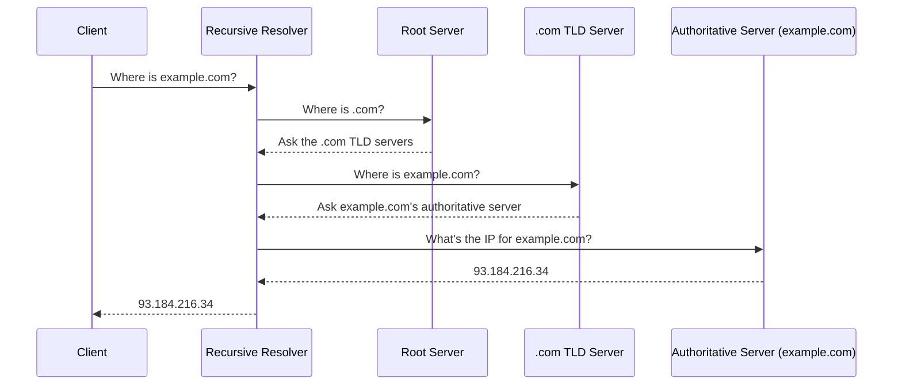

## Definition

DNS (Domain Name System) is a distributed, hierarchical naming system that translates human-readable domain names (`api.example.com`) into the IP addresses (`93.184.216.34`) computers actually use to route network traffic.

## Why it exists

Computers route traffic using numeric IP addresses, but humans (and, often, application configuration) work far more easily with memorable names. DNS exists to bridge that gap — and, just as importantly for system design, to let the IP address behind a name **change** without anyone needing to update every client that references the name.

## The problem it solves

Without DNS, every client would need to know the exact, current IP address of every server it wants to reach — and that address could never change without breaking every client. DNS decouples the stable, human-facing name from the actual (and potentially frequently changing) network location, enabling load balancing, failover, and infrastructure changes to happen transparently.

## Real-world analogy

DNS is like calling a company's main phone number instead of memorizing the direct line of whichever specific employee happens to be handling calls today. The company can freely reassign who answers that number — new employees, different departments, a different office entirely — without you ever needing to learn a new number.

## Simple explanation

When you type `example.com` into a browser, DNS resolves it to an IP address through a series of lookups, typically cached at multiple layers so the full lookup chain rarely happens on every request.

## Technical explanation

### The resolution hierarchy

In practice, this full chain is rarely walked on every request — DNS responses are cached extensively at every layer (the browser, the OS, the recursive resolver, and often an ISP-level cache), each governed by a **TTL (time to live)** set on the DNS record itself.

### Common record types

| Record | Purpose |
|---|---|
| A | Maps a name directly to an IPv4 address |
| AAAA | Maps a name to an IPv6 address |
| CNAME | Maps a name to another name (an alias) |
| MX | Specifies mail servers for a domain |
| TXT | Arbitrary text, often used for domain verification |

## Internal working — DNS and load balancing / failover

Because DNS decouples name from address, it's a common (if coarse-grained) tool for both load balancing and failover:

- **Round-robin DNS**: return multiple IP addresses for one name, in rotating order, spreading client connections across multiple servers.
- **Geo-DNS**: return a different IP address depending on the requester's geographic location, routing users to the nearest data center.
- **Failover**: health-check the servers behind a name and stop returning the IP of any that are unhealthy.

<Callout type="warning" title="TTL is a real trade-off, not just a technical detail">
A low TTL means changes propagate quickly (useful for fast failover) but increases DNS query volume and adds latency overhead from more frequent lookups. A high TTL reduces lookup overhead but means a change (like failing over to a backup server) takes longer to actually reach all clients, since many will keep using a cached, stale answer until their TTL expires.
</Callout>

## Advantages

- Decouples human-facing names from the actual, changeable network topology behind them.
- Extensive caching at multiple layers keeps the vast majority of lookups fast and keeps load off authoritative servers.
- Provides simple, infrastructure-level tools for geographic routing and basic failover.

## Disadvantages

- DNS caching (TTLs) means changes don't propagate instantly — a failover or migration can take as long as the longest cached TTL among clients to fully take effect.
- DNS-based load balancing is coarse — it can't react to real-time server load the way an actual load balancer can, only to whether a server is up or down (and even that, only as fast as health checks and TTLs allow).
- A DNS outage (rare, but it happens) can make an otherwise perfectly healthy system completely unreachable, since clients can't resolve the name to any address at all.

## Trade-offs

Shorter TTLs give faster failover and more up-to-date routing at the cost of more DNS query volume and lookup latency; longer TTLs reduce overhead but slow down how quickly changes propagate to all clients.

## Complexity considerations

Basic DNS usage (a domain pointing at a load balancer's IP) is simple. Sophisticated DNS-based routing (geo-routing, weighted traffic splitting across regions, automated failover based on health checks) requires either a managed DNS provider with these features or real operational tooling to manage correctly.

## When DNS-level routing matters most

- Multi-region deployments, where routing users to their nearest region meaningfully improves latency.
- Disaster recovery plans, where failing over an entire region requires redirecting traffic at the DNS level (since the servers themselves, and their IPs, may be entirely different in a backup region).

## When simpler DNS setups are fine

- Single-region deployments behind one load balancer, where DNS just needs to point at that load balancer's stable address — the load balancer itself handles the finer-grained routing.

## Common mistakes

- Setting a very high TTL and then being surprised that a failover or migration takes hours to fully propagate to all clients.
- Relying on DNS-based load balancing alone for real-time traffic distribution, when an actual load balancer (which can react instantly to server health and load) is what's actually needed.
- Forgetting that DNS itself is a dependency — if it's not resilient (e.g. using a reputable managed provider with its own redundancy), it becomes a single point of failure for an otherwise well-architected system.

## Interview questions

- "How would you use DNS to support a multi-region failover strategy?"
- "What's the trade-off in setting a very low vs. very high TTL on a critical DNS record?"
- "Why can't DNS alone replace a real load balancer?"

## Practical example

A service migrating from one cloud provider to another lowers its DNS TTL well in advance of the migration (so the change will propagate quickly once made), performs the cutover by updating the DNS record to point at the new provider's IPs, and only raises the TTL back up once confident the migration is stable.

## Production example

Netflix and other large streaming services use geo-aware DNS as one layer (alongside CDNs) of routing users to the data center or edge location that will give them the best streaming performance, based on their resolved location.

## Best practices

- Lower TTLs in advance of planned migrations or expected failover events, and raise them again once stable.
- Use a reputable, redundant managed DNS provider rather than treating DNS as an afterthought — it's a real dependency on the critical path of every request.
- Don't rely on DNS alone for fine-grained, real-time load balancing — pair it with an actual load balancer for that.

## Summary

DNS translates human-readable domain names into IP addresses, decoupling stable names from a system's actual (and potentially changing) network topology. It's cached extensively via TTLs, which is both its main performance strength and the source of its main limitation: changes don't propagate instantly, and the coarseness of TTL-based caching is a real design trade-off, especially for failover planning.

## References

- RFC 1035 (DNS specification)
- Cloudflare Learning Center: What is DNS?

<Quiz questions={[
  {
    q: "Why might lowering a DNS record's TTL in advance of a planned migration be a good idea?",
    options: [
      "It makes DNS lookups faster permanently",
      "It reduces how long cached, stale answers persist on clients, so the actual cutover propagates faster",
      "It has no effect on migrations",
      "It permanently disables caching"
    ],
    answer: 1,
    explanation: "A lower TTL means clients re-check the DNS record more often, so once the record is actually changed during the migration, clients pick up the new address faster instead of continuing to use a long-cached, stale one."
  }
]} />
