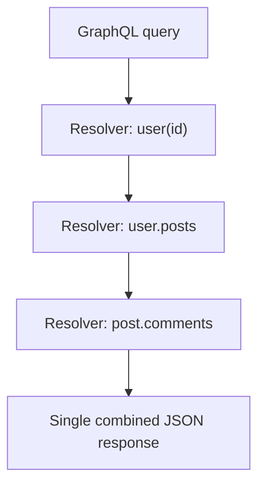

## Definition

GraphQL is a query language and runtime for APIs that lets clients specify exactly what data they need — across potentially many related resources — in a single request, and receive back a response shaped exactly like that request, no more and no less.

## Why it exists

[REST](/docs/networking/rest) endpoints return a fixed shape of data per URL, decided by the server. Different clients (a mobile app needing a minimal payload, a web dashboard needing much more detail) often need meaningfully different shapes of the same underlying data. GraphQL exists to move that decision to the client — each client asks for precisely what it needs, in one request.

## The problem it solves

Two specific problems with typical REST APIs, both from Facebook's own experience building GraphQL:

- **Over-fetching**: a REST endpoint returns a fixed set of fields, even if a specific client only needs two of the ten fields in that response — wasted bandwidth and parsing, especially costly on mobile networks.
- **Under-fetching**: a client needing data from multiple related resources (a user, their posts, and each post's comments) often needs multiple sequential REST calls (or a bespoke composite endpoint) to assemble it all — GraphQL lets a single query traverse all of these relationships in one round trip.

## Real-world analogy

REST is like ordering from a fixed-menu restaurant — you get exactly what's on the plate for that dish, whether you wanted all of it or not, and if you want to combine parts of two different dishes, you often need to order both entirely. GraphQL is like a made-to-order buffet where you specify precisely which items and how much of each you want, and it's all served on one plate in a single trip.

## Simple explanation

A client sends a single GraphQL query describing exactly the fields and relationships it wants; the server executes it against a predefined **schema** (a strongly-typed description of all available data and how it relates) and returns JSON shaped exactly like the query.

## Technical explanation

### Example query

```graphql
query {
  user(id: "123") {
    name
    posts {
      title
      comments {
        author
        text
      }
    }
  }
}
```

This single request traverses a user, their posts, and each post's comments — a relationship traversal that would typically require multiple REST calls (`/users/123`, then `/users/123/posts`, then `/posts/:id/comments` for each post) — in one round trip, returning only the specific fields requested (`name`, `title`, `author`, `text`), nothing more.

### The schema

GraphQL APIs are defined by a strongly-typed schema describing every available type, field, and relationship — this schema is both the API's contract and the basis for tooling (auto-generated documentation, client-side type checking) that a loosely-typed REST API doesn't get for free.

## Internal working — resolvers



Each field in the schema has an associated **resolver** function — a small piece of server-side logic that knows how to fetch that specific field's data (often from a database or another internal service). GraphQL's execution engine calls the right resolvers, in the right order, to satisfy exactly what the incoming query asked for.

<Callout type="warning" title="The N+1 query problem">
A naive resolver implementation can trigger one database query per user, per post, per comment — an "N+1" query explosion. GraphQL servers commonly solve this with a **batching/dataloader** pattern that groups and deduplicates these underlying data-fetching calls, rather than letting the query's structure directly and naively dictate database access patterns.
</Callout>

## Advantages

- Clients get exactly the data they need in one request — solving both over-fetching and under-fetching in one design.
- Strongly-typed schema provides auto-generated documentation and enables strong client-side tooling (autocomplete, compile-time query validation).
- A single, evolving schema can serve many different clients (web, mobile, etc.) with very different data needs, without needing separate bespoke endpoints per client.

## Disadvantages

- More complex to implement correctly on the server side than REST, particularly around avoiding the N+1 query problem and correctly limiting query complexity/depth (a malicious or accidental deeply nested query can be very expensive to execute).
- Harder to cache at the HTTP layer than REST — since queries can vary arbitrarily, typical URL-based HTTP caching (CDNs, browser caches) doesn't apply the same way.
- Steeper learning curve, and more upfront schema design work, than a straightforward REST endpoint.

## Trade-offs

GraphQL trades REST's simplicity and out-of-the-box HTTP cacheability for flexibility in exactly what data a client can request — a strong fit when different clients genuinely need different shapes of related data, and less clearly worth the added complexity when a system has simple, uniform data needs across its clients.

## Complexity considerations

Implementing a naive GraphQL server is straightforward; implementing one that performs well at scale (avoiding N+1 queries, limiting query complexity/depth to prevent abuse, caching effectively despite variable queries) is a meaningfully more advanced undertaking than a comparable REST API.

## When to use

- Systems serving multiple, meaningfully different client types (web, mobile, third-party integrations) with different data shape needs from largely the same underlying data.
- Applications with complex, deeply nested/related data where assembling a full REST response would otherwise require many sequential API calls from the client.

## When NOT to use

- Simple systems with a small number of clients that all need roughly the same, simple data shapes — REST's simplicity and native HTTP cacheability are likely a better fit.
- Systems that rely heavily on CDN/HTTP-level caching for performance, where GraphQL's variable query shapes complicate that caching strategy significantly.

## Common mistakes

- Not addressing the N+1 query problem, leading to serious performance issues as query complexity grows in production.
- Not limiting query depth/complexity, leaving the API vulnerable to expensive or even denial-of-service-inducing queries from a client (accidental or malicious).
- Adopting GraphQL for a simple system where REST would have been sufficient, adding real implementation complexity for limited actual benefit.

## Interview questions

- "How would GraphQL help a mobile client compared to a REST API returning a fixed response shape?"
- "What is the N+1 query problem in GraphQL, and how would you address it?"
- "Why is HTTP-level caching harder with GraphQL than with REST?"

## Practical example

A social media app's mobile client fetches a user's profile, their five most recent posts, and the first two comments on each post — all the specific fields the mobile UI actually displays and nothing more — in a single GraphQL query, rather than several separate REST calls each over-fetching unused fields.

## Production example

GraphQL was originally built at Facebook specifically to solve the over/under-fetching problem for their mobile News Feed, where bandwidth efficiency and minimizing round trips over often-slow mobile networks mattered enormously, and has since been open-sourced and widely adopted (GitHub's public API, for instance, offers a GraphQL interface alongside REST).

## Best practices

- Use a batching/dataloader pattern in resolvers to avoid the N+1 query problem from the start.
- Set explicit query complexity/depth limits to protect against expensive or abusive queries.
- Consider persisted queries (pre-registered, cacheable query IDs) if HTTP-level caching benefits are important for your use case.

## Summary

GraphQL lets clients request exactly the data they need, across related resources, in a single query — solving REST's over-fetching and under-fetching problems directly, at the cost of more complex server implementation (particularly around the N+1 query problem and query complexity limits) and weaker native HTTP caching.

## References

- graphql.org official documentation
- Facebook Engineering: GraphQL origins

<Quiz questions={[
  {
    q: "What specific problem does GraphQL solve that a typical REST endpoint doesn't?",
    options: [
      "It makes the network connection itself faster",
      "It lets clients request exactly the fields and related data they need in one query, avoiding fixed-shape over-fetching and multi-call under-fetching",
      "It removes the need for a server entirely",
      "It only works with mobile apps"
    ],
    answer: 1,
    explanation: "GraphQL's core value is letting the client specify precisely what data (and what related data) it needs in a single request, rather than being stuck with a REST endpoint's fixed response shape."
  }
]} />
